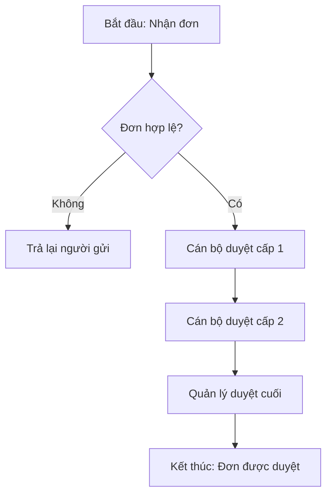
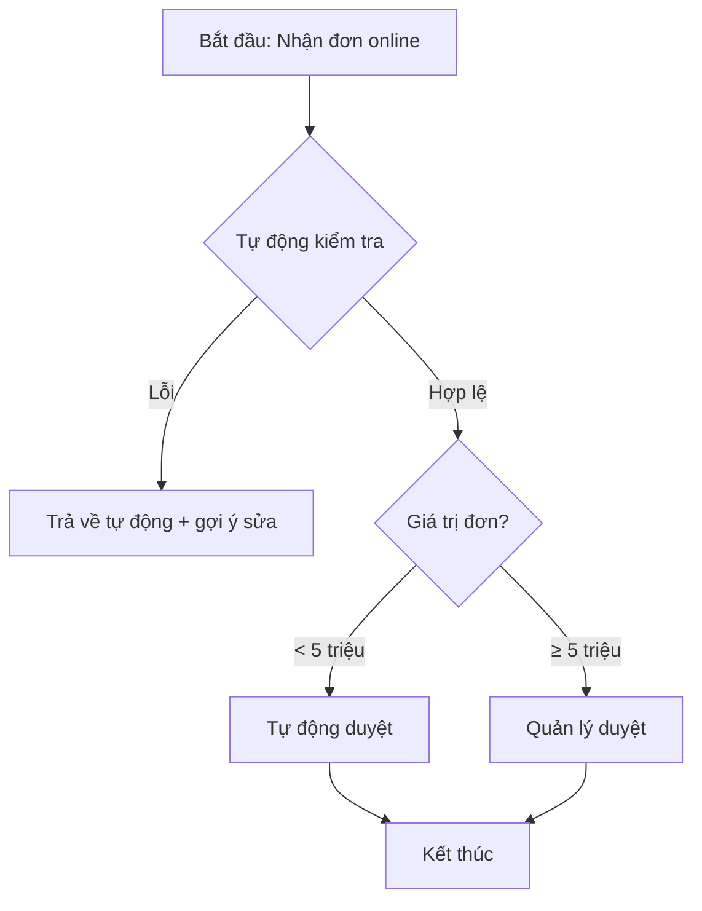

# /asis-tobe — As-Is → To-Be Process Analysis

## Execution flow

### Step 1 — Scope the process (REQUIRED)

Use `AskUserQuestion` to ask the user (up to 4 questions):

1. **Name of the process to analyze:** e.g., "Quy trình duyệt đơn đặt hàng", "Quy trình ký hợp đồng", etc.
2. **Scope:** Which event starts it? When does it end?
3. **Participating Roles:** Who is involved in the current process?
4. **Current pain points:** Bottlenecks, errors, slow steps — where?

### Step 2 — Collect As-Is details

Continue asking the user using a **5W1H** structure to describe As-Is:
- **What:** What are the steps in the current process? (list sequentially)
- **Who:** Who performs each step?
- **When:** When / how long for each step?
- **Where:** Where executed (which system, manual or automated)?
- **Why:** Why does this step exist? (probe for real value)
- **How:** How is it currently done (tools, forms)?

If the user already has documentation, read it directly instead of asking question-by-question.

### Step 3 — Propose To-Be (delegate to business-analyst)

Ask the `business-analyst` agent to:
- Propose a future-state (To-Be) process that eliminates identified bottlenecks.
- Apply the principles: automate, remove redundant steps, merge duplicate steps, parallelize independent steps.
- Preserve mandatory controls (legal compliance, regulatory approvals).

### Step 4 — Generate Mermaid diagrams for both As-Is and To-Be (REQUIRED)

Each diagram as a `flowchart`, with swimlanes by role if needed. Output literally in Vietnamese, e.g.:

````markdown
## Sơ đồ Quy trình Hiện tại (As-Is)



## Sơ đồ Quy trình Đề xuất (To-Be)


````

### Step 5 — Generate comparison table + Gap Analysis

**Summary comparison table** (output in Vietnamese):

| Tiêu chí | As-Is | To-Be | Cải thiện |
|---|---|---|---|
| Thời gian xử lý | {{...}} | {{...}} | {{Δ}} |
| Số bước thủ công | {{...}} | {{...}} | {{Δ}} |
| Số người tham gia | {{...}} | {{...}} | {{Δ}} |
| Tỷ lệ sai sót dự kiến | {{...}} | {{...}} | {{Δ}} |

**Detailed Gap Analysis table** (per template [.claude/templates/ba/gap-analysis-template.md](.claude/templates/ba/gap-analysis-template.md)):

| Mã | Hạng mục | As-Is | To-Be | Khoảng cách | Mức độ | Loại | Khuyến nghị |
|---|---|---|---|---|---|---|---|
| GAP-001 | {{...}} | {{...}} | {{...}} | {{...}} | Cao/TB/Thấp | People/Process/Tech/Data | {{...}} |

### Step 6 — Save output

- File: `ba/process/gap-analysis/AsIs-ToBe-<process-slug>-v1.0-<YYYY-MM-DD>.md`
- Standard YAML frontmatter.
- Include 5 sections: Bối cảnh, As-Is (mô tả + sơ đồ), To-Be (mô tả + sơ đồ), Bảng so sánh, Gap Analysis + Khuyến nghị.

## Mandatory rules

- **All generated deliverable content MUST be in Vietnamese.** The agent reasons in English but produces Vietnamese output.
- Mermaid diagrams are mandatory for both As-Is and To-Be. Do not skip.
- Each gap must carry a `GAP-VCM-NNN` ID and a severity level.
- Each recommendation must link to a specific GAP ID and carry a MoSCoW priority.

## After completion

Report: number of As-Is steps, number of To-Be steps, projected % time improvement, number of identified gaps, top 3 high-priority recommendations.
