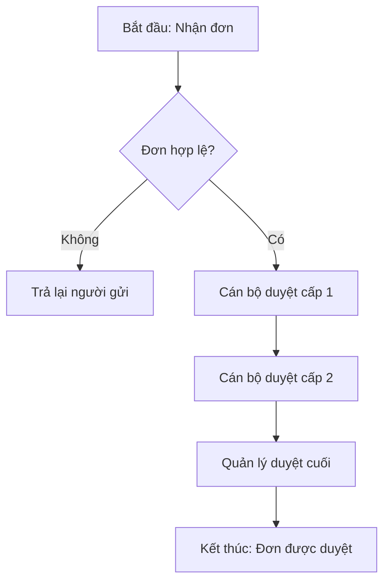
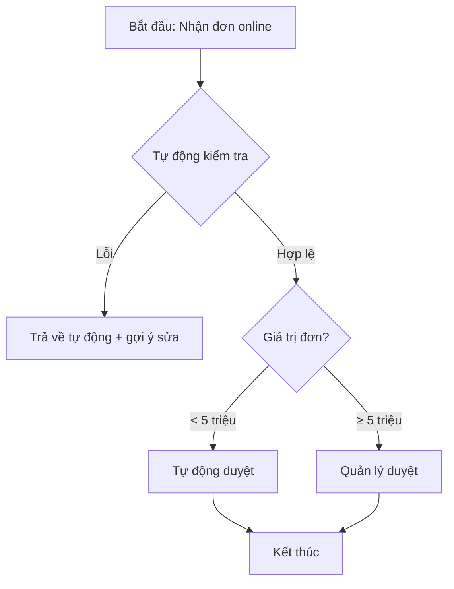

# /asis-tobe — Phân tích Quy trình As-Is → To-Be

## Quy trình thực hiện

### Bước 1 — Khoanh vùng quy trình (BẮT BUỘC)

Dùng `AskUserQuestion` hỏi người dùng (tối đa 4 câu):

1. **Tên quy trình cần phân tích:** ví dụ "Quy trình duyệt đơn đặt hàng", "Quy trình ký hợp đồng"...
2. **Phạm vi:** Bắt đầu từ sự kiện nào? Kết thúc khi nào?
3. **Các vai trò tham gia (Roles):** Ai liên quan trong quy trình hiện tại?
4. **Vấn đề đang gặp:** Điểm nghẽn, sai sót, thời gian chậm... ở đâu?

### Bước 2 — Thu thập chi tiết As-Is

Hỏi tiếp người dùng theo cấu trúc **5W1H** để mô tả As-Is:
- **What:** Các bước trong quy trình hiện tại là gì? (liệt kê tuần tự)
- **Who:** Ai thực hiện mỗi bước?
- **When:** Khi nào / Mất bao lâu cho mỗi bước?
- **Where:** Thực hiện ở đâu (hệ thống nào, thủ công hay tự động)?
- **Why:** Tại sao bước này tồn tại? (kiểm tra giá trị thực sự)
- **How:** Cách thực hiện hiện tại (công cụ, biểu mẫu)?

Nếu người dùng có sẵn tài liệu mô tả, đọc trực tiếp thay vì hỏi lại từng câu.

### Bước 3 — Đề xuất To-Be (delegate sang business-analyst)

Yêu cầu agent `business-analyst`:
- Đề xuất quy trình tương lai (To-Be) loại bỏ điểm nghẽn đã xác định.
- Áp dụng nguyên tắc: tự động hóa, loại bỏ bước thừa, gộp bước trùng lặp, song song hóa bước độc lập.
- Giữ nguyên các kiểm soát bắt buộc (tuân thủ pháp lý, phê duyệt theo quy định).

### Bước 4 — Sinh sơ đồ Mermaid cho cả As-Is và To-Be (BẮT BUỘC)

Mỗi sơ đồ ở dạng `flowchart` với swimlane theo role nếu cần:

````markdown
## Sơ đồ Quy trình Hiện tại (As-Is)



## Sơ đồ Quy trình Đề xuất (To-Be)


````

### Bước 5 — Sinh bảng so sánh + Gap Analysis

**Bảng so sánh tổng quan:**

| Tiêu chí | As-Is | To-Be | Cải thiện |
|---|---|---|---|
| Thời gian xử lý | {{...}} | {{...}} | {{Δ}} |
| Số bước thủ công | {{...}} | {{...}} | {{Δ}} |
| Số người tham gia | {{...}} | {{...}} | {{Δ}} |
| Tỷ lệ sai sót dự kiến | {{...}} | {{...}} | {{Δ}} |

**Bảng Gap Analysis chi tiết** (theo template [.claude/templates/ba/gap-analysis-template.md](.claude/templates/ba/gap-analysis-template.md)):

| Mã | Hạng mục | As-Is | To-Be | Khoảng cách | Mức độ | Loại | Khuyến nghị |
|---|---|---|---|---|---|---|---|
| GAP-001 | {{...}} | {{...}} | {{...}} | {{...}} | Cao/TB/Thấp | People/Process/Tech/Data | {{...}} |

### Bước 6 — Lưu kết quả

- File: `ba/process/gap-analysis/AsIs-ToBe-<process-slug>-v1.0-<YYYY-MM-DD>.md`
- Frontmatter YAML chuẩn.
- Bao gồm 5 phần: Bối cảnh, As-Is (mô tả + sơ đồ), To-Be (mô tả + sơ đồ), Bảng so sánh, Gap Analysis + Khuyến nghị.

## Quy tắc bắt buộc

- **Toàn bộ nội dung bằng tiếng Việt.**
- Sơ đồ Mermaid bắt buộc cho cả As-Is và To-Be. Không được bỏ qua.
- Mỗi khoảng cách phải có mã `GAP-VCM-NNN` và mức độ.
- Khuyến nghị phải gắn với mã GAP cụ thể và có ưu tiên MoSCoW.

## Sau khi hoàn thành

Báo cáo: số bước As-Is, số bước To-Be, % cải thiện thời gian dự kiến, số khoảng cách đã xác định, top 3 khuyến nghị ưu tiên cao.
