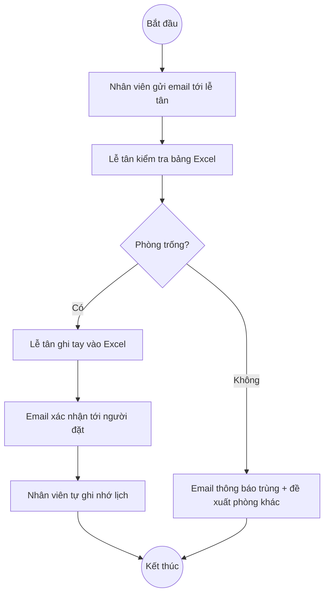
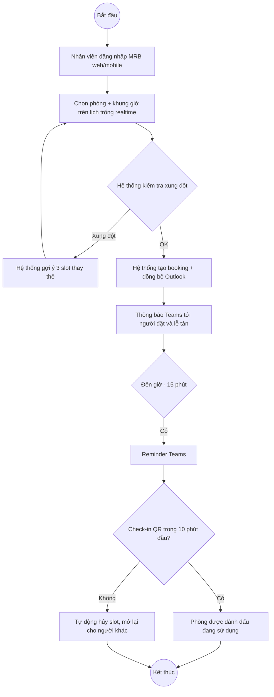

> **Ví dụ few-shot dành cho agent `business-analyst`.** File này minh họa một BRD hoàn chỉnh theo phong cách tiếng Việt mục tiêu — đây là phong cách agent phải tạo ra. Bản canonical (AGENTS scope) tại `.claude/examples/ba/example-BRD-finished.md`. Đồng bộ theo [SYNC-PROTOCOL.md](../../sync/SYNC-PROTOCOL.md).

# Tài liệu Yêu cầu Nghiệp vụ (BRD) — Hệ thống Quản lý Đặt phòng họp Nội bộ VCM

## 1. Thông tin tài liệu (Document Control)

| Trường | Giá trị |
|---|---|
| Tên dự án | Hệ thống Quản lý Đặt phòng họp Nội bộ |
| Mã dự án | VCM-MRB-2026 |
| Module | Meeting Room Booking (MRB) |
| Phiên bản | 1.0 |
| Ngày phát hành | 2026-05-26 |
| Trạng thái | Approved |
| Người soạn thảo | Nguyễn Thị B — Business Analyst |
| Người phê duyệt | Trần Văn C — Trưởng phòng Hành chính |

### Lịch sử thay đổi

| Phiên bản | Ngày | Người sửa | Mô tả |
|---|---|---|---|
| 0.1 | 2026-04-10 | Nguyễn Thị B | Bản nháp đầu tiên sau workshop khảo sát |
| 0.5 | 2026-04-25 | Nguyễn Thị B | Bổ sung Mục 7 sau phỏng vấn 5 phòng ban |
| 1.0 | 2026-05-26 | Nguyễn Thị B | Phát hành chính thức sau review của Sponsor |

---

## 2. Tóm tắt điều hành (Executive Summary)

Hiện tại 18 phòng họp tại trụ sở VCM được đặt thủ công qua email tới lễ tân hoặc bảng Excel chia sẻ. Trung bình mỗi tuần phát sinh 12 vụ trùng lịch và 23% slot bị "đặt nhưng không sử dụng" (no-show), gây lãng phí và xung đột giữa các phòng ban. Dự án **Hệ thống Quản lý Đặt phòng họp Nội bộ (Meeting Room Booking — MRB)** đề xuất xây dựng ứng dụng web + mobile cho phép nhân viên tự đặt phòng theo thời gian thực, đồng bộ với Microsoft 365, và tự động hủy slot không check-in trong 10 phút đầu.

Lợi ích dự kiến: giảm 90% xung đột lịch, tăng tỷ lệ sử dụng phòng từ 62% lên 85%, tiết kiệm ~120 giờ công lễ tân mỗi tháng. Tổng đầu tư ước lượng 850 triệu đồng, hoàn vốn trong 14 tháng.

---

## 3. Bối cảnh nghiệp vụ (Business Context)

### 3.1 Tình hình hiện tại
- 18 phòng họp tại trụ sở (3 phòng > 20 chỗ, 8 phòng 8–12 chỗ, 7 phòng < 6 chỗ).
- Đặt phòng qua 2 kênh: email tới `letan@vcm.vn` (60% lượng đặt) và bảng Excel chia sẻ trên SharePoint (40%).
- Lễ tân chuyển thông tin sang bảng Excel thủ công, trung bình mất 2–5 phút/lần đặt.

### 3.2 Vấn đề
- **Trùng lịch:** trung bình 12 vụ/tuần do thông tin không đồng bộ realtime giữa email và Excel.
- **No-show:** 23% slot đã đặt không có người sử dụng, không có cơ chế phát hiện tự động.
- **Khó báo cáo:** không có dữ liệu tin cậy về tỷ lệ sử dụng theo phòng, theo phòng ban, theo khung giờ.
- **Khó tra cứu:** nhân viên không thể tự xem phòng trống mà phải hỏi lễ tân.

### 3.3 Cơ hội
- VCM đã triển khai Microsoft 365 — có thể tận dụng Outlook Calendar và Teams cho thông báo.
- Đa số phòng họp đã có TV thông minh ở cửa — có thể hiển thị thông tin booking realtime.

---

## 4. Mục tiêu nghiệp vụ (Business Objectives)

| Mã | Mục tiêu | KPI | Mục tiêu định lượng | Hạn |
|---|---|---|---|---|
| OBJ-001 | Loại bỏ trùng lịch đặt phòng | Số vụ trùng lịch/tuần | ≤ 1 vụ/tuần (giảm từ 12) | Q4/2026 |
| OBJ-002 | Tăng tỷ lệ sử dụng phòng họp | Utilization % theo dữ liệu check-in | ≥ 85% (từ 62%) | Q1/2027 |
| OBJ-003 | Giảm thời gian lễ tân xử lý booking | Giờ công/tháng | ≤ 30 giờ (từ ~150 giờ) | Q4/2026 |
| OBJ-004 | Cung cấp báo cáo sử dụng phòng | Tần suất phát hành báo cáo | Báo cáo realtime + tổng kết hằng tháng | Q4/2026 |

---

## 5. Phạm vi (Scope)

### 5.1 Trong phạm vi (In-scope)
- Đặt / sửa / hủy lịch phòng họp trên web và mobile (iOS, Android).
- Đồng bộ 2 chiều với Outlook Calendar (Microsoft 365).
- Thông báo qua email + Microsoft Teams.
- Check-in qua QR code dán tại cửa phòng.
- Tự động hủy slot không check-in trong 10 phút đầu.
- Dashboard báo cáo sử dụng phòng theo thời gian thực.
- 18 phòng họp tại trụ sở chính (Tòa nhà A, Quận 1).

### 5.2 Ngoài phạm vi (Out-of-scope)
- Phòng họp tại các chi nhánh tỉnh (giai đoạn 2).
- Tích hợp với hệ thống lễ tân ảo (chatbot tiếp khách).
- Quản lý dịch vụ kèm theo (đồ uống, thiết bị thuê thêm).
- Đặt phòng cho khách bên ngoài (chỉ nội bộ).

---

## 6. Các bên liên quan (Stakeholders)

| Bên liên quan | Vai trò | Quan tâm | Ảnh hưởng | Kỳ vọng |
|---|---|---|---|---|
| Trưởng phòng Hành chính | Sponsor | Cao | Cao | Phê duyệt và bảo đảm ngân sách |
| Lễ tân (3 người) | End user — quản trị | Cao | Trung | Giảm khối lượng công việc thủ công |
| Nhân viên 28 phòng ban | End user — đặt phòng | Cao | Thấp | Đặt phòng nhanh, không xung đột |
| Trưởng các phòng ban | Stakeholder gián tiếp | Trung | Trung | Báo cáo sử dụng cho ban giám đốc |
| Đội CNTT | Triển khai & vận hành | Cao | Cao | Tích hợp Microsoft 365 ổn định |
| Phòng Tài chính | Phê duyệt ngân sách | Trung | Cao | ROI rõ ràng |

### Ma trận RACI

| Hoạt động | Sponsor | BA | Đội CNTT | Lễ tân | Phòng ban |
|---|---|---|---|---|---|
| Phê duyệt phạm vi | A | R | C | C | I |
| Soạn yêu cầu chức năng | I | R/A | C | C | C |
| Cấu hình Microsoft 365 | I | C | R/A | I | I |
| UAT | C | C | C | R | R |
| Đào tạo nhân viên | A | R | C | C | I |

---

## 7. Yêu cầu nghiệp vụ chi tiết (Detailed Business Requirements)

| Mã | Mô tả yêu cầu | Loại | Ưu tiên | Nguồn |
|---|---|---|---|---|
| BR-VCM-MRB-001 | Hệ thống phải cho phép nhân viên đặt phòng họp 24/7 qua web và mobile | Chức năng | Must | Khảo sát 04/2026 |
| BR-VCM-MRB-002 | Hệ thống phải đồng bộ 2 chiều với Outlook Calendar trong vòng 30 giây | Chức năng | Must | PV CNTT |
| BR-VCM-MRB-003 | Hệ thống phải gửi thông báo qua Teams khi đặt thành công và trước 15 phút | Chức năng | Must | Workshop 04/15 |
| BR-VCM-MRB-004 | Hệ thống phải hỗ trợ check-in bằng QR code tại cửa phòng | Chức năng | Must | PV Lễ tân |
| BR-VCM-MRB-005 | Hệ thống phải tự động hủy slot không check-in trong 10 phút đầu | Chức năng | Must | OBJ-002 |
| BR-VCM-MRB-006 | Hệ thống phải hiển thị bảng đặt phòng realtime trên TV cửa phòng | Chức năng | Should | PV Lễ tân |
| BR-VCM-MRB-007 | Hệ thống phải cung cấp dashboard utilization theo phòng và phòng ban | Chức năng | Should | OBJ-004 |
| BR-VCM-MRB-008 | Hệ thống phải cho phép đặt định kỳ (recurring booking) hằng tuần/tháng | Chức năng | Should | PV Quản lý dự án |
| BR-VCM-MRB-009 | Hệ thống phải hỗ trợ đặt phòng kéo dài tối đa 8 giờ liên tục | Chức năng | Could | Workshop |
| BR-VCM-MRB-010 | Hệ thống phải có Dark Mode | Chức năng | Won't | Bản đề xuất UX |
| NFR-VCM-MRB-001 | 95% thao tác đặt phòng phản hồi ≤ 2 giây | Phi chức năng | Must | Tiêu chuẩn UX |
| NFR-VCM-MRB-002 | SLA 99.5%/tháng cho cổng đặt phòng | Phi chức năng | Must | Hợp đồng vận hành |
| NFR-VCM-MRB-003 | Tuân thủ Nghị định 13/2023/NĐ-CP về dữ liệu cá nhân | Phi chức năng | Must | Pháp chế |

---

## 8. Quy trình nghiệp vụ (Business Process)

### 8.1 Quy trình hiện tại (As-Is)

### 8.2 Quy trình đề xuất (To-Be)

### 8.3 Điểm khác biệt chính (Key Changes)

- Loại bỏ vai trò lễ tân khỏi luồng xử lý hằng ngày (chỉ còn vai trò quản trị ngoại lệ).
- Thêm tự động hóa: phát hiện xung đột, gợi ý thay thế, reminder, auto-cancel no-show.
- Thay email + Excel bằng nguồn dữ liệu duy nhất (single source of truth) đồng bộ Outlook.
- Giảm trung bình 7 bước xuống còn 3 bước cho người dùng.

---

## 9. Rủi ro & Giả định (Risks & Assumptions)

### 9.1 Rủi ro

| Mã | Rủi ro | Xác suất | Tác động | Biện pháp giảm thiểu |
|---|---|---|---|---|
| RISK-001 | Microsoft 365 API thay đổi gây gián đoạn đồng bộ | Trung | Cao | Bọc API qua adapter layer; subscribe Microsoft 365 changelog |
| RISK-002 | Nhân viên cao tuổi kháng cự thay đổi quy trình | Cao | Trung | Đào tạo 1-1 + duy trì kênh email cũ trong 3 tháng đầu |
| RISK-003 | Mạng nội bộ trục trặc làm hỏng check-in QR | Thấp | Trung | Cho phép check-in fallback bằng nhân viên xác nhận thủ công |
| RISK-004 | TV cửa phòng cũ không hỗ trợ trình duyệt mới | Trung | Thấp | Thay 7 TV cũ trong giai đoạn 1 (đã có ngân sách dự phòng) |

### 9.2 Giả định

- Microsoft 365 license đủ cho toàn bộ 1.200 nhân viên (đã xác nhận với CNTT).
- Mạng Wi-Fi nội bộ phủ sóng tất cả phòng họp (đã đo signal Q1/2026).
- Lễ tân chấp nhận chuyển vai trò sang quản trị ngoại lệ — đã có cam kết từ Trưởng phòng Hành chính.
- Tất cả 18 phòng đều có TV thông minh hoặc sẽ được nâng cấp trong giai đoạn 1.

---

## 10. Phụ lục (Appendix)

- Phụ lục A: Biên bản phỏng vấn 5 phòng ban (file riêng).
- Phụ lục B: Kết quả khảo sát 87 nhân viên về pain point (Google Form 04/2026).
- Phụ lục C: Đánh giá 3 SaaS có sẵn (Robin, Joan, Skedda) — kết luận: build in-house tiết kiệm hơn dài hạn.
- Phụ lục D: Tham chiếu chéo BR → User Story (sẽ tạo trong giai đoạn FRD).

---

## Checklist hoàn thiện

- [x] Đã điền đầy đủ thông tin tài liệu và lịch sử thay đổi.
- [x] Tóm tắt điều hành ngắn gọn (< 300 từ).
- [x] Mục tiêu nghiệp vụ định lượng theo SMART, có hạn cụ thể.
- [x] Phạm vi In-scope/Out-of-scope rõ ràng, không mơ hồ.
- [x] Mỗi yêu cầu nghiệp vụ có mã duy nhất (`BR-VCM-MRB-xxx`, `NFR-VCM-MRB-xxx`) và mức ưu tiên MoSCoW.
- [x] Đã liệt kê đầy đủ stakeholder với mức ảnh hưởng/quan tâm.
- [x] Có sơ đồ As-Is và To-Be bằng Mermaid.
- [x] Rủi ro đã được đánh giá xác suất, tác động, biện pháp.
- [x] Giả định nêu rõ, có thể kiểm chứng.
- [x] Đã có chữ ký phê duyệt của Sponsor (Trưởng phòng Hành chính, ngày 2026-05-26).
