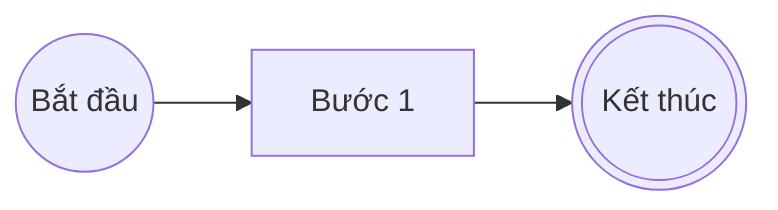
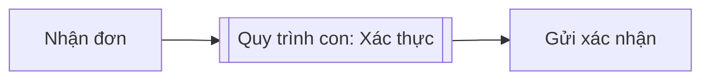
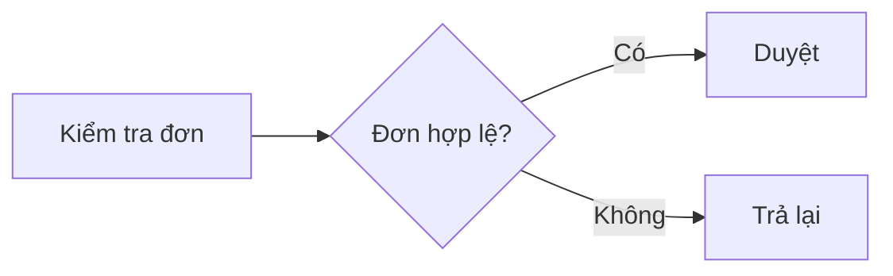
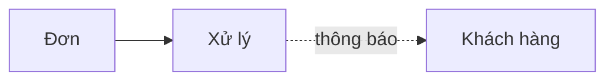
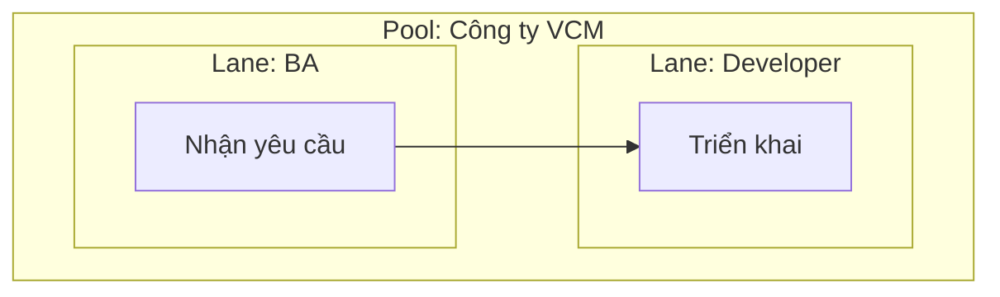

> Bản canonical (AGENTS scope) tại `.claude/knowledge/bpmn-2.0-cheatsheet.md`. Đồng bộ theo [SYNC-PROTOCOL.md](../../sync/SYNC-PROTOCOL.md).

# BPMN 2.0 Cheatsheet — Bảng ký hiệu (HUMAN scope)

Tham chiếu nhanh các ký hiệu BPMN 2.0 phổ biến để mô hình hóa quy trình nghiệp vụ. Mỗi mục có: hình ASCII/Mermaid, tên tiếng Anh, tên tiếng Việt, khi nào dùng, ví dụ.

---

## 1. Events (Sự kiện)

Sự kiện là "điều gì đó xảy ra" trong quy trình — biểu diễn bằng **vòng tròn**.

| Ký hiệu | EN | VI | Khi nào dùng | Ví dụ |
|---|---|---|---|---|
| `( )` vòng tròn mảnh | Start Event | Sự kiện bắt đầu | Kích hoạt quy trình | "Khách hàng gửi đơn" |
| `(( ))` vòng tròn đậm | End Event | Sự kiện kết thúc | Khép lại một nhánh quy trình | "Đơn được duyệt" |
| `( ( ) )` 2 vòng mảnh | Intermediate Event | Sự kiện trung gian | Xảy ra giữa start và end | "Chờ phản hồi khách hàng" |
| `(✉)` có phong bì | Message Event | Sự kiện thông điệp | Gửi/nhận thông điệp | "Nhận email xác nhận" |
| `(⏰)` có đồng hồ | Timer Event | Sự kiện thời gian | Kích hoạt theo thời gian | "Sau 3 ngày tự hủy" |
| `(⚡)` có tia sét | Error Event | Sự kiện lỗi | Phát sinh/bắt lỗi | "Thanh toán thất bại" |
| `(🛑)` đen đặc | Terminate Event | Sự kiện chấm dứt | Dừng toàn bộ instance ngay lập tức | "Hủy toàn bộ quy trình" |

**Quy tắc dùng:** Mỗi luồng phải có ít nhất 1 Start và 1 End. Bỏ qua End là lỗi BPMN thường gặp nhất.

---

## 2. Activities (Hoạt động)

Hoạt động là "công việc được thực hiện" — biểu diễn bằng **hình chữ nhật bo góc**.

| Ký hiệu | EN | VI | Khi nào dùng | Ví dụ |
|---|---|---|---|---|
| `[ ]` bo góc | Task | Nhiệm vụ | Đơn vị công việc nguyên tử | "Duyệt hồ sơ" |
| `[[ ]]` lồng | Sub-process | Quy trình con | Gom nhiều task thành cụm | "Quy trình thanh toán" |
| `[👤]` biểu tượng người | User Task | Nhiệm vụ người dùng | Con người thực hiện trên hệ thống | "Nhập thông tin" |
| `[⚙️]` biểu tượng bánh răng | Service Task | Nhiệm vụ dịch vụ | Tự động hóa bởi phần mềm | "Gọi API VNPay" |
| `[✉↗]` phong bì+mũi tên | Send Task | Nhiệm vụ gửi | Gửi một thông điệp | "Gửi email xác nhận" |
| `[↘✉]` mũi tên+phong bì | Receive Task | Nhiệm vụ nhận | Chờ một thông điệp | "Chờ phản hồi khách hàng" |
| `[📜]` biểu tượng giấy | Script Task | Nhiệm vụ kịch bản | Engine chạy đoạn script | "Tính phí tự động" |
| `[📞]` biểu tượng điện thoại | Call Activity | Hoạt động gọi | Gọi sang quy trình khác | "Gọi quy trình kiểm tra" |

**Mẹo:** Nếu tên task chứa nhiều động từ (vd "Kiểm tra và phê duyệt và lưu"), hãy tách thành nhiều task.

---

## 3. Gateways (Cổng quyết định)

Cổng điều khiển luồng rẽ nhánh / hợp nhánh — biểu diễn bằng **hình thoi**.

| Ký hiệu | EN | VI | Khi nào dùng | Ví dụ |
|---|---|---|---|---|
| `<X>` có X bên trong | Exclusive (XOR) | Cổng loại trừ | Chọn DUY NHẤT một nhánh theo điều kiện | "Đơn ≥ 5tr? Có/Không" |
| `<+>` có + bên trong | Parallel (AND) | Cổng song song | TẤT CẢ các nhánh chạy đồng thời | "Vừa duyệt vừa lưu kho" |
| `<O>` có O bên trong | Inclusive (OR) | Cổng bao gồm | ≥ 1 nhánh chạy (có thể nhiều) | "Gửi email và/hoặc SMS" |
| `<⬡>` ngũ giác | Event-based | Cổng dựa sự kiện | Chọn nhánh theo sự kiện nào xảy ra trước | "Phản hồi hay timeout?" |
| `<*>` dấu sao | Complex | Cổng phức hợp | Logic phức tạp; tránh dùng nếu có thể | "Tổ hợp điều kiện" |

**Quy tắc:** Nếu rẽ nhánh bằng XOR, thường phải **hợp nhánh** bằng XOR ở phía sau để luồng không bị "đứt" cờ token.

---

## 4. Flows (Luồng)

Luồng nối các phần tử lại với nhau — biểu diễn bằng **mũi tên**.

| Ký hiệu | EN | VI | Khi nào dùng | Ví dụ |
|---|---|---|---|---|
| `-->` đặc | Sequence Flow | Luồng tuần tự | Thứ tự hoạt động trong **cùng một Pool** | A → B → C |
| `-.->` đứt nét | Message Flow | Luồng thông điệp | Giữa các Pool (xuyên tổ chức) | "Khách hàng → Ngân hàng" |
| `==>` dày | Default Flow | Luồng mặc định | Nhánh fallback từ một gateway | "Nhánh Else" |
| `-->\|cond\|` có nhãn | Conditional Flow | Luồng có điều kiện | Đi ra từ hoạt động có điều kiện | "Khi > 1tr" |

**Quy tắc vàng:** Mũi tên đặc (`-->`) chỉ chạy trong cùng 1 Pool. Đi sang Pool khác phải dùng đứt nét (`-.->`).

---

## 5. Pools & Lanes (Khu vực & Làn)

Swimlane phân chia ai làm gì.

| Ký hiệu | EN | VI | Khi nào dùng | Ví dụ |
|---|---|---|---|---|
| Hộp lớn, tên bên cạnh | Pool | Khu vực (Pool) | Một bên tham gia / tổ chức (1 quy trình) | "Công ty VCM" |
| Hộp con trong Pool | Lane | Làn (Lane) | Vai trò / phòng ban trong bên tham gia | "Phòng Mua sắm" |
| Pool đen (hộp đen) | Collapsed Pool | Pool thu gọn | Bên tham gia ngoài, không cần hiện chi tiết | "Khách hàng" |

**Mẹo:** Tách Lane theo VAI TRÒ (cán bộ duyệt cấp 1) chứ không theo CON NGƯỜI cụ thể (Anh Nguyễn Văn A).

---

## 6. Artifacts (Đối tượng phụ trợ)

Bổ sung thông tin — không thuộc luồng chính.

| Ký hiệu | EN | VI | Khi nào dùng | Ví dụ |
|---|---|---|---|---|
| `[📄]` biểu tượng tài liệu | Data Object | Đối tượng dữ liệu | Dữ liệu được tạo/dùng bởi hoạt động | "Hồ sơ khách hàng" |
| `[🗄️]` hình trụ | Data Store | Kho dữ liệu | Dữ liệu lưu lâu dài, dùng xuyên hoạt động | "CSDL hợp đồng" |
| `[ ]` đứt nét, gom nhóm | Group | Nhóm | Gom nhóm trực quan (không có ngữ nghĩa) | "Nhóm chức năng A" |
| `[💬]` chú thích | Text Annotation | Chú thích | Ghi chú tự do | "Theo Luật Đấu thầu §X" |

---

## Những lỗi BPMN hay gặp

1. **Trộn lẫn luồng tuần tự và luồng thông điệp** — mũi tên đặc chỉ trong Pool, đứt nét xuyên Pool.
2. **Thiếu End Event** — mọi nhánh phải kết thúc tường minh.
3. **Gateway rẽ mà không hợp** — đã tách XOR thì thường phải gộp lại XOR.
4. **Task ôm đồm quá nhiều việc** — nếu tên task có nhiều động từ, tách ra.
5. **Lane lẫn lộn vai trò và hệ thống** — tách rõ vai trò người vs. hệ thống tự động.

## Công cụ vẽ BPMN

- **Mermaid** (có sẵn trong Markdown) — nhanh, dễ version control, không hỗ trợ đầy đủ BPMN. ✅ Khuyến nghị cho VCM.
- **draw.io** / **Lucidchart** — đủ palette BPMN, xuất PNG/SVG.
- **Camunda Modeler** — mã nguồn mở, tuân thủ chuẩn BPMN, xuất XML thực thi.

---

*Tra cứu thuật ngữ: [.claude/human/glossary/ba-terms-vi-en.md](../glossary/ba-terms-vi-en.md) — Nhóm 2 (Quy trình & Mô hình hóa).*
