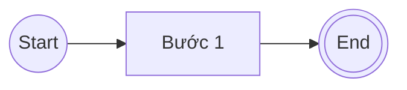
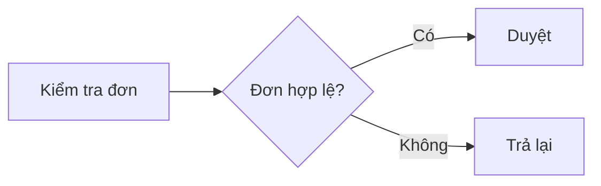
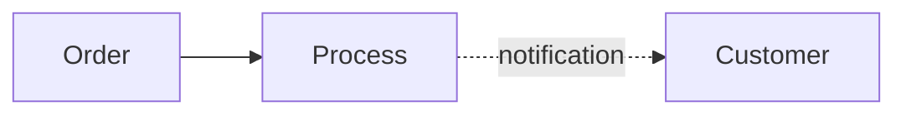
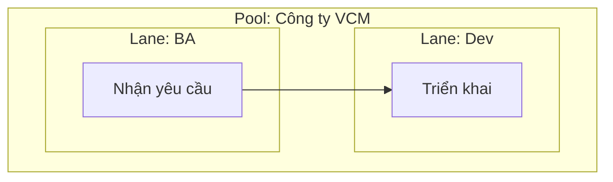

> Mirrored at `.claude/human/knowledge/bpmn-2.0-cheatsheet.md`. Sync per [SYNC-PROTOCOL.md](../sync/SYNC-PROTOCOL.md). Bilingual content — tables identical in both scopes.

# BPMN 2.0 Cheatsheet (AGENTS scope)

Quick reference for the most common BPMN 2.0 symbols used in business-process modeling. Each entry includes ASCII/Mermaid form, English & Vietnamese names, when to use, and a short example.

---

## 1. Events (Sự kiện)

Events represent something that happens during a process — circles in BPMN.

| Symbol | EN | VI | When to use | Example |
|---|---|---|---|---|
| `( )` thin circle | Start Event | Sự kiện bắt đầu | Triggers the process | "Khách hàng gửi đơn" |
| `(( ))` thick circle | End Event | Sự kiện kết thúc | Closes a process path | "Đơn được duyệt" |
| `( ( ) )` double thin | Intermediate Event | Sự kiện trung gian | Occurs between start and end | "Chờ phản hồi khách hàng" |
| `(✉)` with envelope | Message Event | Sự kiện thông điệp | Send/receive a message | "Nhận email xác nhận" |
| `(⏰)` with clock | Timer Event | Sự kiện thời gian | Time-based trigger | "Sau 3 ngày tự hủy" |
| `(⚡)` with bolt | Error Event | Sự kiện lỗi | Error thrown/caught | "Thanh toán thất bại" |
| `(🛑)` filled black | Terminate Event | Sự kiện chấm dứt | End all instances immediately | "Hủy toàn bộ quy trình" |

---

## 2. Activities (Hoạt động)

Activities are work performed — rounded rectangles.

| Symbol | EN | VI | When to use | Example |
|---|---|---|---|---|
| `[ ]` rounded | Task | Nhiệm vụ | Atomic unit of work | "Duyệt hồ sơ" |
| `[[ ]]` nested | Sub-process | Quy trình con | Group of tasks bundled | "Quy trình thanh toán" |
| `[👤]` user icon | User Task | Nhiệm vụ người dùng | Human performs in a system | "Nhập thông tin" |
| `[⚙️]` gear icon | Service Task | Nhiệm vụ dịch vụ | Automated by software | "Gọi API VNPay" |
| `[✉↗]` envelope+arrow | Send Task | Nhiệm vụ gửi | Send a message | "Gửi email xác nhận" |
| `[↘✉]` arrow+envelope | Receive Task | Nhiệm vụ nhận | Wait for a message | "Chờ phản hồi" |
| `[📜]` script icon | Script Task | Nhiệm vụ kịch bản | Engine executes a script | "Tính phí tự động" |
| `[📞]` phone icon | Call Activity | Hoạt động gọi | Invoke another process | "Gọi quy trình kiểm tra" |

---

## 3. Gateways (Cổng quyết định)

Gateways control flow divergence/convergence — diamonds.

| Symbol | EN | VI | When to use | Example |
|---|---|---|---|---|
| `<X>` X inside | Exclusive (XOR) | Cổng loại trừ | Pick ONE path based on condition | "Đơn ≥ 5tr? Có/Không" |
| `<+>` + inside | Parallel (AND) | Cổng song song | All paths execute simultaneously | "Vừa duyệt vừa lưu kho" |
| `<O>` O inside | Inclusive (OR) | Cổng bao gồm | ≥ 1 path executes (multiple OK) | "Gửi email và/hoặc SMS" |
| `<⬡>` pentagon | Event-based | Cổng dựa sự kiện | Pick path based on which event fires first | "Phản hồi hay timeout?" |
| `<*>` asterisk | Complex | Cổng phức hợp | Custom logic; avoid if possible | "Tổ hợp điều kiện" |

---

## 4. Flows (Luồng)

Flows connect elements — arrows.

| Symbol | EN | VI | When to use | Example |
|---|---|---|---|---|
| `-->` solid arrow | Sequence Flow | Luồng tuần tự | Order of activities within a Pool | A → B → C |
| `-.->` dashed | Message Flow | Luồng thông điệp | Between Pools (cross-organization) | "Khách hàng → Ngân hàng" |
| `==>` thick | Default Flow | Luồng mặc định | Fallback path from a gateway | "Else branch" |
| `-->\|cond\|` labeled | Conditional Flow | Luồng có điều kiện | Outgoing from activity with condition | "Khi > 1tr" |

---

## 5. Pools & Lanes (Khu vực & Làn)

Swimlanes organize participants.

| Symbol | EN | VI | When to use | Example |
|---|---|---|---|---|
| Large box, name on side | Pool | Khu vực (Pool) | A participant / organization (1 process) | "Công ty VCM" |
| Sub-box inside Pool | Lane | Làn (Lane) | A role/department within the participant | "Phòng Mua sắm" |
| Black-box Pool | Collapsed Pool | Pool thu gọn | External participant whose internals are hidden | "Khách hàng" |

---

## 6. Artifacts (Đối tượng phụ trợ)

Provide additional info — not part of the flow.

| Symbol | EN | VI | When to use | Example |
|---|---|---|---|---|
| `[📄]` document | Data Object | Đối tượng dữ liệu | Data produced/consumed by an activity | "Hồ sơ khách hàng" |
| `[🗄️]` cylinder | Data Store | Kho dữ liệu | Persistent data accessible across activities | "CSDL hợp đồng" |
| `[ ]` dashed group | Group | Nhóm | Visual grouping of elements (no semantic effect) | "Nhóm chức năng A" |
| `[💬]` text annotation | Text Annotation | Chú thích | Free-text note | "Theo Luật Đấu thầu §X" |

---

## Common Mistakes to Avoid

1. **Mixing sequence and message flow** — solid arrows stay inside a Pool; dashed cross Pools.
2. **Missing End Event** — every path must terminate explicitly.
3. **Gateway without merge** — if you split with XOR, you usually need to merge back.
4. **Tasks doing too much** — if a task description has multiple verbs, split it.
5. **Lanes mixing roles and systems** — separate human roles from automated systems.

## Tooling

- **Mermaid** (built into Markdown) — fast, version-controllable, limited BPMN fidelity.
- **draw.io** / **Lucidchart** — full BPMN palette, export to PNG/SVG.
- **Camunda Modeler** — open-source, BPMN-strict, can export to executable XML.

---

*See full Vietnamese reference at `.claude/human/knowledge/bpmn-2.0-cheatsheet.md`. Cross-reference glossary at [.claude/glossary/ba-terms-vi-en.md](../glossary/ba-terms-vi-en.md) (Group 2 — Process & Modeling).*
