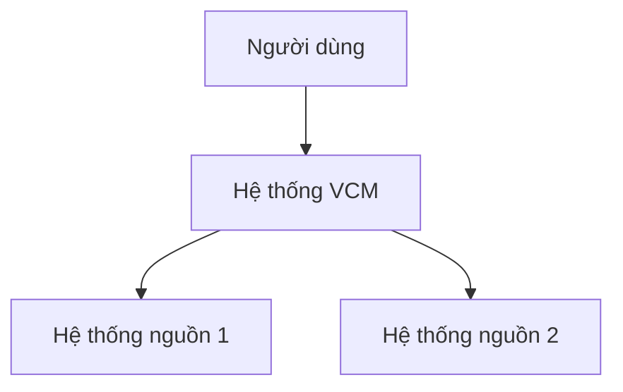
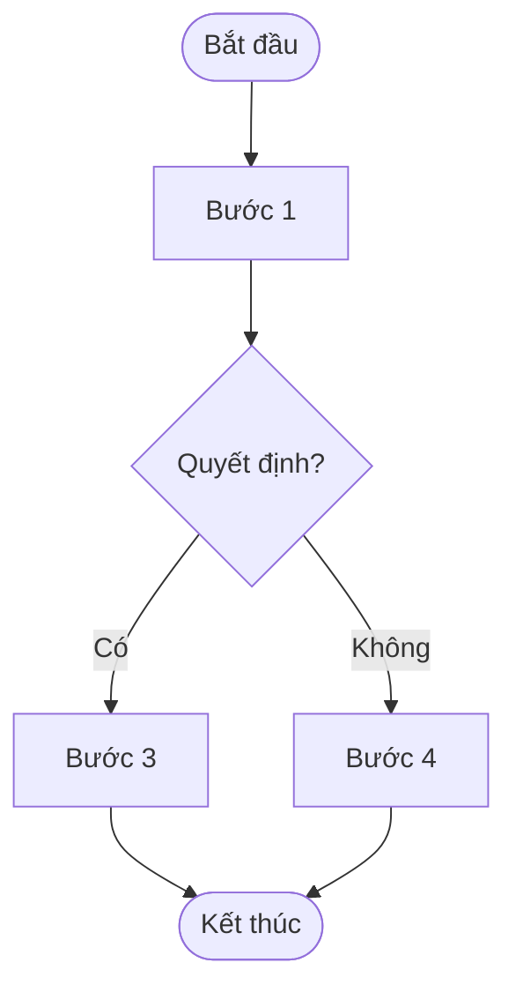
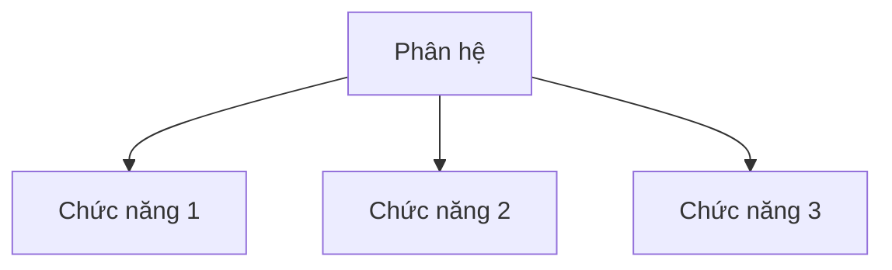
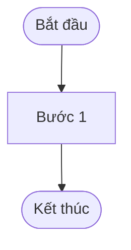

<!--
AGENTS_SECTION — for internal use only, not exported to DOCX
Template: URD (Tài liệu Phân tích Yêu cầu Người Sử dụng)
Source: QT02.BM.01_Phan tich yeu cau.docx (Viettel standard)
Rules:
- ALL 5 chapters + unnumbered data-source section MUST be present
- ALL 22 tables with exact column headers MUST be preserved
- Each function MUST have Table-10 (Use-Case Spec) + Table-11 (Basic Flow) + Table-12 (Alt Flow)
- Sections 4.1 and 4.10 are MANDATORY — never omit
- Placeholders: <…> = fill-in fields; […] = author instructions to delete before delivery
- Process diagrams: swim-lane, 4–10 steps, verb+noun step names, 1 Start / 1 End
- DOCX export: use QT02.BM.01 or latest formatted URD as --reference-doc
-->

---
project: "VCM — Hệ thống Đầu tư & Mua sắm"
author: "<Họ tên người lập>"
version: "1.0"
date: "YYYY-MM-DD"
status: "Draft"
document_type: "URD"
document_id: "URD-VCM-<NNN>"
---

# TẬP ĐOÀN CÔNG NGHIỆP - VIỄN THÔNG QUÂN ĐỘI
# <ĐƠN VỊ>

## <Tên dự án>

# TÀI LIỆU PHÂN TÍCH YÊU CẦU NGƯỜI SỬ DỤNG

**Mã hiệu dự án:** `<Mã hiệu dự án>`  
**Mã hiệu tài liệu:** `<Mã hiệu tài liệu>`  
**Địa điểm, Thời gian:** `<Địa điểm, Thời gian>`

---

## BẢNG GHI NHẬN THAY ĐỔI

| Ngày thay đổi | Vị trí thay đổi | A* M, D | Nguồn gốc | Phiên bản cũ | Mô tả thay đổi | Phiên bản mới |
|---|---|---|---|---|---|---|
| | | | | | | |

*\*A – Tạo mới, M – Sửa đổi, D – Xóa bỏ*

---

## TRANG KÝ

| Vai trò | Họ tên | Chức danh | Ngày |
|---|---|---|---|
| Người lập | | | |
| Người xem xét | | | |
| Người xem xét | | | |
| Người phê duyệt | | | |

---

## MỤC LỤC

[Tự động sinh khi xuất DOCX]

---

## 1. GIỚI THIỆU

### 1.1. Mục đích tài liệu

[Mô tả mục đích của tài liệu này: tài liệu phân tích yêu cầu người sử dụng cho dự án, ai sử dụng, dùng để làm gì.]

### 1.2. Phạm vi tài liệu

[Mô tả phạm vi áp dụng: các phân hệ, chức năng, đối tượng người dùng được bao phủ trong tài liệu này.]

### 1.3. Định nghĩa thuật ngữ và các từ viết tắt

**Bảng thuật ngữ và định nghĩa:**

| Thuật ngữ | Định nghĩa | Ghi chú |
|---|---|---|
| | | |
| | | |
| | | |
| | | |
| | | |

### 1.4. Tài liệu tham khảo

| Tên tài liệu | Ngày phát hành | Nguồn | Ghi chú |
|---|---|---|---|
| | | | |
| | | | |
| | | | |

### 1.5. Mô tả tài liệu

[Mô tả tổng thể cấu trúc tài liệu: gồm bao nhiêu chương, mỗi chương trình bày nội dung gì.]

---

## 2. TỔNG QUAN VỀ HỆ THỐNG

### 2.1. Phát biểu bài toán

#### 2.1.1. Tổng quan bài toán

[Mô tả bối cảnh nghiệp vụ, vấn đề cần giải quyết, lý do triển khai hệ thống.]

#### 2.1.2. Hiện trạng quy trình nghiệp vụ

[Mô tả quy trình nghiệp vụ hiện tại (As-Is): các bước, đối tượng thực hiện, điểm yếu, khó khăn.]

#### 2.1.3. Hiện trạng hạ tầng dữ liệu

[Mô tả hạ tầng dữ liệu hiện tại: hệ thống nguồn, định dạng dữ liệu, phương thức trao đổi, tồn tại.]

### 2.2. Mục tiêu hệ thống

[Liệt kê các mục tiêu cụ thể, đo lường được mà hệ thống cần đạt.]

### 2.3. Phạm vi hệ thống

#### 2.3.1. Danh sách nhóm người sử dụng hệ thống

| STT | Nhóm người dùng | Mô tả | Quyền hạn chính |
|---|---|---|---|
| 1 | | | |
| 2 | | | |
| 3 | | | |

#### 2.3.2. Mô hình tổng thể hệ thống

[Sơ đồ kiến trúc tổng thể hệ thống — dùng Mermaid hoặc đính kèm ảnh.]

---

## THỐNG NHẤT DANH SÁCH CÁC NGUỒN DỮ LIỆU

### DANH SÁCH NGUỒN DỮ LIỆU

| STT | Hệ thống nguồn | Loại dữ liệu | Đầu mối nghiệp vụ | Đầu mối kỹ thuật | Nền tảng | Ghi chú |
|---|---|---|---|---|---|---|
| 1 | | | | | | |
| 2 | | | | | | |
| 3 | | | | | | |

### DANH SÁCH BẢNG NGUỒN

| STT | Mã hệ thống | Tên hệ thống | Schema | Tên bảng | Mô tả ý nghĩa bảng | Dung lượng (GB) | Số bản ghi | Số trường | Tần suất | Thời gian lưu trữ | Ghi chú |
|---|---|---|---|---|---|---|---|---|---|---|---|
| 1 | | | | | | | | | | | |
| 2 | | | | | | | | | | | |

---

## 3. THỐNG NHẤT YÊU CẦU CHỨC NĂNG/NGHIỆP VỤ

### 3.1. <Tên quy trình / chức năng nghiệp vụ / phân hệ>

#### 3.1.1. Quy trình nghiệp vụ (nếu có)

##### Thông tin chung

[Mô tả ngắn gọn quy trình: tên, mục tiêu, đối tượng liên quan.]

**Ký hiệu sử dụng trong sơ đồ:**

| Ký hiệu | Ý nghĩa |
|---|---|
| Hình bầu dục | Điểm bắt đầu / kết thúc quy trình |
| Hình chữ nhật | Hoạt động / nhiệm vụ |
| Hình thoi | Quyết định Có / Không |
| Hình chữ nhật nghiêng | Đầu vào / đầu ra số liệu |
| Ký hiệu tham chiếu | Tham chiếu đến một quy trình khác |

##### Luồng quy trình

[Sơ đồ swim-lane: 4–10 bước, 1 Start, 1 End. Tên bước = Động từ + Danh từ.]

##### Mô tả các bước trong quy trình

| Bước | Tên bước | Mô tả | Đối tượng sử dụng |
|---|---|---|---|
| **Luồng dữ liệu chính** | | | |
| 1 | | | |
| 2 | | | |
| 3 | | | |
| **Luồng dữ liệu rẽ nhánh** | | | |
| 3a | | | |

#### 3.1.2. Yêu cầu chi tiết chức năng (Bắt buộc)

##### Mô hình phân rã chức năng

[Sơ đồ phân rã chức năng — Function Decomposition Diagram.]

---

##### Chức năng 1: <Tên chức năng>

###### Thông tin chung chức năng

| Mục | Nội dung |
|---|---|
| **Tên chức năng** | `<Tên chức năng>` — [tham chiếu danh sách chức năng] |
| **Mô tả** | [Vai trò, mục đích, phạm vi tác động của chức năng] |
| **Tác nhân** | [Người dùng hoặc hệ thống ngoài tương tác với chức năng] |
| **Điều kiện trước** | [Trạng thái hệ thống / điều kiện phải thỏa mãn trước khi thực hiện] |
| **Điều kiện sau** | [Trạng thái hệ thống sau khi thực hiện thành công / thất bại] |
| **Ngoại lệ** | [Các sự kiện lỗi có thể xảy ra khi thực thi] |
| **Các yêu cầu đặc biệt** | [NFR đặc thù: pháp lý, chất lượng, OS, tương thích phần cứng/phần mềm] |

###### Biểu đồ luồng xử lý chức năng

[Sơ đồ luồng xử lý nội bộ của chức năng.]

###### Mô tả dòng sự kiện chính (Basic Flow)

| Hành động của tác nhân | Phản ứng của hệ thống | Dữ liệu liên quan (C/R/U/D) |
|---|---|---|
| [Nội dung đầu vào của người dùng…] | [Các xử lý, phản ứng của hệ thống] | [Create/Update/Read/Delete trên business objects] |
| | | |
| | | |
| | | |

###### Mô tả dòng sự kiện phụ (Alternative Flow)

| Hành động của tác nhân | Phản ứng của hệ thống | Dữ liệu liên quan (C/R/U/D) |
|---|---|---|
| | | |
| | | |
| | | |

###### Ghi chú

[Các ghi chú bổ sung, ràng buộc đặc biệt, hoặc tham chiếu liên quan.]

---

##### Chức năng 2: <Tên chức năng>

###### Thông tin chung chức năng

| Mục | Nội dung |
|---|---|
| **Tên chức năng** | |
| **Mô tả** | |
| **Tác nhân** | |
| **Điều kiện trước** | |
| **Điều kiện sau** | |
| **Ngoại lệ** | |
| **Các yêu cầu đặc biệt** | |

###### Biểu đồ luồng xử lý chức năng

[Sơ đồ luồng xử lý chức năng.]

###### Mô tả dòng sự kiện chính (Basic Flow)

| Hành động của tác nhân | Phản ứng của hệ thống | Dữ liệu liên quan (C/R/U/D) |
|---|---|---|
| | | |
| | | |

###### Mô tả dòng sự kiện phụ (Alternative Flow)

| Hành động của tác nhân | Phản ứng của hệ thống | Dữ liệu liên quan (C/R/U/D) |
|---|---|---|
| | | |
| | | |

###### Ghi chú

[Ghi chú.]

---

## 4. CÁC YÊU CẦU PHI CHỨC NĂNG

### 4.1. Yêu cầu bảo mật hệ thống - ATTT *(Bắt buộc)*

[Mô tả các yêu cầu bảo mật thông tin: xác thực, phân quyền, mã hóa, audit log, v.v.]

**Phân mức nguy cơ bảo mật:**

| Mức độ | Nguy cơ |
|---|---|
| Nghiêm trọng | [Ví dụ: Deface trang chủ, lỗi XSS, upload file trái phép] |
| Cao | [Ví dụ: Chiếm quyền điều khiển, lộ thông tin người dùng, liệt kê người dùng] |
| Trung bình | |
| Thấp | |

### 4.2. Yêu cầu sao lưu

[Mô tả chính sách sao lưu: tần suất, phương thức, thời gian lưu trữ, điểm phục hồi (RPO/RTO).]

### 4.3. Yêu cầu về tính ổn định

[Đưa ra con số downtime tối đa cho phép, SLA uptime (ví dụ: 99.9%).]

### 4.4. Yêu cầu về hiệu năng

**Các chỉ tiêu KPI hiệu năng bắt buộc:**

| Các mục tiêu kiểm thử | Tên các chức năng nghiệp vụ kiểm thử tương ứng | Giá trị cần đạt và đơn vị đo lường |
|---|---|---|
| Response time | | < 5 giây |
| Throughput | | < 200 giao dịch/giây |
| Concurrency | | < 200 giao dịch đồng thời |
| CPU usage | | < _% |
| RAM usage | | < _% |

**Phân phối người dùng đồng thời:**

| Giao dịch | Số lượng active user thực | Số lượng concurrent user max |
|---|---|---|
| | | |
| | | |

**Thời gian xử lý theo giao dịch:**

| Giao dịch | Thời gian xử lý trung bình | Thời gian xử lý cao tải |
|---|---|---|
| | | |
| | | |

**Batch function processing benchmarks:**

| Chức năng | Tiêu chuẩn xử lý trung bình | Tiêu chuẩn xử lý tại thời điểm cao tải |
|---|---|---|
| | | |
| | | |

### 4.5. Yêu cầu về giao tiếp

#### 4.5.1. Giao diện người dùng

[Mô tả yêu cầu về giao diện: ngôn ngữ, trình duyệt hỗ trợ, độ phân giải, accessibility.]

#### 4.5.2. Giao tiếp phần cứng

[Mô tả yêu cầu về phần cứng đầu cuối, thiết bị ngoại vi (nếu có).]

#### 4.5.3. Giao tiếp phần mềm bên ngoài

[Mô tả các hệ thống bên ngoài cần tích hợp, giao thức, định dạng dữ liệu trao đổi.]

### 4.6. Yêu cầu về tính hỗ trợ

[Mô tả yêu cầu hỗ trợ kỹ thuật: SLA hỗ trợ, kênh hỗ trợ, thời gian phản hồi.]

### 4.7. Yêu cầu về công nghệ và các ràng buộc

[Mô tả stack công nghệ bắt buộc, ràng buộc hạ tầng, giấy phép phần mềm.]

### 4.8. Các yêu cầu tài liệu người dùng và hỗ trợ trực tuyến

[Mô tả tài liệu hướng dẫn sử dụng, help online, video training cần cung cấp.]

### 4.9. Các thành phần mua ngoài

[Liệt kê phần mềm/thư viện/dịch vụ mua ngoài cần tích hợp.]

### 4.10. Yêu cầu về vận hành khai thác *(Bắt buộc)*

[Mô tả yêu cầu vận hành: môi trường, quy trình deploy, monitoring, escalation.]

#### Yêu cầu về giải pháp hạ tầng

[Mô tả yêu cầu server, network, cloud/on-premise, HA/DR.]

#### Yêu cầu về tính ghi log

[Mô tả yêu cầu audit log, access log, error log: định dạng, thời gian lưu, mức độ chi tiết.]

#### Yêu cầu tuân thủ tiêu chuẩn Quản trị dữ liệu

##### Quản trị dữ liệu

[Mô tả yêu cầu tổng thể về quản trị dữ liệu, tham chiếu tiêu chuẩn Viettel `TC.CNVTQĐ.QTDL.01`.]

##### Yêu cầu tuân thủ Bảo mật dữ liệu

[Tham chiếu `TC.CNVTQĐ.QTDL.02`. Mô tả phân cấp bảo mật, masking, phân quyền truy cập theo dữ liệu nhạy cảm.]

**Bảng phân loại bảo mật và masking dữ liệu:**

| STT | Tên trường dữ liệu | Hệ thống/Module | Phân cấp bảo mật | Phân loại bảo mật | Định nghĩa các vai trò (role) và phân quyền dữ liệu tương ứng | Làm mờ - masking dữ liệu |
|---|---|---|---|---|---|---|
| 1 | | | | | | |
| 2 | | | | | | |

##### Yêu cầu tuân thủ Chất lượng dữ liệu

[Tham chiếu `TC.CNVTQĐ.QTDL.03`. Định nghĩa quy tắc chất lượng cho từng trường dữ liệu quan trọng.]

**Bảng quy tắc chất lượng dữ liệu:**

| STT | Tên trường dữ liệu | Hệ thống | Tính chính xác | Tính đầy đủ | Tính nhất quán | Tính kịp thời | Tính duy nhất | Tính hợp lệ | Log giám sát |
|---|---|---|---|---|---|---|---|---|---|
| 1 | | | | | | | | | |
| 2 | | | | | | | | | |

**Xác định Critical Data Elements (CDE):**

| STT | Tên trường dữ liệu | Mô tả | Bảng dữ liệu | Trường dữ liệu | Loại dữ liệu | Chủ sở hữu dữ liệu |
|---|---|---|---|---|---|---|
| 1 | | | | | | |
| 2 | | | | | | |

##### Yêu cầu tuân thủ Quản lý Siêu dữ liệu

[Tham chiếu `TC.CNVTQĐ.QTDL.04.6`. Định nghĩa metadata cần quản lý.]

**Bảng siêu dữ liệu (Metadata):**

| STT | Hệ thống | Loại siêu dữ liệu | Các thông tin cần quản lý |
|---|---|---|---|
| 1 | | Đối tượng dữ liệu (trường/bảng) | Tên, Mô tả, Loại, Kiểu dữ liệu, Thời gian tạo/chỉnh sửa, Cấp độ bảo mật, Đơn vị chủ trì, Đầu mối quản trị kỹ thuật |
| 2 | | Luồng dữ liệu | Tên luồng, Mô tả, Lệnh tổng hợp, Đầu mối quản lý, Hệ thống/nghiệp vụ sử dụng luồng |
| 3 | | Thuật ngữ nghiệp vụ | Tên, Viết tắt/gợi nhớ, Định nghĩa, Quy tắc nghiệp vụ, Đơn vị định nghĩa, Các thuật ngữ liên quan, Trường dữ liệu liên kết, Thời điểm tạo, Lịch sử chỉnh sửa |

##### Lưu trữ và vận hành

[Tham chiếu `TC.CNVTQĐ.QTDL.05.5`. Mô tả chính sách lưu trữ, vòng đời dữ liệu, archiving.]

### 4.11. <Thêm các loại yêu cầu khác, nếu cần>

[Bổ sung các yêu cầu phi chức năng không thuộc các nhóm trên.]

---

## 5. TIÊU CHUẨN NGHIỆM THU HỆ THỐNG

**Danh sách chức năng nghiệm thu (UAT Sign-off Checklist):**

| STT | Chức năng nghiệm thu |
|---|---|
| 1 | |
| 2 | |
| 3 | |
| 4 | |
| 5 | |
| 6 | |
