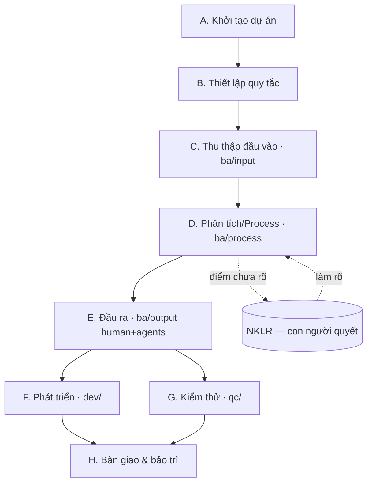

# BUILD-GUIDE — Hướng dẫn build dự án từ A→Z

> Playbook vòng đời dự án dùng khung này (Claude Code agents + monorepo BA/DEV/QC). Đọc [README.md](README.md) để nắm tổng quan, [CLAUDE.md](CLAUDE.md) cho quy tắc đầy đủ. File này là **trình tự thực hiện** từ lúc chưa có gì đến khi bàn giao & bảo trì.

## Sơ đồ tổng thể



---

## A. Khởi tạo dự án (Initialization)

1. **Lấy khung** vào thư mục dự án: `.claude/`, `CLAUDE.md`, `HUMAN.md`, `README.md`, `CONTRIBUTING.md`, `.gitignore`, `.gitattributes`, `.aiignore`.
2. **Điền §1 Project Overview** trong `CLAUDE.md` + `HUMAN.md`: tên dự án (VI/EN), mã, domain (§2), personas (§3).
3. **Tạo cấu trúc thư mục:**
   ```
   ba/{input, process, output/{human, agents}}   dev/   qc/{test-plan,test-case,test-report}   shared/
   ```
4. **Khởi tạo Git** (cộng tác 100% qua git):
   ```powershell
   git init -b main
   git config core.quotepath false ; git config core.autocrlf input
   ```
5. **Sửa portable** trước khi chia sẻ: hook `settings.json` dùng `$CLAUDE_PROJECT_DIR`; script dùng đường dẫn tương đối (không hardcode `c:\…`/`d:\…`).

> **Tuân thủ §0 ngay từ đầu:** agent *phân rã + tái hiện theo nguồn*, không tự suy diễn. Mọi quyết định nghiệp vụ là của con người.

## B. Thiết lập quy tắc (Governance) — TRƯỚC khi làm tài liệu

1. **§0.1 — CHỌN LUỒNG (BẮT BUỘC).** Đọc [`ba-workflow-patterns.md`](.claude/knowledge/ba-workflow-patterns.md), chọn 1 trong P1–P6, ghi vào trường **"Active Document Workflow"** ở §1. *Chưa chọn ⇒ chưa được làm tài liệu.* (Mặc định khuyến nghị **P4**.)
2. **§0.2 — Triết lý phát triển (TÙY CHỌN).** Agent hỏi: có áp triết lý nào trong [`dev-philosophies.md`](.claude/knowledge/dev-philosophies.md) không? Mặc định **none**. Chỉ áp khi con người yêu cầu → ghi trường "Active Dev Philosophy".
3. **Cấu hình `.aiignore`** loại context rác (logs/, binary, tài liệu tham khảo lớn).

## C. Thu thập đầu vào (Input) → `ba/input/`

- Đưa **tài liệu nguồn** vào `ba/input/`: khảo sát, biên bản họp, tài liệu UI khách, biểu mẫu chuẩn (QT02), tài liệu tham khảo.
- **Ghi nhận trung thực** (transcribe) nếu cần trích dẫn — không suy diễn, không thêm yêu cầu.
- `ba/input/` là **chỉ-đọc**: không sửa, không lưu đầu ra vào đây.

## D. Phân tích / Process (BA) → `ba/process/`

Thực hiện theo **luồng đã chọn ở bước B**. Ví dụ với **P4 (đồng tiến hóa)**:

1. **BRD** (`process/brd/`) — yêu cầu nghiệp vụ mức cao.
2. **Phân rã chức năng + trích trường** từ input (song song với wireframe).
3. **Wireframe/Mockup** (`process/wireframe/`, `process/mockup/`) — bám nguồn UI, validate sớm với khách.
4. **SRS** (`process/srs/`) — đặc tả theo biểu mẫu; mỗi điểm dẫn nguồn `[src]`.
5. **NKLR** (`process/quan-ly-yeu-cau/`) — gom mọi điểm *chưa rõ/xung đột* để **con người quyết** (không tự trả lời).
6. **RTM** — truy vết BR → chức năng → màn → (TC).

> Trước mỗi tài liệu: **đọc lại luồng đang set** (§0.1) và tuân theo trình tự của nó.

## E. Đầu ra (Output) → `ba/output/`

| Nhánh | Cho ai | Đặc điểm |
|---|---|---|
| `output/human/` | Con người / khách hàng | Word QT02, presentation — **100% theo biểu mẫu**, tự mô tả, có version |
| `output/agents/` | Agent DEV/QC | **Dense, machine-readable**, ít token, truy vết về `process/` (xem [README scaffold](ba/output/agents/README.md)) |

**Xuất Word** (chạy từ gốc): skill `export-word` → `output/human/exports/`.

## F. Phát triển (DEV) → `dev/`

- Đọc `ba/output/agents/` (đặc tả compact) + `ba/process/srs/` phân hệ liên quan — **không** đọc cả repo (tiết kiệm token).
- Định nghĩa/đọc **contract** ở `shared/` (API, event, mô hình dữ liệu) — *contract-first* nếu áp DP1.
- Code trong `dev/`; nhánh `dev/<tinh-nang>` → PR.

## G. Kiểm thử (QC) → `qc/`

- Đọc acceptance criteria trong `ba/output/agents/` + đặc tả phân hệ.
- Viết `test-plan/ test-case/ test-report/`; nhánh `qc/<bo-test>` → PR.
- Kiểm thử tích hợp theo Data Flow giữa các phân hệ (nếu áp DP1 "Khắc nhập").

## H. Bàn giao & bảo trì (Maintain)

- **Mốc bàn giao:** `git tag` (vd `srs-v2.1`); bản giao khách kèm version+ngày.
- **Versioning tài liệu:** không ghi đè bản đã chốt — bump version; git history là bộ nhớ dài hạn.
- **Đổi luồng/triết lý giữa chừng:** cập nhật trường §1 + ghi [`SYNC-LOG.md`](.claude/sync/SYNC-LOG.md).
- **Đồng bộ dual-scope:** sửa `.claude/…` hoặc `CLAUDE.md` → cập nhật mirror + SYNC-LOG.

---

## Quy ước xuyên suốt (mọi pha)

- **Git:** nhánh theo vai trò → PR review chéo; Conventional Commits (`docs(ba): …`, `feat(dev): …`, `test(qc): …`).
- **Token AI:** 1 tính năng = 1 cửa sổ chat; `@mention` file liên quan; tiếng Anh cho lệnh code, tiếng Việt cho tài liệu. Xem [`ai-agent-token-optimization.md`](.claude/knowledge/ai-agent-token-optimization.md).
- **Truy nguồn:** mọi artefact dẫn nguồn; phân biệt *sự thật* (`✓`) vs *suy luận cần xác nhận* (`≈`); chỗ thiếu ghi `(cần bổ sung)`.
- **Vai trò:** con người quyết định & suy diễn; agent phân rã & tái hiện.

## Checklist nhanh khởi động dự án mới

- [ ] Lấy khung + điền §1/§2/§3 (tên, domain, personas)
- [ ] Tạo `ba/{input,process,output}`, `dev/`, `qc/`, `shared/`
- [ ] `git init` + cấu hình + sửa portable path
- [ ] **Chọn luồng (§0.1)** → ghi Active Document Workflow
- [ ] Hỏi triết lý phát triển (§0.2) → ghi Active Dev Philosophy
- [ ] Cấu hình `.aiignore`
- [ ] Đưa tài liệu nguồn vào `ba/input/`
- [ ] Bắt đầu Process theo luồng đã chọn

---

*Cập nhật 2026-06-03. Nguồn chân lý: [CLAUDE.md](CLAUDE.md). Tổng quan: [README.md](README.md). Quy ước cộng tác: [CONTRIBUTING.md](CONTRIBUTING.md).*
