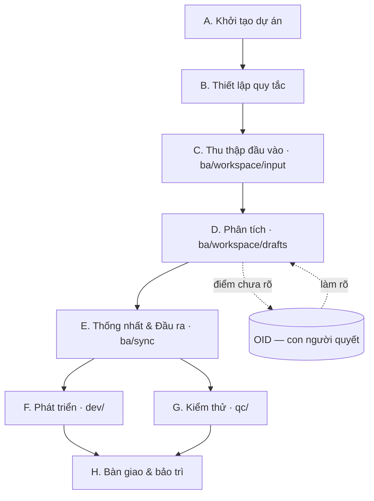

# BUILD-GUIDE — Hướng dẫn build dự án từ A→Z

> Playbook vòng đời dự án dùng khung này (Claude Code agents + monorepo BA/DEV/QC). Đọc [README.md](README.md) để nắm tổng quan, [CLAUDE.md](CLAUDE.md) cho quy tắc đầy đủ. File này là **trình tự thực hiện** từ lúc chưa có gì đến khi bàn giao & bảo trì.

## Sơ đồ tổng thể



---

## A. Khởi tạo dự án (Initialization)

1. **Lấy khung** vào thư mục dự án: `.claude/`, `CLAUDE.md`, `HUMAN.md`, `README.md`, `CONTRIBUTING.md`, `.gitignore`, `.gitattributes`, `.aiignore`.
2. **Điền §1 Project Overview** trong `CLAUDE.md` + `HUMAN.md`: tên dự án (VI/EN), mã, domain (§2), personas (§3).
3. **Tạo cấu trúc thư mục:**
   ```
   ba/workspace/{input, drafts}
   ba/sync/{requirements, models, output/{human, agents}}
   dev/   qc/{test-plan,test-case,test-report}   shared/   logs/ba-sessions/
   ```
4. **Khởi tạo Git** (cộng tác qua git):
   ```powershell
   git init -b main
   git config core.quotepath false ; git config core.autocrlf input
   ```
5. **§0.4 — Định danh người dùng:** phiên đầu trên máy mới, agent hỏi tên/vai trò BA/phân hệ trước việc cần quyền (approve, chọn luồng, publish sync).
6. **Sửa portable** trước khi chia sẻ: hook `settings.json` dùng `$CLAUDE_PROJECT_DIR`; script dùng đường dẫn tương đối (không hardcode `c:\…`/`d:\…`). Key Service Account (Google) để ở `.secrets/` (gitignore, không bàn giao).

> **Tuân thủ §0 ngay từ đầu:** agent *phân rã + tái hiện theo nguồn*, không tự suy diễn. Mọi quyết định nghiệp vụ là của con người.

## B. Thiết lập quy tắc (Governance) — TRƯỚC khi làm tài liệu

1. **§0.1 — CHỌN LUỒNG (BẮT BUỘC).** Đọc [`ba-workflow-patterns.md`](.claude/knowledge/ba-workflow-patterns.md), chọn 1 trong P1–P6, ghi vào **"Active Document Workflow"** ở §1. *Chưa chọn ⇒ chưa được làm tài liệu.* (TOSS đang dùng **P4 — Co-evolution Hybrid**.)
2. **§0.2 — Triết lý phát triển (TÙY CHỌN).** Agent hỏi: có áp triết lý nào trong [`dev-philosophies.md`](.claude/knowledge/dev-philosophies.md) không? Mặc định **none**.
3. **Cấu hình `.aiignore`** loại context rác (logs/, binary, tài liệu tham khảo lớn).

## C. Thu thập đầu vào (Input) → `ba/workspace/input/`

- **Customer_docs/** — tài liệu VNA cung cấp (DOCX/XLSX/PPTX/PDF) + **meeting-notes/** (transcript phỏng vấn). Agent **tự extract** file Office/PDF mới → `drafts/phan-tich/01-nguon/*.extracted.md` (markitdown / pymupdf4llm) + cập nhật INDEX + TIMELINE.
- **domain-knowledge/** — ICAO/IATA/CAAV/FTL + `toss-glossary-v0.1.md`. Human và agent cập nhật song song.
- **Google Drive/Sheets live** — pull tài liệu đang ở Drive/Sheets (YCKT, Function list) về `.md` qua Service Account; re-pull khi nguồn đổi.
- `ba/workspace/input/` là **chỉ-đọc**: không sửa, không lưu đầu ra vào đây.

## D. Phân tích (BA) → `ba/workspace/drafts/`

Thực hiện theo **luồng đã chọn ở bước B**. Với **P4**:

1. **Báo cáo Khảo sát** (`phan-tich/02-khao-sat/`) — từ transcript, qua skill `survey-report` (Yêu cầu/Thảo luận/Kết luận). Sau mỗi báo cáo: rà **OID** + đề xuất **glossary**.
2. **Phân tích YCKT** (`phan-tich/03-yckt/`) — phân rã sheet yêu cầu kỹ thuật khách hàng.
3. **BRD** (`brd/`) — yêu cầu nghiệp vụ mức cao.
4. **Phân rã song song:** SRS chức năng (`srs/`, agent `srs-writer`) · entity map (`data-modeler`) · luồng BPMN (`process-modeler`) · Wireframe (`wireframe/`) · Mockup HTML (`mockup/`, skill `gen-mockup`).
5. **Đối chiếu & làm giàu:** dùng workflow [`survey-to-spec`](.claude/workflows/survey-to-spec.js) — đối chiếu báo cáo ↔ YCKT + Function list + wireframe/SRS → sinh **đề xuất** (FUNC/OID/glossary) + bảng quyết định BA Lead. *Chỉ đề xuất, người duyệt mới áp dụng (§0).*
6. **Sổ theo dõi (cập nhật liên tục):** **OID-TOSS-001** (điểm cần chốt) · **BA-VERSION-LOG** (version) · **survey-pipeline-status.md** (tiến độ pipeline) · **RTM** (truy vết BR→FUNC→màn→TC).

> Trước mỗi tài liệu: **đọc lại luồng đang set** (§0.1) + lấy bearings (§0.5); KHÔNG tự đóng cờ `[cần xác nhận]`.

## E. Thống nhất & Đầu ra → `ba/sync/`

| Vùng | Cho ai | Đặc điểm |
|---|---|---|
| `sync/requirements/` | Team BA | BRD/SRS đã review + NKLR (quản lý thay đổi yêu cầu) |
| `sync/models/` | Cross-cutting | ERD, deliverable-status.json, RTM, survey-pipeline-status.md |
| `sync/output/human/` | Con người / khách | Word **QT02.BM.04**, presentation — tự mô tả, có version+ngày |
| `sync/output/agents/` | Agent DEV/QC | Dense, machine-readable, ít token |

**Xuất Word** (chạy từ gốc): skill `export-word` → `sync/output/human/exports/` (QC tự kiểm: font TNR, logo/footer, không lọt link nội bộ/ASR/thẻ trích).

## F. Phát triển (DEV) → `dev/`

- Đọc `ba/sync/output/agents/` + SRS phân hệ liên quan (`ba/workspace/drafts/srs/` hoặc `sync/requirements/srs/`) — **không** đọc cả repo (tiết kiệm token).
- Định nghĩa/đọc **contract** ở `shared/` (API, event, mô hình dữ liệu).
- Stack: **Angular 21 · Signals · Standalone · PrimeNG** ([`angular-guidelines.md`](.claude/rules/angular-guidelines.md)). Code-gen qua `gen-*` skills + workflow `gen-feature`. Nhánh `dev/<tinh-nang>` → PR.

## G. Kiểm thử (QC) → `qc/`

- Đọc acceptance criteria trong SRS + `ba/sync/output/agents/`.
- Viết `test-plan/ test-case/ test-report/`; nhánh `qc/<bo-test>` → PR.

## H. Bàn giao & bảo trì (Maintain)

- **Mốc bàn giao:** `git tag` (vd `srs-v2.1`); bản giao khách kèm version+ngày.
- **Versioning tài liệu (§8):** file chỉ chứa nội dung hiện tại — không nhúng CHANGELOG; bump version = file mới + xóa file cũ (git giữ lịch sử) + ghi **BA-VERSION-LOG** + cập nhật INDEX.
- **Đổi luồng/triết lý giữa chừng:** cập nhật trường §1 + ghi [`SYNC-LOG.md`](.claude/sync/SYNC-LOG.md).
- **Đồng bộ dual-scope:** sửa `.claude/{agents,commands,templates,glossary}/` hoặc `CLAUDE.md` → cập nhật mirror VI + SYNC-LOG.

---

## Quy ước xuyên suốt (mọi pha)

- **Git:** tài liệu BA commit trực tiếp `main` (nhóm commit theo chủ đề); code DEV/QC dùng nhánh + PR. Conventional-style (`docs(ba): …`, `feat(dev): …`, `test(qc): …`).
- **Token AI:** 1 tính năng = 1 cửa sổ chat; đọc/ghi file chọn lọc (Grep/offset, không nạp cả file); tiếng Anh cho lệnh code, tiếng Việt cho tài liệu giao người.
- **Truy nguồn:** mọi artefact dẫn nguồn (timestamp transcript / mã sheet / §wireframe / FUNC); chỗ thiếu ghi `[cần xác nhận]` — không bịa.
- **Vai trò:** con người quyết định & suy diễn; agent phân rã & tái hiện.

## Checklist nhanh khởi động dự án mới

- [ ] Lấy khung + điền §1/§2/§3 (tên, domain, personas)
- [ ] Tạo `ba/workspace/{input,drafts}`, `ba/sync/{requirements,models,output}`, `dev/`, `qc/`, `shared/`
- [ ] `git init` + cấu hình + sửa portable path; `.secrets/` cho key SA
- [ ] **Chọn luồng (§0.1)** → ghi Active Document Workflow (mặc định P4)
- [ ] Hỏi triết lý phát triển (§0.2) + định danh người dùng (§0.4)
- [ ] Cấu hình `.aiignore`
- [ ] Đưa tài liệu nguồn vào `ba/workspace/input/Customer_docs/`
- [ ] Bắt đầu phân tích theo luồng đã chọn (survey-report → survey-to-spec)

---

*Cập nhật 2026-06-22. Nguồn chân lý: [CLAUDE.md](CLAUDE.md) (v2.10). Tổng quan: [README.md](README.md). Quy ước cộng tác: [CONTRIBUTING.md](CONTRIBUTING.md).*
