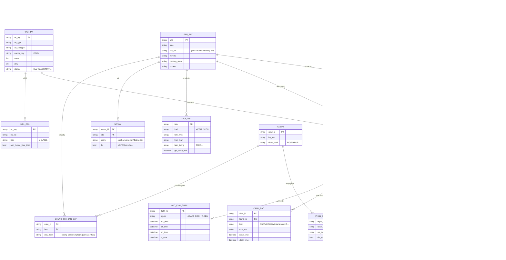

# Mô hình dữ liệu khái niệm — Cụm màn hình giám sát điều phái

> **Phạm vi:** các thực thể dữ liệu phục vụ cụm màn hình giám sát của điều phái viên — BR-112 (dashboard tài liệu), BR-113 (2 màn giám sát), BR-114 (kiểm tra đầu ca), BR-125 (Monitoring overview). Đây là **mô hình KHÁI NIỆM** (conceptual) phục vụ co-evolution với wireframe (Workflow P4) — chỉ thực thể + trường khóa + quan hệ, CHƯA chuẩn hóa vật lý/kiểu dữ liệu.
>
> **Nguồn:** cột "Dữ liệu liên quan" của FUNC (PHAN-RA-BRD-PH1-…-v0.4) + FOS sheet-09 + Đề xuất §II.1. Trường/khái niệm chưa rõ gắn `[cần xác nhận]`.

## 1. Sơ đồ thực thể (ERD khái niệm)

## 2. Thực thể lõi & vai trò trong cụm màn giám sát

| Thực thể | Vai trò | Màn dùng |
|---|---|---|
| **CHUYEN_BAY** (Flight/Leg) | Trung tâm — mỗi dòng giám sát = 1 chuyến/leg | BR-113, 114, 125 |
| **TAU_BAY** (Aircraft) | Hiển thị REG/type, tàu quay | BR-114, 125 |
| **PHAN_CONG_TO_BAY / TO_BAY** | Tổ bay, đổi tổ, chứng chỉ | BR-114 (chứng chỉ), 125 (đổi tổ) |
| **TAI_LIEU_CHUYEN** (Document) | Trạng thái tài liệu, OFP version, release | BR-112, 113 (cán bộ tài liệu) |
| **TAI_TRONG** (Load/PAX) | Tải, ZFW, khách nối chuyến | BR-113 (trực ban), 114 (tải) |
| **SAN_BAY** + **THOI_TIET** + **NOTAM** | RFFS, thời tiết, NOTAM cho kiểm tra đầu ca | BR-114 |
| **MEL_CDL** | Lỗi kỹ thuật ảnh hưởng khai thác | BR-114 |
| **CANH_BAO** (Alert) | Cảnh báo màu/nhấp nháy, raise/clear theo mốc ACARS | BR-114, 125 |
| **MOC_KHAI_THAC** (ACARS OOOI / A-CDM) | Mốc thời gian thực tế, ETA, trạng thái bay | BR-125 |
| **NGUOI_DUNG / CA_TRUC** | Phân quyền theo vai trò + phạm vi giám sát | tất cả |

## 3. Điểm `[cần xác nhận]` ảnh hưởng data model (đồng bộ OID)
- Enum **LEG STATE** — **POC dsp_monitoring đề xuất GRD/BRD/OUT/ENR/IN/ARR** (ứng viên), chờ SME khách hàng xác nhận.
- Nguồn **Transfer PAX / khách nối chuyến** (FOS không có cột trực tiếp).
- Trường lưu **cấp RFFS** sân bay (RFFS cảnh báo qua NOTAM — có cần lưu cấp?).
- Cấu trúc **CHUNG_CHI_SAN_BAY** (chứng chỉ tổ bay theo sân bay đặc biệt — SME-18).
- **VMA** (ngưỡng thời tiết) — lưu ở SAN_BAY hay danh mục riêng.
- **TAI_LIEU_CHUYEN.ofp_rev_color** — POC dùng 3 màu (🟢 đã release / 🟡 bản trước đã release / 🔴 chưa rev nào release) + format "x/y/z Rn" `[cần xác nhận ý nghĩa x/y/z]` — trạng thái suy ra từ Dispatch Release.
- Nguồn **Crew↓** (tổ bay đã/chưa download tài liệu) = **Pilot App / MO Plus** `[cần xác nhận trường nguồn]`.

## 4. Ghi chú
- Đây là mô hình **co-evolution P4** — tinh chỉnh song song khi vẽ wireframe; khác biệt phát hiện trong wireframe/POC phản hồi ngược về model.
- **Cập nhật co-evolution (từ POC dsp_monitoring, 2026-06-12):** bổ sung enum ứng viên `leg_state`; ghi chú `ofp_rev_color`; nguồn Crew↓ = Pilot App; (gợi ý thực thể mở rộng sau: PILOT_EXTRA, TO_LD/RTOW, MCT cho nối chuyến).
- Các mốc A-CDM/ACARS gom trong `MOC_KHAI_THAC` (xem glossary v0.8: A-CDM Milestone Times, ACARS OOOI).
- Chưa mô hình hóa các thực thể ngoài cụm giám sát (master data đầy đủ, báo cáo) — sẽ làm khi mở rộng phạm vi.
