# Mô hình dữ liệu khái niệm — Cụm màn hình giám sát điều phái (v0.2)

> **Phạm vi:** các thực thể dữ liệu phục vụ cụm màn hình giám sát của điều phái viên — BR-112 (dashboard tài liệu), BR-113 (2 màn giám sát), BR-114 (kiểm tra đầu ca), BR-125 (Monitoring overview). Đây là **mô hình KHÁI NIỆM** (conceptual) phục vụ co-evolution với wireframe (Workflow P4) — chỉ thực thể + trường khóa + quan hệ, CHƯA chuẩn hóa vật lý/kiểu dữ liệu.
>
> **Nguồn v0.1:** cột "Dữ liệu liên quan" của FUNC (PHAN-RA-BRD-PH1-…-v0.4) + FOS sheet-09 + Đề xuất §II.1.
>
> **Nguồn bổ sung v0.2:** Aircraft_Netline.extracted.md (39 cột), Aircraft_FIMS.extracted.md (21 cột), MEL-78A/B/C.extracted.md (38 cột), OFP-SGN-SFO-RECLEARANCE.extracted.md, LOADSHEET_VN1237_R02_19JUN26.extracted.md, PM_VN1237_R01_19JUN26.extracted.md, PM_VN1822_R01_19JUN26.extracted.md, BRD-TOSS-PH4-quan-ly-danh-muc-v0.6.md (BR-412/418/424/425/427), BRD-TOSS-PH2-tai-lieu-chuyen-bay-v0.7.md (BR-201/203), BRD-TOSS-PH1-thong-tin-dieu-hanh-v0.8.md (BR-124), toss-glossary-v0.1.md (entries: MEL penalty, Master MEL, DOW, DAO).

---

## 1. Sơ đồ thực thể (ERD khái niệm)

```mermaid
erDiagram
    %% ── Lõi chuyến bay ──────────────────────────────────
    CHUYEN_BAY ||--o{ TAI_LIEU_CHUYEN : "có"
    CHUYEN_BAY ||--o{ PHAN_CONG_TO_BAY : "gồm"
    CHUYEN_BAY ||--|| TAI_TRONG : "có 1"
    CHUYEN_BAY ||--o{ CANH_BAO : "phát sinh"
    CHUYEN_BAY ||--o{ MOC_KHAI_THAC : "ghi nhận"
    CHUYEN_BAY ||--o{ DANH_SACH_KHACH : "có (chuyến chở khách)"

    %% ── Tàu bay ──────────────────────────────────────────
    TAU_BAY ||--o{ CHUYEN_BAY : "khai thác"
    TAU_BAY ||--o{ MEL_ITEM_ACTIVE : "có MEL đang mở"
    TAU_BAY ||--o{ CAU_HINH_TAU : "có nhiều cấu hình"

    %% ── Sân bay / thời tiết / NOTAM ────────────────────
    SAN_BAY ||--o{ CHUYEN_BAY : "đi (DEP)"
    SAN_BAY ||--o{ CHUYEN_BAY : "đến (ARR)"
    SAN_BAY ||--o{ THOI_TIET : "có bản tin"
    SAN_BAY ||--o{ NOTAM : "có"

    %% ── Tổ bay ───────────────────────────────────────────
    TO_BAY ||--o{ PHAN_CONG_TO_BAY : "được phân"
    TO_BAY ||--o{ CHUNG_CHI_SAN_BAY : "có chứng chỉ"
    SAN_BAY ||--o{ CHUNG_CHI_SAN_BAY : "yêu cầu"

    %% ── Danh mục MEL (Master) → MEL active ─────────────
    MASTER_MEL ||--o{ MEL_ITEM_ACTIVE : "định nghĩa penalty"

    %% ── OFP tách riêng từ TAI_LIEU_CHUYEN ──────────────
    TAI_LIEU_CHUYEN ||--o{ OFP_PHIEN_BAN : "bao gồm phiên bản OFP"
    OFP_PHIEN_BAN ||--o{ MEL_ITEM_ACTIVE : "tham chiếu (mel trong OFP)"

    %% ── Ca trực / người dùng ───────────────────────────
    NGUOI_DUNG ||--o{ CA_TRUC : "trực"
    CA_TRUC ||--o{ CHUYEN_BAY : "giám sát (phạm vi)"

    %% ─── ENTITY DEFINITIONS ─────────────────────────────

    CHUYEN_BAY {
        string flight_no PK
        string carrier "VN/0V/BL [BRD-PH1 BR-106]"
        int leg_no
        string dep_iata FK
        string arr_iata FK
        string ac_reg FK
        datetime std
        datetime sta
        datetime etd
        datetime eta "ELDT/EIBT"
        datetime atd "ACARS OUT/OFF"
        datetime ata "ACARS ON/IN"
        string leg_state "GRD/BRD/OUT/ENR/IN/ARR [ứng viên — cần xác nhận SME]"
        string leg_type "thường/ferry/VIP/charter…"
        bool irregular
        bool diverted
        string delay_code
        int delay_mins
    }

    TAU_BAY {
        string ac_reg PK
        string ac_type "loại tàu A320/A321/B787… [Netline REGISTRATION]"
        string ac_subtype "32A/32B/78C… [Netline AC_SUBTYPE; BR-423]"
        string ac_logical_no "số thứ tự logic trong đội tàu [Netline AC_LOGICAL_NO]"
        string ac_operator "mã hãng khai thác [Netline AC_OPERATOR]"
        string ac_owner "mã chủ sở hữu [Netline AC_OWNER]"
        string ac_owner_name "tên chủ sở hữu / lessor [Netline AC_OWNER_NAME; BR-418]"
        string ac_state "trạng thái: R/khai thác/BQ/MNT… [Netline AC_STATE; BR-417]"
        int dow "Trọng lượng khô kg [Netline DRY_OPERATING_WGT; glossary DOW]"
        int max_takeoff_wgt "MTOW theo Netline kg [Netline MAX_TAKEOFF_WGT; cần xác nhận xung đột FIMS]"
        int avg_fuel_consump "tiêu hao nhiên liệu trung bình [Netline AVG_FUEL_CONSUMP]"
        int fuel_capacity "dung tích bình nhiên liệu [Netline FUEL_CAPACITY]"
        int crewsize_cockpit "số phi công tiêu chuẩn [Netline CREWSIZE_COCKPIT; BR-413]"
        int crewsize_cabin "số tiếp viên tiêu chuẩn [Netline CREWSIZE_CABIN; BR-413]"
        string ap_restriction "hạn chế khai thác đặc biệt [Netline AP_RESTRICTION]"
        bool acars "có ACARS không [Netline ACARS]"
        string ils_equipment "cấp ILS: I/II/III [Netline ILS_EQUIPMENT]"
        bool autoland "có khả năng Autoland [Netline AUTOLAND]"
        string std_version "cấu hình thương mại chuẩn [Netline STD_VERSION; BR-412]"
        string ac_category "nhóm tàu: J/narrow… [Netline AC_CATEGORY]"
        datetime valid_since "hiệu lực gia nhập đội bay [Netline VALID_SINCE; BR-408]"
        datetime valid_until "hiệu lực rời đội bay [Netline VALID_UNTIL; BR-408]"
    }

    CAU_HINH_TAU {
        string ac_reg FK
        string std_version_alt "cấu hình thay thế (ALT_1..4) [Netline STD_VERSION_ALT_1..4; BR-412]"
        string ac_type_icao "designator ICAO [FIMS AC_TYPE_ICAO]"
        string ac_model "mô hình cụ thể [FIMS AC_MODEL]"
        int mtow_config "MTOW theo cấu hình FIMS kg [FIMS MTOW_CONFIG; cần xác nhận xung đột Netline]"
        int max_payload "tải trọng tối đa kg [FIMS MAX_PAYLOAD]"
        int tank_capacity "dung tích bình kg [FIMS TANK_CAPACITY]"
        bool center_tank "có bình trung tâm [FIMS CENTER_TANK]"
        int c_class "số ghế hạng C khai báo [FIMS C_CLASS]"
        int wy_class "số ghế hạng W+Y khai báo [FIMS WY_CLASS]"
        string seat_map "sơ đồ ghế đầy đủ [FIMS SEAT]"
        string sub_group "nhóm phụ cấu hình [FIMS SUB_GROUP]"
    }

    MASTER_MEL {
        string icao_airl_code "ICAO hãng — HVN [MEL-78A col.1; BR-424(a)]"
        string perf_type "biến thể hiệu năng: 87975/87967/87X75 [MEL-78A col.2; BR-424(a)]"
        string deviation_code PK "mã ATA XX-XX-XX+case [MEL-78A col.3; BR-424(b)]"
        string mel_dx_remark "nội dung điều kiện cho Dispatcher [MEL-78A col.4; BR-424(c)]"
        string mel_ofp_remark "mô tả thiết bị hỏng cho OFP [MEL-78A col.5; BR-424(c)]"
        int p_tow "penalty trọng lượng cất cánh kg [MEL-78A; BR-424(d)]"
        int p_enrte_wt "penalty trọng lượng en-route kg [MEL-78A; BR-424(d)]"
        int p_lw "penalty trọng lượng hạ cánh kg [MEL-78A; BR-424(d)]"
        int p_tcap "penalty taxi capacity [MEL-78A; BR-424(d)]"
        float p_perf_corr "hệ số tăng nhiên liệu pct [MEL-78A; BR-424(d)]"
        int p_altitude "giới hạn độ cao bay FF [MEL-78A; BR-424(d)]"
        int p_etops_circles "giới hạn ETOPS phút [MEL-78A; BR-424(d)]"
        int p_etops_critfuel_dc "critical fuel ETOPS diversion [MEL-78A; BR-424(d)]"
        int p_etops_critfuel_dx "critical fuel ETOPS dispatch [MEL-78A; BR-424(d)]"
        string auto_land_down "giảm cấp autoland: auto3A/noauto… [MEL-78A; BR-424(d)]"
        string ils_down "giảm cấp ILS: 3A/1/3B… [MEL-78A; BR-424(d)]"
        string gls_down "giảm cấp GLS [MEL-78A; BR-424(d)]"
        string rnp_precision_down "giảm cấp RNP [MEL-78A; BR-424(d)]"
        string item_10a "Item 10a FPL ICAO [MEL-78A; BR-424(e)]"
        string item10_b "Item 10b FPL ICAO [MEL-78A; BR-424(e)]"
        string item18_rnav "Item 18 RNAV [MEL-78A; BR-424(e)]"
        string item18_rnp "Item 18 RNP [MEL-78A; BR-424(e)]"
        string tcas "downgrade TCAS [MEL-78A; BR-424(e)]"
        string fms "downgrade FMS [MEL-78A; BR-424(e)]"
        string ats_service_type "downgrade ATS service [MEL-78A; BR-424(e)]"
        string action "INSERT/UPDATE/DELETE [MEL-78A; BR-424(f)]"
        datetime eff_from "hiệu lực từ [MEL-78A; BR-424(f)]"
        datetime eff_till "hiệu lực đến [MEL-78A; BR-424(f)]"
        string loai_item "MEL hoặc CDL [BR-424 — phân biệt Section 2 vs 3]"
        string noi_dung_raw "nội dung gốc nhà sản xuất [BR-424(h)]"
        string noi_dung_edited "metadata khai thác hãng bổ sung [BR-424(h)]"
    }

    MEL_ITEM_ACTIVE {
        string ac_reg FK
        string deviation_code FK "khóa đối chiếu Master MEL [OFP-SGN-SFO §MEL/CDL; BR-427]"
        string loai "MEL/CDL [OFP-SGN-SFO §MEL/CDL]"
        string mo_ta "mô tả thiết bị hỏng [OFP-SGN-SFO §MEL/CDL]"
        string ghi_chu_penalty "ghi chú penalty áp dụng chuyến [OFP-SGN-SFO §MEL/CDL]"
        bool anh_huong_khai_thac "có ảnh hưởng không [BR-427]"
        string pham_vi_anh_huong "phi công/tiếp viên/thợ máy [BR-427]"
        datetime ngay_mo "ngày mở lỗi từ AMOS [BR-427]"
        string nguon "AMOS [TOBE-PH5 §tích hợp]"
    }

    OFP_PHIEN_BAN {
        string flight_no FK
        string ofp_number "số OFP do Lido tạo [OFP-SGN-SFO dòng 2; BR-203]"
        string ofp_version "phiên bản TOSS tự gán R1/R2… [BR-203]"
        string loai_khai_thac "IFR SCHEDULED/EDTO/RCL… [OFP-SGN-SFO dòng 7]"
        string route "chuỗi waypoint [OFP-SGN-SFO §ROUTE]"
        string flt_lvl_profile "profile mực bay [OFP-SGN-SFO §FLT LVL]"
        string special_ops "PBN/PBCS/RNAV/RVSM… [OFP-SGN-SFO §SPECIAL OPS]"
        bool edto "có EDTO không [OFP-SGN-SFO §EDTO]"
        int edto_time_limit "giới hạn phút EDTO [OFP-SGN-SFO §EDTO]"
        int zfw "Zero Fuel Weight kg [OFP-SGN-SFO §FUEL ANALYSIS]"
        int tow "Take-Off Weight kg [OFP-SGN-SFO §FUEL ANALYSIS]"
        int ldw "Landing Weight kg [OFP-SGN-SFO §FUEL ANALYSIS]"
        float per_factor "Performance Factor [OFP-SGN-SFO §PER FACTOR]"
        float per_cor_penalty "Penalty hiệu năng pct [OFP-SGN-SFO §PER COR PENALTY]"
        int fuel_trip "trip fuel kg [OFP-SGN-SFO §TRIP]"
        int fuel_cont "contingency fuel kg [OFP-SGN-SFO §CONT RCF]"
        int fuel_dest_altn "fuel dự phòng sân đến kg [OFP-SGN-SFO §DEST ALTN]"
        int fuel_final_res "final reserve fuel kg [OFP-SGN-SFO §FINAL RES]"
        int fuel_edto "ETOPS/EDTO fuel kg [OFP-SGN-SFO §EDTO/ADDNL]"
        int fuel_rcfp_addnl "RCFP additional fuel kg [OFP-SGN-SFO §RCFP ADDNL]"
        int fuel_block "block fuel kg [OFP-SGN-SFO §BLOCK FUEL]"
        int fuel_taxi "taxi fuel kg [OFP-SGN-SFO §TAXI]"
        string dest_altn_list "danh sách alternate [OFP-SGN-SFO §ENROUTE ALTN/DEST ALTN]"
        string minima_dep "minima sân đi [OFP-SGN-SFO §ASC APRT]"
        string minima_dest "minima sân đến [OFP-SGN-SFO §ASC APRT]"
        string dispatcher_name "tên điều phái ký [OFP-SGN-SFO §DISPATCHER]"
        string license_no "số bằng điều phái [OFP-SGN-SFO §DISPATCHER]"
        datetime upload_time
        datetime confirm_time
        string trang_thai "Unconfirmed/Confirmed/Rejected [BR-201]"
        datetime flight_release_time
        string released_by
    }

    TAI_LIEU_CHUYEN {
        string flight_no FK
        string doc_type "OFP/LS/GD/PM/NOTOC/Cargo/Mail [BR-201]"
        int rev_count
        datetime upload_time
        datetime confirm_time
        string trang_thai "Unconfirmed/Confirmed/Rejected"
        datetime flight_release_time
        string released_by
    }

    TAI_TRONG {
        string flight_no FK
        string ac_reg FK "tàu bay khai thác [LOADSHEET VN1237]"
        string version "phiên bản loadsheet R01/R02… [LOADSHEET VN1237 EDNO]"
        int pax_c "hành khách hạng C [LOADSHEET VN1237 PAX]"
        int pax_w "hành khách hạng W [LOADSHEET VN1237 PAX]"
        int pax_y "hành khách hạng Y [LOADSHEET VN1237 PAX]"
        int pax_total "tổng hành khách [LOADSHEET VN1237]"
        int transfer_pax "[cần xác nhận nguồn trực tiếp]"
        int cargo_comp1 "tải khoang 1 kg [LOADSHEET VN1237 CPT 1]"
        int cargo_comp2 "tải khoang 2 kg [LOADSHEET VN1237 CPT 2]"
        int cargo_comp3 "tải khoang 3 kg [LOADSHEET VN1237 CPT 3]"
        int cargo_comp4 "tải khoang 4 kg [LOADSHEET VN1237 CPT 4]"
        int cargo_comp5 "tải khoang 5 kg [LOADSHEET VN1237 CPT 5]"
        int total_traffic_load "tổng tải kg [LOADSHEET VN1237]"
        int dow_actual "DOW thực tế kg [LOADSHEET VN1237 DRY OPERATING WEIGHT]"
        int zfw_actual "ZFW thực tế kg [LOADSHEET VN1237]"
        int zfw_max "ZFW max kg [LOADSHEET VN1237]"
        int tow_actual "TOW thực tế kg [LOADSHEET VN1237]"
        int tow_max "TOW max kg [LOADSHEET VN1237]"
        int ldw_actual "LDW thực tế kg [LOADSHEET VN1237]"
        int ldw_max "LDW max kg [LOADSHEET VN1237]"
        int take_off_fuel "nhiên liệu cất cánh kg [LOADSHEET VN1237]"
        int trip_fuel "trip fuel kg [LOADSHEET VN1237]"
        float doi "Dry Operating Index [LOADSHEET VN1237 DOI]"
        float lizfw "LI tại ZFW [LOADSHEET VN1237 LIZFW]"
        float maczfw "MAC tại ZFW pct [LOADSHEET VN1237 MACZFW]"
        float litow "LI tại TOW [LOADSHEET VN1237 LITOW]"
        float mactow "MAC tại TOW pct [LOADSHEET VN1237 MACTOW]"
        float lilaw "LI tại LAW [LOADSHEET VN1237 LILAW]"
        float maclaw "MAC tại LAW pct [LOADSHEET VN1237 MACLAW]"
        string stab_trim "cài đặt góc stabilizer [LOADSHEET VN1237 STAB:TRIM]"
        int underload_before_lmc "underload trước LMC kg [LOADSHEET VN1237]"
        string lmc_spec "nội dung LMC [LOADSHEET VN1237 LAST MINUTE CHANGES]"
        float fuel_density "tỷ trọng nhiên liệu kg/L [LOADSHEET VN1237]"
    }

    DANH_SACH_KHACH {
        string flight_no FK
        string revision "R01/R02… [PM_VN1237 dòng tiêu đề]"
        int pax_j "số khách hạng J [PM_VN1237 TOTAL J CLASS]"
        int pax_pe "số khách PE [PM_VN1237 PE LIST]"
        int pax_y_total "tổng khách hạng Y [PM_VN1237]"
        int vip_count "số khách VIP [PM_VN1237 VIP LIST]"
        int cip_count "số khách CIP [PM_VN1237 CIP LIST]"
        int wchr_count "số khách cần xe lăn [PM_VN1237 WHEELCHAIR LIST]"
        int special_meal_count "số khách yêu cầu suất ăn đặc biệt [PM_VN1237 SPECIAL MEAL LIST]"
        string ac_reg FK "tàu bay phục vụ [PM_VN1237 dòng tiêu đề]"
    }

    SAN_BAY {
        string iata PK
        string icao
        string rffs_cat "[cần xác nhận trường lưu]"
        string minima
        string parking_stand
        string curfew
    }

    THOI_TIET {
        string iata FK
        string loai "METAR/SPECI"
        string tam_nhin
        string tran_may
        string hien_tuong "TSRA…"
        datetime gio_quan_trac
    }

    NOTAM {
        string notam_id PK
        string iata FK
        string nhom "sân bay/vùng trời/đường bay"
        bool rffs "NOTAM cứu hỏa"
    }

    CANH_BAO {
        string alert_id PK
        string flight_no FK
        string loai "OSP/NOTAM/WX/tài liệu/đổi tổ/MEL…"
        string muc_do
        datetime raise_time
        datetime clear_time
        string acars_trigger "OFF/ON/IN"
    }

    MOC_KHAI_THAC {
        string flight_no FK
        string nguon "ACARS OOOI / A-CDM"
        datetime out_time
        datetime off_time
        datetime on_time
        datetime in_time
        datetime sobt_eobt_tobt_aobt "A-CDM"
        datetime tsat_ctot_ttot_atot "A-CDM"
    }

    TO_BAY {
        string crew_id PK
        string ho_ten
        string chuc_danh "PIC/FO/PUR…"
    }

    PHAN_CONG_TO_BAY {
        string flight_no FK
        string crew_id FK
        string vai_tro
        bool doi_to "đổi tổ bay"
    }

    CHUNG_CHI_SAN_BAY {
        string crew_id FK
        string iata FK
        string dieu_kien "[cần xác nhận]"
    }

    NGUOI_DUNG {
        string user_id PK
        string vai_tro "Dispatcher/Trực ban trưởng/Cán bộ tài liệu"
    }

    CA_TRUC {
        string ca_id PK
        string user_id FK
        string pham_vi "căn cứ/Carrier/sân bay"
    }
```

---

## 2. Thực thể lõi & vai trò trong cụm màn giám sát

| Thực thể | Vai trò | Màn dùng | Thay đổi v0.2 |
|---|---|---|---|
| **CHUYEN_BAY** (Flight/Leg) | Trung tâm — mỗi dòng giám sát = 1 chuyến/leg | BR-113, 114, 125 | Giữ nguyên cấu trúc |
| **TAU_BAY** (Aircraft) | Hiển thị REG/type, tàu quay; master data hợp nhất Netline+FIMS | BR-114, 125 | Làm giàu 14 thuộc tính mới từ Netline (owner/lessor, ILS, ACARS, logical no, restrictions…) |
| **CAU_HINH_TAU** (Aircraft Config) | Cấu hình thương mại thay thế + tham số hiệu năng FIMS | BR-412, PH4 | **Thực thể MỚI** tách từ TAU_BAY để chứa đa-cấu hình STD_VERSION_ALT + trường FIMS (MTOW_CONFIG, MAX_PAYLOAD, AC_TYPE_ICAO…) |
| **MASTER_MEL** | Danh mục MEL gốc (AMOS → TOSS); định nghĩa toàn bộ penalty | BR-424 | **Thực thể MỚI** với 29 thuộc tính (penalty weight/altitude/landing/ETOPS, Item 10/18, 2 lớp nội dung) |
| **MEL_ITEM_ACTIVE** | MEL/CDL đang mở trên tàu bay; trực tiếp gắn với chuyến bay | BR-427; OFP-SGN-SFO §MEL/CDL | Đổi tên/cấu trúc từ MEL_CDL v0.1 — thêm liên kết về MASTER_MEL và trường penalty/nguồn |
| **OFP_PHIEN_BAN** (OFP Version) | Mỗi bản OFP R1/R2… từ Lido; chứa cấu trúc nhiên liệu ICAO 11 thành phần, route, minima, dispatcher | BR-201/203; OFP-SGN-SFO | **Thực thể MỚI** tách từ TAI_LIEU_CHUYEN — OFP có cấu trúc đủ phức tạp để quản lý riêng |
| **TAI_LIEU_CHUYEN** (Document) | Trạng thái tài liệu theo loại (LS/GD/PM/NOTOC/Cargo/Mail); OFP chuyển sang OFP_PHIEN_BAN | BR-112, 113 | Cắt bớt trường OFP (đưa sang OFP_PHIEN_BAN); giữ vai trò container loại tài liệu |
| **TAI_TRONG** (Weight & Balance) | Loadsheet: W&B thực tế, 5 khoang cargo, MAC/LI/STAB, LMC | BR-113 (trực ban), 114 (tải) | Làm giàu toàn bộ từ LOADSHEET VN1237 — thêm 18 thuộc tính W&B |
| **DANH_SACH_KHACH** (Passenger Manifest) | Thống kê hành khách theo hạng, VIP/CIP, đặc biệt (WCHR, AVML…) liên kết chuyến bay | BR-124; PM_VN1237/1822 | **Thực thể MỚI** từ nguồn Passenger Manifest |
| **SAN_BAY** + **THOI_TIET** + **NOTAM** | RFFS, thời tiết, NOTAM cho kiểm tra đầu ca | BR-114 | Không thay đổi v0.2 |
| **CANH_BAO** (Alert) | Cảnh báo màu/nhấp nháy, raise/clear theo mốc ACARS | BR-114, 125 | Không thay đổi |
| **MOC_KHAI_THAC** (ACARS OOOI / A-CDM) | Mốc thời gian thực tế, ETA, trạng thái bay | BR-125 | Không thay đổi |
| **TO_BAY / PHAN_CONG_TO_BAY / CHUNG_CHI_SAN_BAY** | Tổ bay, đổi tổ, chứng chỉ | BR-114 | Không thay đổi |
| **NGUOI_DUNG / CA_TRUC** | Phân quyền theo vai trò + phạm vi giám sát | tất cả | Không thay đổi |

---

## 3. Quan hệ bổ sung (v0.2)

| Từ | Đến | Cardinality | Mô tả | Nguồn |
|---|---|---|---|---|
| CHUYEN_BAY | DANH_SACH_KHACH | 1 — 0..1 | Một chuyến chở khách có tối đa 1 passenger manifest (theo chuyến + ngày) | PM_VN1237; BR-124 |
| TAU_BAY | CAU_HINH_TAU | 1 — 1..* | Một tàu bay có ít nhất 1 cấu hình thương mại (STD + các ALT) | Netline STD_VERSION_ALT_1..4; BR-412 |
| TAU_BAY | MEL_ITEM_ACTIVE | 1 — 0..* | Một tàu bay có thể có nhiều MEL/CDL đang mở tại thời điểm giám sát | OFP-SGN-SFO §MEL/CDL; BR-427 |
| MASTER_MEL | MEL_ITEM_ACTIVE | 1 — 0..* | Mỗi MEL active tham chiếu 1 definition trong MASTER_MEL để lấy penalty | BR-424(b)(d); glossary "MEL penalty" |
| TAI_LIEU_CHUYEN | OFP_PHIEN_BAN | 1 — 0..* | Một tài liệu chuyến loại OFP chứa nhiều phiên bản R1/R2… | BR-203; OFP-SGN-SFO dòng 2 |
| OFP_PHIEN_BAN | MEL_ITEM_ACTIVE | 1 — 0..* | Một OFP phiên bản tham chiếu các MEL/CDL được áp dụng chuyến | OFP-SGN-SFO §MEL/CDL ITEMS |

---

## 4. Điểm `[cần xác nhận]` ảnh hưởng data model (đồng bộ OID)

### 4.1 Tồn tại từ v0.1 (chưa đóng)
- **LEG STATE** — POC dsp_monitoring đề xuất GRD/BRD/OUT/ENR/IN/ARR (ứng viên), chờ SME khách hàng xác nhận.
- **Transfer PAX / khách nối chuyến** — nguồn không có cột trực tiếp trong LOADSHEET/PM; trường `transfer_pax` giữ cờ `[cần xác nhận nguồn]`.
- **RFFS cấp sân bay** — lưu ở SAN_BAY hay danh mục riêng (OID cũ).
- **CHUNG_CHI_SAN_BAY.dieu_kien** — chứng chỉ tổ bay theo sân bay đặc biệt (SME-18).
- **VMA (ngưỡng thời tiết)** — lưu ở SAN_BAY hay danh mục riêng.
- **Crew↓ nguồn** (tổ bay đã/chưa download tài liệu) = Pilot App / MO Plus `[cần xác nhận trường nguồn]`.

### 4.2 Mới phát sinh v0.2

| Cờ | Mô tả | OID đề xuất |
|---|---|---|
| **MTOW xung đột Netline↔FIMS** | VNA336: MAX_TAKEOFF_WGT Netline = 83 000 kg vs MTOW_CONFIG FIMS = 93 000 kg — hai nguồn không khớp. Hiện TAU_BAY lưu giá trị Netline, CAU_HINH_TAU lưu FIMS; cần SME/FOE xác nhận giá trị nào là chuẩn và quy tắc hợp nhất (BR-418). | KS-30 (đã ghi OID) |
| **AC_INDEX ngữ nghĩa** | Netline có trường AC_INDEX = 0 cho toàn bộ mẫu; mục đích nghiệp vụ chưa rõ (BR-413 ghi chú OID SME-30). Chưa đưa vào model v0.2. | SME-30 |
| **Cardinality DANH_SACH_KHACH** | PM có thể có nhiều bản revision (R01, R02…) cho cùng một chuyến — cardinality thực tế 1 CHUYEN_BAY → 0..* DANH_SACH_KHACH hay chỉ giữ bản cuối? | KS-30 mới — cần xác nhận BA Lead |
| **MEL Shortlist FOE vs MASTER_MEL** | BR-424 mô tả 3 lớp: AMOS Master MEL → Shortlist FOE → MEL trong OFP. Mô hình v0.2 có MASTER_MEL và MEL_ITEM_ACTIVE; lớp "Shortlist FOE" chưa được thể hiện rõ là thực thể riêng hay là tập lọc của MASTER_MEL. | [cần xác nhận] — đề xuất thêm MEL_SHORTLIST_FOE nếu lớp này có cấu trúc dữ liệu riêng |
| **perf_type phân biệt tàu** | perf_type (87975/87967/87X75) xác định biến thể B787; liên kết về CAU_HINH_TAU hay về MASTER_MEL? Hiện MASTER_MEL giữ trường này; CAU_HINH_TAU chưa liên kết về MASTER_MEL qua perf_type. | [cần xác nhận] |
| **OFP_PHIEN_BAN.trang_thai màu** | v0.1 ghi chú 3 màu (đã release / bản trước đã release / chưa rev nào release) + format "x/y/z Rn" `[cần xác nhận ý nghĩa x/y/z]` — trạng thái suy ra từ Dispatch Release. Chuyển từ TAI_LIEU_CHUYEN sang OFP_PHIEN_BAN nhưng logic màu vẫn chưa chốt. | OID cũ — giữ cờ |
| **PM hành khách cá nhân vs tổng hợp** | PM nguồn chứa danh sách hành khách từng người (tên, ghế, quốc tịch); DANH_SACH_KHACH v0.2 chỉ mô hình hóa ở mức tổng hợp (đầu người/nhóm đặc biệt). Có cần thực thể HANH_KHACH (từng người)? | [cần xác nhận BA Lead — phạm vi màn giám sát chỉ cần tổng hợp hay cần chi tiết từng người] |

---

## 5. Ghi chú co-evolution & tích hợp hệ thống ngoài

- **AMOS** → cung cấp MEL_ITEM_ACTIVE (lỗi kỹ thuật đang mở) và MASTER_MEL (thư viện MEL) — TOSS chỉ đọc/hiển thị, không ghi ngược lại AMOS.
- **Lido** → cung cấp OFP_PHIEN_BAN (OFP Number, route, fuel, minima); TOSS tự gán phiên bản R1/R2… [BR-203].
- **Netline** → cung cấp master tàu bay (TAU_BAY + CAU_HINH_TAU) qua đồng bộ định kỳ [BR-408/418].
- **FIMS** → cung cấp thêm tham số hiệu năng (MTOW_CONFIG, MAX_PAYLOAD, SEAT map) — hợp nhất vào CAU_HINH_TAU [BR-418].
- **CLC** → cung cấp LOADSHEET (TAI_TRONG) [BRD-PH2 BR-201].
- **Pilot App / MO Plus** → tiêu thụ OFP_PHIEN_BAN; cung cấp trạng thái tổ bay download tài liệu [BRD-PH2].
- Mô hình này là **co-evolution P4** — tinh chỉnh song song khi vẽ wireframe; khác biệt phát hiện trong wireframe/POC phản hồi ngược về model.
- **Các thực thể chưa mô hình hóa** (sẽ làm khi mở rộng phạm vi): PILOT_EXTRA, TO_LD/RTOW, MCT cho nối chuyến, HANH_KHACH cá nhân (nếu BA Lead xác nhận cần chi tiết), MEL_SHORTLIST_FOE (nếu lớp FOE có cấu trúc riêng), PERFORMANCE_FACTOR (BR-428/429).

---

## 6. Nguồn tham chiếu

| File nguồn | Đường dẫn | Nội dung liên quan |
|---|---|---|
| Aircraft_Netline.extracted.md | `ba/workspace/drafts/phan-tich/01-nguon/` | 39 cột master tàu bay Netline |
| Aircraft_FIMS.extracted.md | `ba/workspace/drafts/phan-tich/01-nguon/` | 21 cột tham số hiệu năng FIMS |
| MEL-78A.extracted.md | `ba/workspace/drafts/phan-tich/01-nguon/` | 38 cột Master MEL B787-9 (có OFCR) |
| MEL-78B.extracted.md | `ba/workspace/drafts/phan-tich/01-nguon/` | 38 cột Master MEL B787-9 (không OFCR) |
| MEL-78C.extracted.md | `ba/workspace/drafts/phan-tich/01-nguon/` | 38 cột Master MEL B787-10 |
| OFP-SGN-SFO-RECLEARANCE.extracted.md | `ba/workspace/drafts/phan-tich/01-nguon/` | OFP chuẩn: route, fuel 11 thành phần, MEL/CDL ITEMS, minima |
| LOADSHEET_VN1237_R02_19JUN26.extracted.md | `ba/workspace/drafts/phan-tich/01-nguon/` | Loadsheet W&B: 5 khoang, ZFW/TOW/LDW, MAC/LI, STAB, LMC |
| PM_VN1237_R01_19JUN26.extracted.md | `ba/workspace/drafts/phan-tich/01-nguon/` | Passenger Manifest VN1237: hạng J/PE/Y, VIP/CIP, WCHR, AVML |
| PM_VN1822_R01_19JUN26.extracted.md | `ba/workspace/drafts/phan-tich/01-nguon/` | Passenger Manifest VN1822 |
| BRD-TOSS-PH4-quan-ly-danh-muc-v0.6.md | `ba/workspace/drafts/brd/` | BR-412/418/423/424/425/426/427 (tàu bay + MEL) |
| BRD-TOSS-PH2-tai-lieu-chuyen-bay-v0.7.md | `ba/workspace/drafts/brd/` | BR-201/203 (OFP phiên bản, Lido→TOSS) |
| BRD-TOSS-PH1-thong-tin-dieu-hanh-v0.8.md | `ba/workspace/drafts/brd/` | BR-106/124 (carrier, PAX alert) |
| toss-glossary-v0.1.md | `ba/workspace/input/domain-knowledge/` | Entry: MEL penalty, Master MEL, DOW, DAO, AHM560 |
| erd-la-gi-thinhnotes.md | `.claude/knowledge/` | Ký hiệu ERD tham chiếu |
