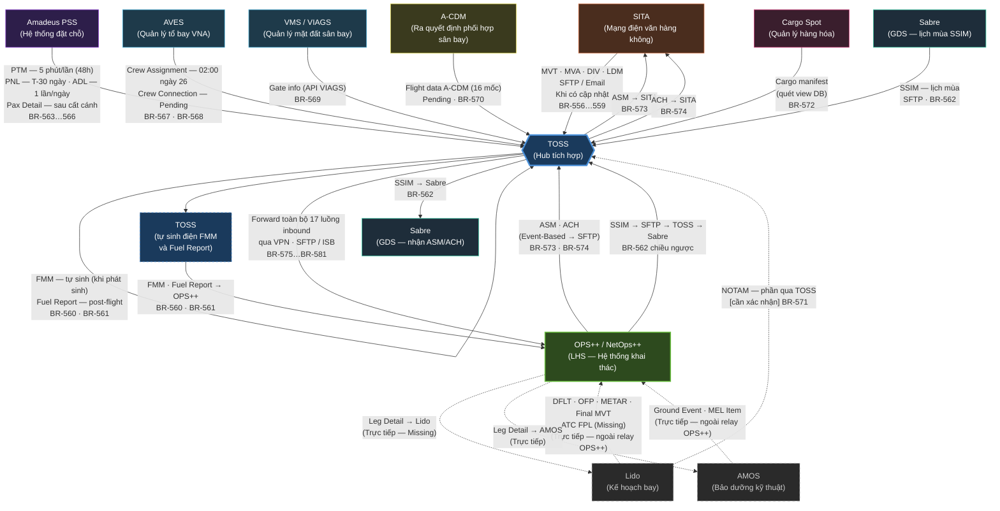
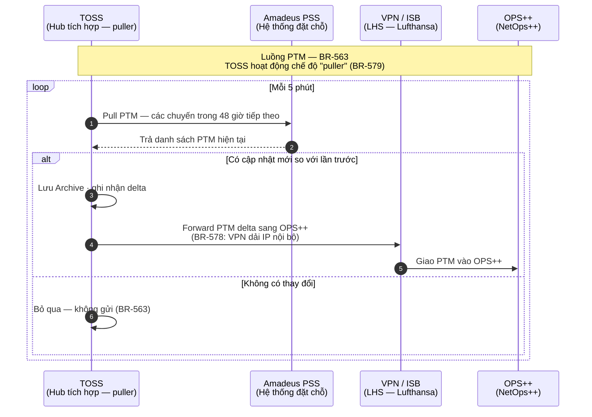
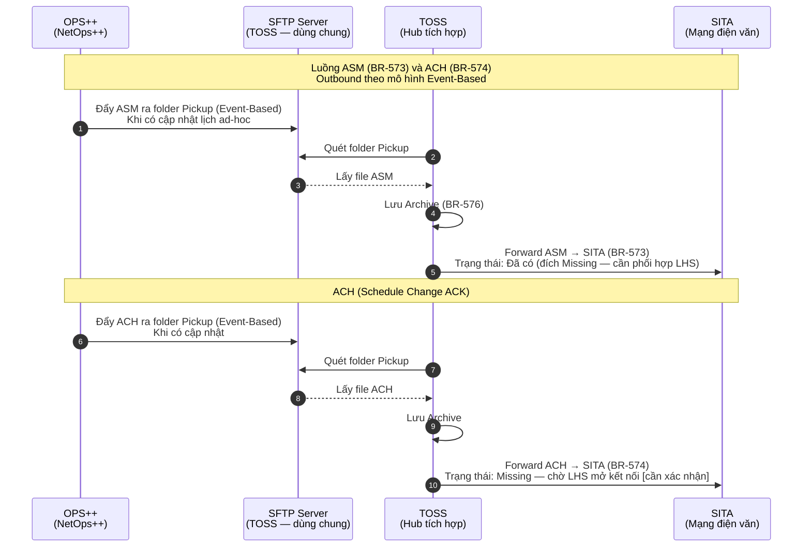

# Mô hình Tích hợp TOSS ↔ Hệ thống Ngoài

> **Nguồn chính:** Bảng "Thông tin tích hợp" Google Sheet v77 (pull 23/06/2026) · `PROPOSAL-BR-TICH-HOP-PH5-2026-06-23.md` (BR-556…BR-581) · `DOI-CHIEU-KS-BRD-1719-2026-06-23-v0.2.md` §2bis.
>
> **Quy ước đường:** Nét liền (`-->`) = luồng **"Thông qua TOSS"** (trong phạm vi relay OPS++, 19 luồng atomic). Nét đứt (`-.->`) = luồng **Trực tiếp / Ngữ cảnh** (ngoài phạm vi relay, nhưng vẽ để thấy bức tranh tổng thể).
>
> **AOS:** ngoài phạm vi TOSS — không vẽ.

---

## 1. Sơ đồ Ngữ cảnh Tích hợp

> 📐 **Bản draw.io chỉnh sửa được:** [`MO-HINH-TICH-HOP-TOSS-HE-THONG-NGOAI-v0.1.drawio`](MO-HINH-TICH-HOP-TOSS-HE-THONG-NGOAI-v0.1.drawio) — mở bằng [draw.io / diagrams.net](https://app.diagrams.net) (song song bản Mermaid bên dưới).



### Chú giải Sơ đồ Ngữ cảnh

| Ký hiệu | Ý nghĩa |
|---|---|
| `{{...}}` | TOSS — hub trung tâm |
| `[...]` | Hệ thống ngoài trong phạm vi kết nối |
| `-->` (nét liền) | Luồng **"Thông qua TOSS"** — trong phạm vi relay, có BR |
| `-.->` (nét đứt) | Luồng **Trực tiếp / Ngữ cảnh** — ngoài phạm vi relay OPS++ |
| Màu xanh đậm | OPS++ / NetOps++ (hệ thống đích chính của relay) |
| Màu xám viền đứt | Lido / AMOS — hệ thống kết nối trực tiếp với OPS++ (ngữ cảnh) |

---

## 2. Bảng Danh mục Luồng

> Nguồn: Sheet v77 (pull 23/06/2026) · BR-556…BR-581.

### 2A. Luồng TRONG phạm vi TOSS — "Thông qua TOSS" (19 luồng atomic)

| # | Nguồn | Đích | Loại dữ liệu / Điện văn | Kênh | Chiều | Phương thức | BR | Tần suất | Triển khai |
|---|---|---|---|---|---|---|---|---|---|
| 1 | SITA | TOSS → OPS++ | MVT (Movement Message) | SFTP + Email | Inbound | Thông qua TOSS | BR-556 | Khi có cập nhật | Đã có |
| 2 | SITA | TOSS → OPS++ | MVA (Movement Advice) | SFTP | Inbound | Thông qua TOSS | BR-557 | Khi có cập nhật | Đã có |
| 3 | SITA | TOSS → OPS++ | DIV (Divert Message) | SFTP + Email | Inbound | Thông qua TOSS | BR-558 | Khi có cập nhật | Đã có |
| 4 | SITA | TOSS → OPS++ | LDM (Load Message) | SFTP + Email | Inbound | Thông qua TOSS | BR-559 | Khi có cập nhật | **Missing** |
| 5 | TOSS (tự sinh) | TOSS → OPS++ | FMM (Fuel Monitoring Message) | SFTP | Inbound | Thông qua TOSS | BR-560 | Khi phát sinh | Đã có — [cần xác nhận] |
| 6 | TOSS (tự sinh) | TOSS → OPS++ | Fuel Report (post-flight) | SFTP | Inbound | Thông qua TOSS | BR-561 | Sau chuyến kết thúc | Đã có — [cần xác nhận] |
| 7 | Sabre | TOSS → OPS++ | SSIM (lịch mùa — chiều vào) | SFTP | Inbound | Thông qua TOSS | BR-562 | Có là gửi | **Missing** |
| 8 | Amadeus | TOSS → OPS++ | PTM (khách nối chuyến) | API/Pull | Inbound | Thông qua TOSS | BR-563 | 5 phút/lần (48h tiếp theo) | Đã có |
| 9 | Amadeus | TOSS → OPS++ | PNL (danh sách khách booking) | API/Pull | Inbound | Thông qua TOSS | BR-564 | 1 lần duy nhất T-30 ngày | Đã có |
| 10 | Amadeus | TOSS → OPS++ | ADL (cập nhật PNL) | API/Pull | Inbound | Thông qua TOSS | BR-565 | 1 lần/ngày (T-30 → T-0) | Đã có |
| 11 | Amadeus | TOSS → OPS++ | Pax Detail (khách thực tế) | API/Pull | Inbound | Thông qua TOSS | BR-566 | Sau cất cánh — [cần xác nhận] | Đã có |
| 12 | AVES | TOSS → OPS++ | Crew Assignment (tổ bay) | Pull | Inbound | Thông qua TOSS | BR-567 | 02:00 ngày 26 hàng tháng + quét cập nhật | Đã có |
| 13 | AVES | TOSS → OPS++ | Crew Connection (tổ bay nối chuyến) | Pull — Pending | Inbound | Thông qua TOSS | BR-568 | **Pending** | **Missing** |
| 14 | VMS / VIAGS | TOSS → OPS++ | Gate info | API (Service) | Inbound | Thông qua TOSS | BR-569 | [cần xác nhận] | **Missing** |
| 15 | A-CDM | TOSS → OPS++ | Flight data (16 mốc A-CDM) | Pull — Pending | Inbound | Thông qua TOSS | BR-570 | **Pending** | **Missing** |
| 16 | Lido / SITA | TOSS → OPS++ | NOTAM (phần "qua TOSS") | TBD — Pending | Inbound | Thông qua TOSS | BR-571 | **Pending** | Phần "trực tiếp" đã có; phần "qua TOSS" **Pending** |
| 17 | Cargo Spot | TOSS → OPS++ | Cargo (manifest hàng hóa) | Quét view DB | Inbound | Thông qua TOSS | BR-572 | Liên tục (tương tự PTM) | **Missing** |
| 18 | OPS++ | TOSS → SITA | ASM (Ad-hoc Schedule Message) | SFTP (Event-Based) | Outbound | Thông qua TOSS | BR-573 | Khi có cập nhật | Đã có (đích Missing) |
| 19 | OPS++ | TOSS → SITA | ACH (Schedule Change ACK) | SFTP (Event-Based) | Outbound | Thông qua TOSS | BR-574 | Khi có cập nhật | **Missing** |

> Ghi chú: Luồng SSIM (dòng 7) là 2 chiều — Sabre → TOSS → OPS++ và OPS++ → TOSS → Sabre — ghi nhận là 1 luồng SSIM (BR-562 phủ cả hai chiều per phát biểu BR). Tổng atomic = 19 luồng.

### 2B. Luồng NGOÀI phạm vi relay — "Trực tiếp" (Ngữ cảnh — không sinh BR)

| # | Nguồn | Đích | Loại dữ liệu | Kênh | Ghi chú | Sheet v77 |
|---|---|---|---|---|---|---|
| D1 | Lido | NetOps++ | DFLT (thông tin chuyến hàng ngày) | Trực tiếp | Ngoài relay | Dòng 14 |
| D2 | Lido | NetOps++ | OFP (kế hoạch bay) | Trực tiếp | Ngoài relay | Dòng 19 |
| D3 | Lido | NetOps++ | METAR (thời tiết) | Trực tiếp | Ngoài relay | Dòng 17 |
| D4 | Lido | NetOps++ | Final MVT (MVT IN) | Trực tiếp | Ngoài relay | Dòng 16 |
| D5 | Lido | NetOps++ | ATC FPL | Trực tiếp | Missing | Dòng 24 |
| D6 | AMOS | NetOps++ | Ground Event (lịch bảo dưỡng) | SFTP Event-based | Ngoài relay | Dòng 20 |
| D7 | AMOS | NetOps++ | MEL Item (MEL/CDL) | Trực tiếp | Ngoài relay | Dòng 21 |
| D8 | NetOps++ | Lido | Leg Detail Lido | Trực tiếp | Missing | Outbound D2 |
| D9 | NetOps++ | AMOS | Leg Detail AMOS | SFTP Event-based | Ngoài relay | Outbound D1 |

---

## 3. Sequence Diagram — Các Luồng Tiêu biểu

### 3.1 OFP và Tài liệu Lido → TOSS → MO Plus (ngữ cảnh TOSS kết nối nội bộ)

> Nguồn: `toss-glossary-v0.1.md` mục "Lido video"; khảo sát 11/06/2026; BR-528c (Lido). Luồng này là kết nối **nội bộ TOSS** lấy OFP từ Lido phục vụ điều phái — ngoài phạm vi relay OPS++.

```mermaid
sequenceDiagram
    autonumber
    participant Lido as Lido<br/>(Kế hoạch bay)
    participant TOSS as TOSS<br/>(Hub tích hợp)
    participant DP as Điều phái<br/>(Dispatcher)
    participant MOPlus as MO Plus<br/>(Tàu bay)

    Note over Lido,MOPlus: Luồng OFP — kết nối nội bộ (ngoài relay OPS++)<br/>Nguồn: khảo sát 11/06/2026; toss-glossary mục "Lido video"

    Lido->>TOSS: Adapter Lido tự động đẩy OFP<br/>(PDF + TXT + HTML — 3 định dạng song song)
    TOSS->>TOSS: Lưu OFP · gán OFP Version (R1, R2…)
    DP->>TOSS: Xem xét OFP · thực hiện Dispatch Release
    TOSS->>MOPlus: Đẩy OFP + tài liệu đã Release sang MO Plus<br/>(ba định dạng)
    MOPlus->>DP: Phi công xác nhận Captain's Release trên MO Plus
    Note over DP,TOSS: Dispatch Release phải hoàn tất<br/>trước Captain's Release (BR-528c)
```

---

### 3.2 MVT / MVA — SITA → TOSS → OPS++ (kênh kép)

> Nguồn: Sheet v77 dòng 1–2; BR-556, BR-557; khảo sát 19/06/2026 §II.2, §III.4–§III.7; toss-glossary mục MVT, MVA.

```mermaid
sequenceDiagram
    autonumber
    participant SITA as SITA<br/>(Mạng điện văn)
    participant SFTP as SFTP Server<br/>(TOSS — dùng chung)
    participant TOSS as TOSS<br/>(Hub tích hợp)
    participant VPN as VPN / ISB<br/>(LHS — Lufthansa)
    participant OPSPP as OPS++<br/>(NetOps++)

    Note over SITA,OPSPP: Luồng MVT (BR-556) và MVA (BR-557)<br/>SITA là nguồn PUSH duy nhất (BR-579 — ngoại lệ SITA)

    SITA->>SFTP: Đẩy điện MVT vào folder Temp<br/>(kênh SFTP — hiệu lực)<br/>BR-576: ghi 2 bước Temp → Pickup
    SITA->>TOSS: Đẩy điện MVT qua Email<br/>(kênh kép — BR-556; BR-577: email dùng chung)
    Note over SFTP,TOSS: Hai kênh song song — SFTP và Email<br/>Kênh nào hiệu lực chính? [cần xác nhận]
    SFTP->>TOSS: TOSS quét folder Pickup<br/>(move từ Temp khi đã ghi xong)
    TOSS->>TOSS: Lưu Archive (BR-576)<br/>Không xử lý nội dung — forward nguyên trạng
    TOSS->>VPN: Forward MVT qua VPN dải IP nội bộ<br/>(BR-578: xác thực Private Key + User Path)
    VPN->>OPSPP: Giao điện MVT vào OPS++

    Note over SITA,TOSS: MVA (BR-557): chỉ kênh SFTP — không có kênh Email
    SITA->>SFTP: Đẩy điện MVA vào folder Temp (SFTP only)
    SFTP->>TOSS: TOSS quét Pickup
    TOSS->>VPN: Forward MVA
    VPN->>OPSPP: Giao điện MVA vào OPS++
```

---

### 3.3 PTM Amadeus → TOSS → OPS++ (tần suất 5 phút, cửa sổ 48 giờ)

> Nguồn: Sheet v77 dòng 7; BR-563; khảo sát 23/06/2026 §II.7.



---

### 3.4 Outbound ASM / ACH — OPS++ → TOSS → SITA

> Nguồn: Sheet v77 Outbound dòng 3–4; BR-573, BR-574; khảo sát 23/06/2026 §II.12; toss-glossary mục "Event-Based output".



---

## 4. Điểm Cần Xác nhận `[cần xác nhận]`

> Tổng hợp các điểm chưa rõ từ nguồn. Mã D-x trỏ về `DOI-CHIEU-KS-BRD-1719-2026-06-23-v0.2.md` §4; mã OID trỏ về OID-TOSS-001.

| # | BR liên quan | Nội dung cần xác nhận | Trạng thái nguồn | Mã tham chiếu |
|---|---|---|---|---|
| 1 | BR-559 (LDM) | Khi nào LHS mở kết nối luồng LDM SITA → OPS++? Định danh kênh (SFTP hay Email)? | Sheet v77: Missing | D-8 |
| 2 | BR-560 (FMM) | Trường dữ liệu FMM mà OPS++ yêu cầu? Sự kiện trigger "có phát sinh" cụ thể là gì? | Khảo sát 23/06 §II.5: Pending | — |
| 3 | BR-561 (Fuel Report) | "Sau khi chuyến bay kết thúc" = sau IN-block hay sau lập biên bản kỹ thuật? Trường dữ liệu chuẩn? | Khảo sát 23/06 §II.10 | — |
| 4 | BR-556 + BR-558 (MVT/DIV) | Kênh kép SFTP + Email — kênh nào là kênh hiệu lực chính? Kênh còn lại có vai trò dự phòng không? | Sheet v77: ghi cả hai, không phân định | — |
| 5 | BR-566 (Pax Detail) | Trigger "sau cất cánh" = OFF-block, ACARS OFF, hay sau N phút? | Sheet v77 dòng 11: "Khách thực tế sau cất cánh" | — |
| 6 | BR-567 (Crew Assignment) | Ngưỡng "tổ bay <1000" — đếm cái gì (chuyến/người/thiết bị)? Có cấu hình được không? Danh sách email nhận cảnh báo? | Sheet v77 dòng 12 | D-11 |
| 7 | BR-568 (Crew Connection) | Logic toàn phần Pending: định kỳ hay sự kiện, tần suất, trường dữ liệu cần thiết? | Sheet v77 dòng 23: Pending | — |
| 8 | BR-569 (Gate info) | Endpoint API "flight status VIAGS" — có sample spec chưa? Tần suất gọi? | Sheet v77 dòng 13: Missing | D-12 |
| 9 | BR-570 (Flight data A-CDM) | Tập 16 mốc nào cần forward sang OPS++? Tần suất và trigger? | Sheet v77 dòng 15: Pending | — |
| 10 | BR-571 (NOTAM qua TOSS) | Phần NOTAM nào do TOSS phụ trách — phân định ranh giới với luồng Lido ↔ NetOps++ trực tiếp? | Sheet v77 dòng 18: "Trực tiếp - Thông qua TOSS" | D-2 |
| 11 | BR-572 (Cargo) | Tên view cụ thể trên Cargo Spot? Tài khoản DB read-only? Rules cập nhật (ngưỡng delta)? | Sheet v77 dòng 22: Missing | — |
| 12 | BR-574 (ACH outbound) | Khi nào LHS mở kết nối ACH TOSS → SITA? | Sheet v77 Outbound dòng 4: Missing | — |
| 13 | BR-580 (ISB outbound) | Danh mục dữ liệu nào lấy qua ISB (Event-Based / Request-Based) vs lấy qua Clone DB NetLine? | Khảo sát 23/06 §II.1, §II.12 | — |
| 14 | BR-581 (dual-source) | Năm cutover chính xác (ước tính ~03/2027)? Danh mục luồng chạy song song hai hệ thống? | Khảo sát 19/06 §III.13 | D-6 |

---

*Mô hình này chỉ phân rã và tái hiện thông tin từ nguồn đã dẫn. Mọi diễn giải logic chưa được nguồn ghi nhận được đánh dấu `[cần xác nhận]` — BA Lead quyết định.*
