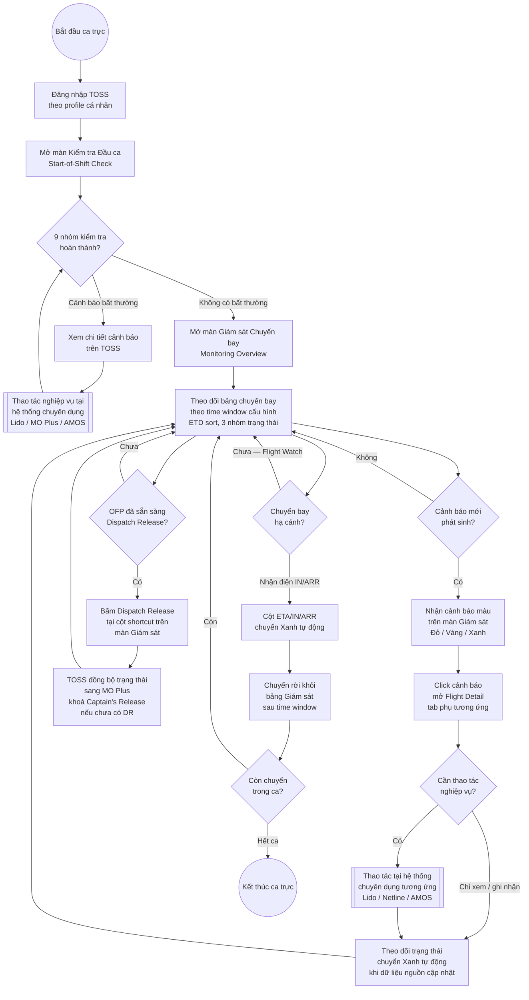
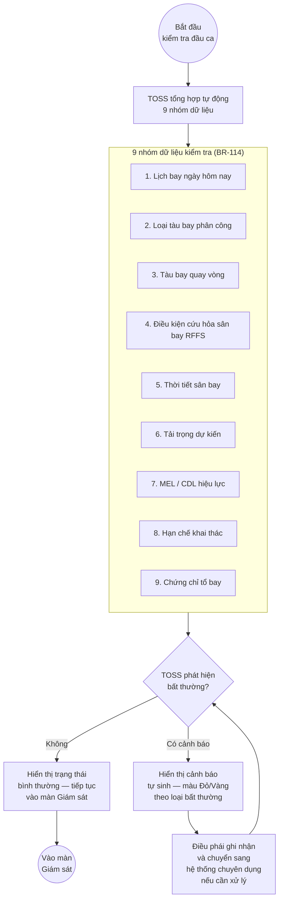
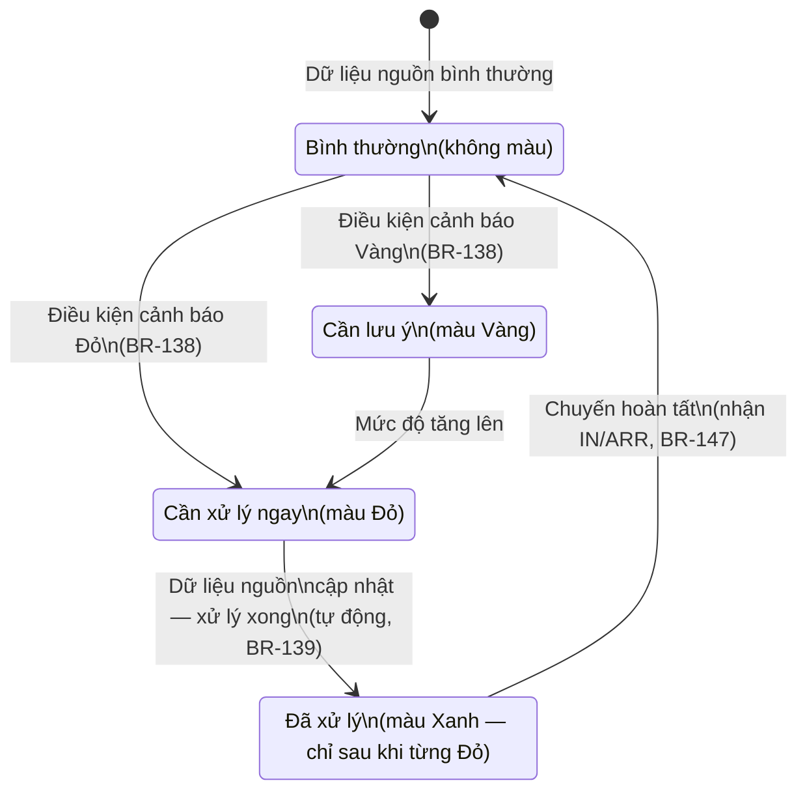
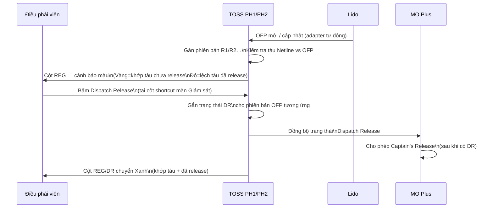

# Sơ đồ Quy trình To-Be — Phân hệ 1: Thông tin điều hành chuyến bay

> **Nguyên tắc (CLAUDE.md §0):** Sơ đồ này chỉ mô tả những gì đã được ghi nhận trong các nguồn BRD-TOSS-PH1 và ASIS-OCC-DISPATCH-v0.1.md. Nơi nào nguồn còn cờ `[cần xác nhận]` thì giữ nguyên cờ đó. Không suy diễn thêm bước hoặc logic chưa có trong nguồn.

---

## 1. Tổng quan phạm vi

| Trường | Giá trị |
|---|---|
| Phân hệ | PH1 — Thông tin điều hành chuyến bay |
| Actor chính | Điều phái viên (Dispatcher), Trực ban OCC, Trực ban Trưởng |
| Ranh giới hệ thống | TOSS PH1 (view + cảnh báo); Lido/Netline/AMOS/MO Plus là hệ thống chuyên dụng ngoài phạm vi điều khiển (BR-115) |
| Trigger (khởi động) | Đầu ca trực (Shift Start) — điều phái viên / trực ban đăng nhập TOSS |
| Kết thúc | Chuyến bay nhận điện IN/ARR, trạng thái Xanh (hoàn tất) |
| Nguồn BR | BR-101 … BR-150 (BRD-TOSS-PH1-thong-tin-dieu-hanh-v0.2.md) |

---

## 2. Sơ đồ To-Be — Luồng chính Điều phái viên (Dispatcher)

> Biểu diễn luồng làm việc trong một ca trực từ góc nhìn điều phái viên.

### Chú giải sơ đồ 2

- **`((...))`** — điểm bắt đầu / kết thúc quy trình.
- **`[...]`** — bước xử lý (activity) thực hiện trên TOSS.
- **`[[...]]`** — quy trình con tại hệ thống ngoài phạm vi TOSS (BR-115).
- **`{...}`** — điểm quyết định (decision gateway).
- **Mũi tên có nhãn** — nhánh có điều kiện.

---

## 3. Sơ đồ To-Be — Luồng Kiểm tra Đầu ca (Start-of-Shift Check)

> Nguồn: BR-114 — màn hình tập trung 9 nhóm nội dung, tự đối chiếu và sinh cảnh báo.

### Chú giải sơ đồ 3

- **subgraph** — nhóm nghiệp vụ (swim lane theo chức năng).
- TOSS chỉ đóng vai trò "view + cảnh báo" — không thực hiện nghiệp vụ chuyên dụng (BR-115).

---

## 4. Sơ đồ To-Be — Vòng đời Cảnh báo (Alert Lifecycle)

> Nguồn: BR-138, BR-139, BR-140 — bộ 4 mã màu thống nhất, tô màu ô, xanh chỉ sau khi từng Đỏ.

### Chú giải sơ đồ 4

- Trạng thái **Xanh** chỉ xuất hiện sau khi đã từng qua trạng thái Đỏ (BR-139).
- Đổi màu diễn ra **tự động** theo dữ liệu nguồn — điều phái không tick thủ công (BR-139).
- Trạng thái Xanh phục vụ thống kê khối lượng công việc (BR-140).

---

## 5. Sơ đồ To-Be — Luồng Dispatch Release

> Nguồn: BR-145, BR-213, BR-214 (PH2 tích hợp), BR-144.

### Chú giải sơ đồ 5

- Phạm vi giao diện cụ thể giữa TOSS và MO Plus cần làm rõ thêm (BR-214).
- Lido vẫn tự sinh OFP và đẩy lên MO Plus như hiện hành; TOSS bổ sung lớp quản lý phiên bản và trạng thái Release (BR-213).

---

## 6. So sánh As-Is → To-Be

### 6.1 Bảng so sánh theo bước quy trình

| Bước nghiệp vụ | Trạng thái As-Is | Trạng thái To-Be | Thay đổi | BR liên quan |
|---|---|---|---|---|
| Kiểm tra đầu ca | Điều phái tự tra thủ công nhiều hệ thống (Ops++, AMOS, Crew Trip, WNI…) | TOSS tổng hợp tự động 9 nhóm, tự sinh cảnh báo | **Thay thế thủ công** | BR-114 |
| Xem trạng thái chuyến bay | Mở 5–7 màn hình riêng biệt, tổng hợp bằng mắt | Bảng giám sát hợp nhất trên TOSS, time window tự trôi | **Thay thế/Hợp nhất** | BR-101, BR-125, BR-148 |
| Phát hiện bất thường | Phụ thuộc nhân viên nhìn màn hình | TOSS sinh cảnh báo màu tự động theo ngưỡng cấu hình | **Tự động hóa** | BR-103, BR-116–131, BR-138–139 |
| Tra NOTAM | Vào web nguồn bên ngoài thủ công `[Cần xác nhận]` | TOSS tích hợp NOTAM từ nguồn chính thức, phân loại và đánh giá ảnh hưởng | **Tích hợp mới** | BR-118 |
| Tra thời tiết | Vào WNI thủ công `[Cần xác nhận]` | TOSS parse METAR/SPECI, cảnh báo theo ngưỡng VMA | **Tích hợp mới** | BR-119 |
| Theo dõi MEL/CDL tàu bay | Tra Ops++ / AMOS riêng biệt | TOSS cảnh báo NAIL/CDL tự động gắn với chuyến bay trong khoảng hiệu lực | **Tích hợp mới** | BR-121 |
| Kiểm tra tổ bay | Tra Crew Trip thủ công | TOSS đối chiếu chứng chỉ tổ bay vs điều kiện sân bay, sinh cảnh báo | **Tích hợp mới** | BR-122, BR-123 |
| Kiểm tra lệch tải | Chưa rõ — `[Cần xác nhận As-Is]` | TOSS đối chiếu OFP vs số liệu CLC, cảnh báo theo ma trận ngưỡng | **Tích hợp mới** | BR-120 |
| Dispatch Release | Soạn thủ công / form `[Cần xác nhận As-Is]` | Bấm shortcut trên màn Giám sát, TOSS gán phiên bản và đồng bộ MO Plus | **Số hóa / Thay thế thủ công** | BR-145, BR-213 |
| Theo dõi chuyến đang bay | Xem Flight Radar màn riêng | TOSS nhúng liên kết FlightRadar24, Flight Watch giữ chuyến dài ngoài time window | **Tích hợp / Giữ nguyên kênh** | BR-105, BR-149 |
| Ghi nhận delay code | Thủ công `[Cần xác nhận]` | `[Chưa rõ trong nguồn — cần làm rõ với VNA]` | — | — |
| Báo cáo OTP cuối ngày | Tổng hợp thủ công từ nhiều nguồn | Thuộc phạm vi PH3 (Báo cáo tối ưu) — không nằm trong PH1 | Ngoài phạm vi PH1 | PH3 |
| Xem vị trí tàu bay trên bản đồ | Màn hình riêng (Flight Radar24 hoặc tương tự) | TOSS nhúng liên kết FlightRadar24 (BR-105) | **Giữ nguyên kênh, tích hợp vào TOSS** | BR-105 |
| Lưu lịch sử quyết định | Không có audit trail `[Cần xác nhận]` | TOSS lưu lịch sử thay đổi chuyến bay, lịch sử cảnh báo theo timeline UTC | **Tính năng mới** | BR-104, BR-150 |
| Cấu hình hiển thị cá nhân | Không có | Lưu filter/cột/trạng thái theo profile user, đăng nhập máy nào cũng giữ | **Tính năng mới** | BR-102, BR-142 |

### 6.2 Tổng hợp nhanh

| Loại thay đổi | Số bước | Ví dụ |
|---|---|---|
| Thay thế / Hợp nhất thủ công | 4 | Kiểm tra đầu ca, xem trạng thái chuyến, phát hiện bất thường, Dispatch Release |
| Tích hợp mới (hệ thống nguồn → TOSS) | 5 | NOTAM, WX, MEL/CDL, Tổ bay, Lệch tải |
| Tính năng mới hoàn toàn | 3 | Audit trail, profile cá nhân, cảnh báo Flight Type Code |
| Giữ nguyên kênh / tích hợp vào TOSS | 2 | FlightRadar24, Flight Watch |
| Chưa rõ trong nguồn | 2 | Ghi nhận delay code, báo cáo OTP (PH3) |

---

## 7. Giả định và ràng buộc

| # | Nội dung | Loại | Nguồn |
|---|---|---|---|
| GA-01 | TOSS PH1 đóng vai trò "view + cảnh báo" — các thao tác nghiệp vụ chuyên dụng vẫn ở Lido, MO Plus, AMOS. | Ràng buộc thiết kế | BR-115 |
| GA-02 | Nguồn NOTAM chính thức là VNCM/VNCS — tên cụ thể cần xác nhận. | Cần làm rõ | BR-118 `[cần xác nhận]` |
| GA-03 | Ngưỡng VMA cho cảnh báo thời tiết — tên đầy đủ và giá trị cần xác nhận. | Cần làm rõ | BR-119 `[cần xác nhận]` |
| GA-04 | Danh mục sân bay địa hình/điều kiện đặc thù cần điều kiện chứng chỉ đặc biệt (Điện Biên, Đồng Hới…) cần danh sách đầy đủ từ VNA. | Cần làm rõ | BR-122 `[cần xác nhận]` |
| GA-05 | Danh mục mã loại chuyến không thường lệ (O, Z, G, H, A, P, V…) cần xác nhận đầy đủ. | Cần làm rõ | BR-126 `[cần xác nhận]` |
| GA-06 | Ngưỡng phút trước STD để sinh cảnh báo PAX time cần xác nhận. | Cần làm rõ | BR-124 `[cần xác nhận]` |
| GA-07 | Dữ liệu từ Netline là nguồn thẩm quyền cho lịch bay và leg history — TOSS không tự xây dựng song song. | Ràng buộc thiết kế | BR-137 |
| GA-08 | Toàn bộ giao diện TOSS là tiếng Anh, giờ UTC 24h, dark mode ưu tiên. | Ràng buộc thiết kế | BR-143 |

---

*TOBE-PH1-OCC-DISPATCH v0.1 — 2026-06-17. Nguồn: BRD-TOSS-PH1-thong-tin-dieu-hanh-v0.2.md (BR-101…150), ASIS-OCC-DISPATCH-v0.1.md, PHAN-RA-BRD-PH1-thong-tin-dieu-hanh-chuyen-bay-v0.5.md.*
