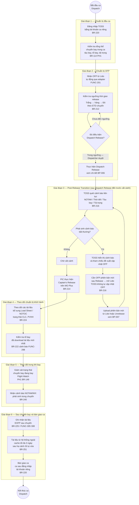
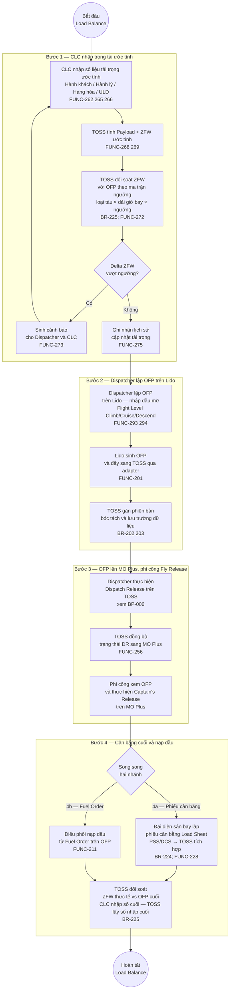

# Sơ đồ Quy trình To-Be — Phân hệ 2: Quản lý tài liệu chuyến bay

> **Nguyên tắc (CLAUDE.md §0):** Sơ đồ này chỉ mô tả những gì đã được ghi nhận trong BRD-TOSS-PH2 v0.6 và tài liệu phân rã FUNC v0.4. Nơi nào nguồn còn cờ `[cần xác nhận]` hoặc ghi "chưa chốt" thì giữ nguyên cờ đó trong diagram. Không suy diễn thêm bước hoặc logic chưa có trong nguồn.

---

## 1. Tổng quan phạm vi

| Trường | Giá trị |
|---|---|
| Phân hệ | PH2 — Quản lý tài liệu chuyến bay |
| Actor chính | Điều phái viên (Dispatcher), Phi công / Cơ trưởng (Pilot/Captain), Bộ phận Cân bằng Tải (CLC), Phục vụ Hàng hóa / Mặt đất (PVHH), KTKTB |
| Hệ thống liên quan | TOSS PH2, MO Plus, Lido, PSS/DCS, SkyOffice, Cita |
| Ranh giới hệ thống | TOSS PH2 quản lý toàn bộ vòng đời tài liệu chuyến bay; Lido / MO Plus / PSS/DCS là hệ thống chuyên dụng ngoài phạm vi điều khiển trực tiếp |
| Trigger (khởi động) | OFP nhận tự động từ Lido qua adapter; hoặc Dispatcher tải thủ công / upload |
| Kết thúc | Chuyến hạ cánh, tổ bay đã Confirm Release, tài liệu ngoài được tự xóa sau 3 ngày (BR-251) |
| Nguồn BR | BR-201 … BR-261 (BRD-TOSS-PH2 v0.6) |

---

## 2. Sơ đồ To-Be — BP-006: Dispatch Release → Captain's Release

> **Nguồn:** BR-205, BR-206, BR-207, BR-212, BR-213, BR-214 (BRD-TOSS-PH2 v0.6); FUNC-252…FUNC-258.
>
> **Mô tả luồng:** Dispatcher thực hiện Dispatch Release trên TOSS → TOSS đồng bộ sang MO Plus → Phi công thực hiện Captain's Release. TOSS chặn Captain's Release khi chưa có Dispatch Release.

```mermaid
sequenceDiagram
    participant Lido as Lido
    participant TOSS as TOSS PH2
    participant DSP as Điều phái viên
    participant MOPlus as MO Plus
    participant PIC as Phi công (Captain)

    Lido ->> TOSS: OFP mới tự động đẩy qua adapter\n(FUNC-201)
    TOSS ->> TOSS: Gán phiên bản R1/R2…\nbóc tách và lưu toàn bộ trường\n(BR-202, BR-203; FUNC-252)
    TOSS ->> DSP: Hiển thị trạng thái OFP\n4 trạng thái + mã màu Trắng/Vàng/Đỏ\n(BR-212, BR-213; FUNC-205)
    DSP ->> TOSS: Bấm Dispatch Release\n(thao tác chủ động có quyền — BR-207)
    TOSS ->> TOSS: Gắn trạng thái "đã Dispatch Release"\ncho phiên bản OFP tương ứng\nGhi lại audit — người thực hiện + thời gian\n(BR-205, BR-207; FUNC-253)
    TOSS ->> MOPlus: Đồng bộ trạng thái\nDispatch Release\n(BR-206; FUNC-256)
    Note over MOPlus: Nhận tín hiệu DR → mở khóa\nCaptain's Release cho phi công\n(phạm vi sửa MO Plus — xem OID KS-08)
    PIC ->> MOPlus: Thực hiện Captain's Release\n(Fly Release / Confirm OFP)
    MOPlus ->> TOSS: Trạng thái PIC Confirm cập nhật\n(BR-214; FUNC cột PIC Confirm)
    TOSS ->> DSP: Trạng thái OFP chuyển\n"Dispatch + Pilot đều đã release"\n(BR-213 trạng thái (d))
```

### Chú giải sơ đồ 2

- **`->>`** — thông điệp đồng bộ (synchronous message).
- **`Note over`** — chú thích phạm vi tại actor.
- Phạm vi điều chỉnh cụ thể phía MO Plus (chặn Captain's Release, thông báo "Dispatch chưa Release") được ghi nhận tại OID KS-08 — nằm ngoài phạm vi trực tiếp của TOSS nhưng phụ thuộc giao diện TOSS↔MO Plus.
- Cột **PIC Confirm** trên lưới giám sát TOSS theo dõi riêng biệt với Dispatch Release và Pilot Release (BR-214; OID KS-41 về ngưỡng cảnh báo khi PIC chưa confirm sát giờ).

---

## 3. Sơ đồ To-Be — BP-007: Unrelease và quay về OFP cũ

> **Nguồn:** BR-208, BR-209, BR-210, BR-211 (BRD-TOSS-PH2 v0.6); FUNC-276…FUNC-282.
>
> **Mô tả luồng:** Dispatcher bấm Unrelease → TOSS hiển thị danh sách phiên bản cũ → Dispatcher chọn phiên bản muốn quay về → TOSS sinh revision mới → đẩy sang MO Plus → reset Confirm Release của phi công → Dispatcher phải Dispatch Release lại trên bản mới.

```mermaid
flowchart TD
    S3((Bắt đầu\nUnrelease)) --> U1[Điều phái viên bấm Unrelease\ntrên phiên bản OFP đang ở trạng thái\nđã Dispatch Release\nFUNC-276]

    U1 --> U2[TOSS khóa tạm thời\ncả Dispatch Release và Pilot Release\nBR-211]

    U2 --> U3[TOSS hiển thị danh sách\ntoàn bộ phiên bản OFP\ncủa chuyến — để Dispatcher chọn\nFUNC-277]

    U3 --> U4[Điều phái chọn phiên bản cũ\nmuốn quay về]

    U4 --> U5[TOSS sinh revision mới\nvới nội dung phiên bản cũ được chọn\ngán số phiên bản mới\nFUNC-278\n*(quy ước đánh số — chờ xác nhận OID KS-21)*]

    U5 --> U6[TOSS đẩy revision mới\nsang MO Plus\nFUNC-278]

    U6 --> U7[MO Plus reset\ntrạng thái Confirm Release\ncủa phi công về 0\nBR-209; FUNC-279\n*(cơ chế notification — xem OID KS-20)*]

    U7 --> U8[Phi công nhận thông báo\ncần Confirm lại\ntrên phiên bản mới]

    U8 --> U9[Điều phái viên KHÔNG\nphải thao tác lại trên Lido\nFUNC-280]

    U9 --> U10{Cần khai thác\nbản mới chính thức?}

    U10 -->|Có| U11[Điều phái thực hiện\nDispatch Release lại\ntrên revision mới\nBR-210; FUNC-282]
    U11 --> E3((Kết thúc —\ntrở về BP-006))

    U10 -->|Chưa cần release ngay| U12[Tài liệu ở trạng thái\nchưa Dispatch Release\ntrên revision mới\nChờ Dispatcher xử lý]
    U12 --> E3
```

### Chú giải sơ đồ 3

- **`((...))`** — điểm bắt đầu / kết thúc.
- **`[...]`** — bước xử lý (activity).
- **`{...}`** — điểm quyết định.
- Bước U7 (reset Confirm Release phía MO Plus): việc thực thi diễn ra trên MO Plus; chi tiết tín hiệu/payload/timing cần làm rõ (OID KS-20).
- Quy ước gán số phiên bản sau Unrelease (vd "2.1" hay auto-tăng "v4") chờ chốt (OID KS-21; sơ bộ 15/06 chốt auto-tăng version cao hơn).

---

## 4. Sơ đồ To-Be — BP-008: 6 Giai đoạn Module Dispatch

> **Nguồn:** BR-216 (Phase 3 Post-Release Transition), BR-212 (ngưỡng release), BR-213 (4 trạng thái OFP), BR-222 (cảnh báo tài liệu), BR-214 (PIC Confirm); KS 11/06 chiều §II.5, §II.8.
>
> **Mô tả:** Module Dispatch trên TOSS có 6 giai đoạn từ đầu ca đến sau chuyến.



### Chú giải sơ đồ 4

- **`subgraph`** — làn bơi theo giai đoạn thời gian (Phase).
- Giai đoạn 3 (Post-Release Transition): TOSS chỉ cảnh báo và tham chiếu — mọi thao tác cập nhật OFP sau Release phải mở Lido (BR-216).
- Giai đoạn 6: EOFP và vòng đời tài liệu xử lý theo BR-225 và BR-251.

---

## 5. Sơ đồ To-Be — BP-011: Bulk Document Upload và Weather Multi-Flight

> **Nguồn:** BR-236, BR-237, BR-238, BR-239, BR-249, BR-250 (BRD-TOSS-PH2 v0.6); FUNC-246…FUNC-248, FUNC-287…FUNC-291.
>
> **Mô tả:** Hai luồng song song — tải hàng loạt tự gắn vào chuyến theo quy ước tên file; Weather Multi-Flight chọn khoảng thời gian → tự gắn toàn bộ chuyến trong khoảng ~3h.

```mermaid
flowchart TD
    S5((Bắt đầu\ntải tài liệu)) --> B1{Loại tải\ntài liệu?}

    B1 -->|Tải hàng loạt\ntài liệu chuyến| BK1

    subgraph BulkUpload ["Luồng A — Tải tài liệu hàng loạt (BR-250)"]
        BK1[Dispatcher chọn khu vực\ntải hàng loạt trên TOSS\nFUNC-246]
        BK1 --> BK2[Upload nhiều file\nPDF / DOCX / ảnh / TXT\nBR-249; FUNC-224]
        BK2 --> BK3[TOSS đọc quy ước tên file\ntự động gắn vào đúng chuyến\nFUNC-247\n*(quy ước đặt tên cụ thể — xem OID KS-05)*]
        BK3 --> BK4[Tài liệu hiển thị\ntrên dashboard chuyến tương ứng\nFUNC-332]
    end

    B1 -->|Weather\nMulti-Flight| WX1

    subgraph WeatherMulti ["Luồng B — Weather Multi-Flight (BR-236, BR-237)"]
        WX1[Dispatcher chọn khoảng\nthời gian hiệu lực\ntừ giờ X đến giờ Y ~3 tiếng\nFUNC-287]
        WX1 --> WX2[Upload file thời tiết\nkhu vực / đường bay\nBR-236]
        WX2 --> WX3[TOSS tự gắn file\nvào toàn bộ chuyến có ETD\nnằm trong khoảng hiệu lực\nFUNC-288]
        WX3 --> WX4{Hai khoảng hiệu lực\nchồng nhau\ncùng một chuyến?}
        WX4 -->|Có| WX5[Chuyến nhận\ncả hai file\nFUNC-290]
        WX4 -->|Không| WX6[Gắn file theo khoảng\nhiệu lực tương ứng]
        WX5 --> WX7[Dispatcher quyết định\nẩn hoặc hiện tài liệu\ntrên MO Plus\nBR-239; FUNC-291]
        WX6 --> WX7
    end

    BK4 --> E5((Hoàn tất\ntải tài liệu))
    WX7 --> E5
```

### Chú giải sơ đồ 5

- Hai luồng A và B chạy độc lập — có thể sử dụng đồng thời (BR-237).
- Quy ước tên file tự gắn chuyến (Bulk Upload): chưa chốt chi tiết, xem OID KS-05.
- Điều phái có thể ẩn/hiện tài liệu trên MO Plus (áp dụng trước mắt cho file Weather Multi-Flight — BR-239).
- Cơ chế xử lý trùng tên file phía MO Plus (hardcode "latest by name") cần phối hợp đội MO Plus (BR-238; OID KS-24).

---

## 6. Sơ đồ To-Be — BP-012: Vòng đời tài liệu (Document Lifecycle)

> **Nguồn:** BR-251 (lưu trữ), BR-203 (phiên bản OFP), BR-208 (Unrelease), BR-240 (revision NOTAM/WX), BR-249 (đa định dạng); FUNC-249…FUNC-251, FUNC-282.
>
> **Mô tả:** Tài liệu TOSS tự sinh ra lưu trong hệ thống; tài liệu ngoài kéo về khi tải, lưu tối đa 3 ngày sau hạ cánh rồi tự xóa.

```mermaid
stateDiagram-v2
    [*] --> Chua_co : Chuyến được lên lịch

    Chua_co --> Da_nhan : OFP nhận tự động từ Lido\n(BR-201; FUNC-201)
    Chua_co --> Da_nhan : Dispatcher tải thủ công\n(BR-249; FUNC-225)

    Da_nhan --> Da_phat_hanh : Dispatch Release\n(BR-205; FUNC-253)

    Da_phat_hanh --> Revision_moi : Unrelease → chọn phiên bản cũ\n→ sinh revision mới\n(BR-208; FUNC-278)
    Revision_moi --> Da_phat_hanh : Dispatch Release lại\n(BR-210; FUNC-282)

    Da_phat_hanh --> Pilot_da_confirm : Captain's Release / Confirm\n(BR-206, BR-214)

    Pilot_da_confirm --> Revision_moi : Revision NOTOC kể cả khi\nphi công đã confirm\n(BR-230)

    Pilot_da_confirm --> Sau_ha_canh : Chuyến hạ cánh — nhận IN/ARR

    Sau_ha_canh --> Tu_xoa : Tài liệu từ hệ thống ngoài\nlưu tối đa 3 ngày\nsau đó tự xóa\n(BR-251)
    Sau_ha_canh --> Luu_tru_vinh_vien : Tài liệu do TOSS tự sinh\nlưu trong hệ thống\n(BR-251)

    Chua_co : Chưa có tài liệu
    Da_nhan : Đã nhận — chưa Dispatch Release
    Da_phat_hanh : Đã Dispatch Release
    Revision_moi : Revision mới\n(nội dung phiên bản cũ)
    Pilot_da_confirm : Phi công đã Confirm Release
    Sau_ha_canh : Sau hạ cánh
    Tu_xoa : Đã tự xóa\n(tài liệu ngoài)
    Luu_tru_vinh_vien : Lưu trữ trong TOSS\n(tài liệu nội bộ)
```

### Chú giải sơ đồ 6

- Sơ đồ trạng thái (`stateDiagram-v2`) theo dõi vòng đời của **một tài liệu chuyến** (đặc biệt là OFP).
- Tài liệu tự sinh bởi TOSS (OFP phiên bản TOSS, NOTOC số hóa, W&B…) lưu vĩnh viễn trong hệ thống.
- Tài liệu kéo từ hệ thống ngoài chỉ lưu cache sau khi người dùng tải xuống; tự xóa sau 3 ngày hạ cánh (BR-251).
- Thời gian lưu theo từng loại tài liệu có thể cấu hình — OID KS-49.

---

## 7. Sơ đồ To-Be — BP-013: Load Balance 4 bước

> **Nguồn:** BR-224 (Load Sheet từ PSS/DCS), BR-225 (đối soát ZFW), BR-228 (W&B), BR-216 (giai đoạn Chuẩn bị OFP), BR-206 (đồng bộ MO Plus); FUNC-262…FUNC-275, FUNC-228…FUNC-233.
>
> **Mô tả 4 bước:** (1) CLC nhập trọng tải ước tính → (2) Dispatcher lập OFP + Lido → (3) OFP lên MO Plus phi công Fly Release → (4a) Đại diện sân bay lập phiếu cân bằng / (4b) Điều phối nạp dầu từ Fuel Order.



### Chú giải sơ đồ 7

- Ngưỡng Delta ZFW theo ma trận nhiều chiều: loại tàu bay × dải giờ bay × ngưỡng trên/dưới không đối xứng (BR-225; OID KS-14 chứa bảng ngưỡng chi tiết).
- Khi CLC nhập lại nhiều lần: TOSS luôn lấy số nhập **cuối cùng** để đối chiếu với OFP cuối cùng (BR-225).
- Bước 4a (phiếu cân bằng) và 4b (Fuel Order) diễn ra song song sau Captain's Release.

---

## 8. Sơ đồ To-Be — BP-014: NOTOC số hóa

> **Nguồn:** BR-229, BR-230, BR-231, BR-232, BR-233, BR-234 (BRD-TOSS-PH2 v0.6); FUNC-299…FUNC-317 (mục NOTOC), FUNC-332…FUNC-335.
>
> **Mô tả:** Bóc tách điện FM từ Cita/email → đẩy PDF lên trang phim cargo → submit lên MO Plus → phi công confirm; cho phép tạo revision mới kể cả khi phi công đã confirm; tình huống 2 NOTOC/chuyến tại SGN *(chưa chốt phương án chính thức)*.

```mermaid
flowchart TD
    S7((Bắt đầu\nNOTOC)) --> N1{Nguồn dữ liệu\nNOTOC?}

    N1 -->|Sân bay có điện NTM\nvd Nội Bài — qua Cita| NC1

    subgraph NguonCita ["Luồng A — Từ điện FM qua Cita (BR-229)"]
        NC1[Cita nhận điện FM\ntừ nguồn hàng hóa]
        NC1 --> NC2[TOSS bóc tách điện FM\ntự động đưa vào form NOTOC\nBR-229; FUNC-...cita]
    end

    N1 -->|Nhập tay từ tờ khai giấy\nvà thông tin chất xếp kho| NM1

    subgraph NguonTay ["Luồng B — Nhập tay (BR-229)"]
        NM1[PVHH / KTKTB nhập tay\ndữ liệu từ tờ khai khách hàng\nvà thông tin chất xếp thực tế từ kho\nBR-229\nKhông lấy từ Go Support hay hệ thống khác]
    end

    NC2 --> N2[Tạo form NOTOC trên TOSS]
    NM1 --> N2

    N2 --> N3{SGN — có 2 loại\nhàng nội địa + quốc tế transit?}
    N3 -->|Không — một NOTOC| N4[Hoàn thiện\nmột form NOTOC]
    N3 -->|Có — tại Tân Sơn Nhất| N5[Điền form thứ nhất\nhàng nội địa\nBR-233]
    N5 --> N6[Điền form thứ hai\nhàng quốc tế transit\nTùy chọn — không bắt buộc sân bay khác\nBR-233\n*(phương án chính thức part1/part2 — chưa chốt\nVTIT làm việc thêm với ATS)*]
    N6 --> N7[TOSS gộp hai form\nsinh một file NOTOC hai trang\nBR-233]
    N7 --> N4

    N4 --> N8[Đẩy PDF NOTOC\nlên MO Plus — submit cho phi công\nFUNC-...submit]

    N8 --> N9[Phi công xem NOTOC\nvà Confirm / Reject\ntrên MO Plus]

    N9 --> N10{Phản hồi của phi công?}
    N10 -->|Reject toàn phần\nmàu đỏ| N11[Hiển thị Reject toàn phần\nmàu đỏ — ghi lịch sử\nBR-232]
    N10 -->|Reject một phần\nmàu cam| N12[Hiển thị Reject một phần\nmàu cam — ghi lịch sử\nchi tiết số/vị trí chất xếp\nBR-232]
    N10 -->|Confirm OK| N13[NOTOC trạng thái\nConfirm OK]

    N11 --> N14[Tạo Revision NOTOC mới\nBR-230 231]
    N12 --> N14
    N13 --> N14

    N14{Cần revision NOTOC\nkể cả phi công\nđã Confirm OK?}
    N14 -->|Có — BR-230 mở quy tắc| N15[Bắt đầu lại quy trình\ntạo revision mới\nkhông sửa file cũ — phải tạo mới\nBR-231]
    N15 --> N2
    N14 -->|Không cần revision| E7((NOTOC\nhoàn tất))
```

### Chú giải sơ đồ 8

- Hai luồng nhập liệu A (Cita/FM) và B (nhập tay) hợp nhất vào form NOTOC trên TOSS.
- Tình huống 2 NOTOC/chuyến tại SGN (Tân Sơn Nhất): form thứ hai là tùy chọn (option) — không bắt buộc cho mọi sân bay (BR-233); phương án chính thức "part 1/part 2" chờ làm việc với ATS.
- BR-230: phi công đã Confirm OK rồi vẫn được phép tạo revision mới — đây là yêu cầu mở quy tắc so với quy trình cũ.
- Phiên bản mobile NOTOC (BR-234): hạ ưu tiên Should; cung cấp chức năng tương đương web.
- Chế độ sandbox/test cho NOTOC (BR-235): hạ ưu tiên Should; xem PH5 BR-542 cho cơ chế đồng bộ PROD→TEST.

---

## 9. Sơ đồ To-Be — BP-015: Backup khi Lido lỗi

> **Nguồn:** BR-218 (backup), BR-249 (đa định dạng), BR-250 (upload); FUNC-283…FUNC-286.
>
> **Mô tả:** Khi Lido không sinh được OFP, TOSS cung cấp link download raw 3 định dạng PDF/TXT/HTML của chuyến tương tự → Dispatcher sửa tay → upload lại → TOSS đẩy 3 định dạng lên MO Plus.

```mermaid
flowchart TD
    S8((Lido\nkhông sinh được OFP)) --> BU1{TOSS phát hiện\nadapter Lido lỗi?}
    BU1 -->|Có — cảnh báo| BU2[TOSS sinh cảnh báo\nadapter / parse / đẩy lỗi\nFUNC-329 330 331\nBR-231]
    BU1 -->|Dispatcher phát hiện thủ công| BU2

    BU2 --> BU3[Dispatcher tìm chuyến tương tự\ntrên TOSS — cùng tuyến đường / loại tàu\ntừ ngày trước làm template\nFUNC-283]

    BU3 --> BU4[Download gói raw OFP\ncủa chuyến tương tự\n3 định dạng: PDF + TXT + HTML\nBR-218; FUNC-283]

    BU4 --> BU5[Dispatcher sửa thủ công\nnội dung cần cập nhật\ngiờ / dầu mỡ / ADC / Brady\nFlight Level\nGiữ nguyên: số hiệu tàu + đường bay\nBR-218; FUNC-284\n*(viết tắt Brady / ADC — xem OID SME-28)*]

    BU5 --> BU6[Dispatcher upload lại\nlên TOSS\nFUNC-284]

    BU6 --> BU7[TOSS gán phiên bản\ntheo thứ tự nhận\nnhư bản nhận từ adapter Lido\nFUNC-286]

    BU7 --> BU8[TOSS đẩy đủ\n3 định dạng lên MO Plus\nPDF → hiển thị\nTXT → bóc tách NOTAM/giờ\nHTML → bóc tách group/section\nBR-218; FUNC-285]

    BU8 --> BU9[Luồng Release/Unrelease\ntiếp tục bình thường\ntrên phiên bản backup\nFUNC-286]

    BU9 --> E8((Hoàn tất\nBackup OFP))
```

### Chú giải sơ đồ 9

- Cả 3 định dạng PDF / TXT / HTML đều cần thiết vì MO Plus sử dụng từng định dạng cho mục đích khác nhau (BR-218; FUNC-285).
- Dispatcher chỉ sửa các trường **có thể thay đổi** (giờ, dầu mỡ, ADC, Brady, Flight Level); không sửa số hiệu tàu và đường bay.
- Sau khi upload backup thành công, luồng Dispatch Release / Unrelease hoạt động bình thường trên phiên bản backup như các phiên bản khác.
- Viết tắt Brady / ADC cần làm rõ thêm (OID SME-28).

---

## 10. So sánh As-Is → To-Be

> **Lưu ý:** Bảng so sánh chỉ liệt kê các điểm **đã có mô tả As-Is** trong nguồn. Các bước To-Be hoàn toàn mới (không có tiền thân rõ ràng trong As-Is) không đưa vào bảng này.

| Bước nghiệp vụ | Trạng thái As-Is | Trạng thái To-Be | Loại thay đổi | BR liên quan |
|---|---|---|---|---|
| Dispatch Release | Soạn thủ công / qua form riêng (chưa tích hợp MO Plus) | Bấm nút trên TOSS, tự đồng bộ sang MO Plus, MO Plus chặn Captain's Release khi chưa có DR | Số hóa + Tích hợp | BR-205, BR-206 |
| Unrelease / quay về OFP cũ | Phải thao tác lại trên Lido, không có luồng số hóa | Bấm Unrelease trên TOSS, TOSS sinh revision mới từ phiên bản cũ, đẩy sang MO Plus, không cần vào Lido | Tự động hóa mới | BR-208, BR-210 |
| Upload tài liệu thời tiết | Upload riêng lẻ từng chuyến qua FME hoặc kênh hiện hành | Song song hai luồng: upload riêng từng chuyến và Weather Multi-Flight tự gắn khoảng ~3h | Tính năng mới song song | BR-236, BR-237 |
| Lưu trữ tài liệu chuyến | Lưu theo quy ước hệ thống cũ (Netline), không phân biệt nguồn gốc | Tài liệu TOSS tự sinh lưu vĩnh viễn; tài liệu ngoài lưu tối đa 3 ngày sau hạ cánh rồi tự xóa | Quy tắc lưu trữ mới | BR-251 |
| NOTOC — Quy tắc revision | Phi công chưa confirm mới được revision | Cho phép revision mới kể cả khi phi công đã confirm OK | Mở rộng quy tắc | BR-230 |
| NOTOC — Nguồn nhập liệu | Nhập tay từ tờ khai giấy (một nguồn) | Nhập tay từ tờ khai giấy HOẶC bóc tách tự động từ điện FM qua Cita (Nội Bài) | Tích hợp mới (Cita) | BR-229 |
| Backup khi Lido lỗi | Dispatcher tự tìm template thủ công, upload 1 định dạng PDF | TOSS cung cấp link download 3 định dạng chuyến tương tự; sau khi upload TOSS đẩy đủ PDF+TXT+HTML lên MO Plus | Số hóa + Chuẩn hóa | BR-218 |
| Tải tài liệu hàng loạt | Gắn thủ công từng tài liệu vào từng chuyến | TOSS tự gắn theo quy ước tên file *(quy ước đặt tên chờ chốt — OID KS-05)* | Tự động hóa mới | BR-250 |
| Quản lý phiên bản OFP | Lido không có khái niệm phiên bản; tổ bay lấy bản mới nhất không kiểm soát | TOSS gán phiên bản R1/R2…, lưu lịch sử toàn bộ, hiển thị 4 trạng thái OFP với mã màu | Tính năng quản lý mới | BR-202, BR-203, BR-213 |
| Cảnh báo tài liệu thiếu / chưa tải | Không có cảnh báo tự động | TOSS sinh cảnh báo "thiếu tài liệu" và "tổ bay chưa tải bản mới nhất" từ dữ liệu MO Plus | Tự động hóa mới | BR-222 |

---

### Chú giải chung toàn tài liệu

| Ký hiệu | Ý nghĩa |
|---|---|
| **`((...))`** | Điểm bắt đầu / kết thúc quy trình |
| **`[...]`** | Bước xử lý (activity) — thực hiện trên TOSS hoặc actor |
| **`{...}`** | Điểm quyết định (decision gateway) |
| **`[[...]]`** | Quy trình con tại hệ thống ngoài phạm vi TOSS |
| **`subgraph`** | Làn bơi (swim lane) theo giai đoạn hoặc luồng |
| **`sequenceDiagram`** | Tương tác có thứ tự thời gian giữa nhiều actor/hệ thống |
| **`stateDiagram-v2`** | Vòng đời trạng thái của một thực thể |
| **`*(chờ xác nhận)*`** | Điểm chưa chốt — cờ giữ nguyên từ nguồn BRD/FUNC |
| **OID KS-xx** | Điểm cần chốt — xem `SO-THEO-DOI-DIEM-CHOT-v0.1.md` |

---

*TOBE-PH2 v0.1 — 2026-06-17. Nguồn: BRD-TOSS-PH2-tai-lieu-chuyen-bay-v0.6.md (BR-201…BR-261) + PHAN-RA-BRD-PH2-quan-ly-tai-lieu-chuyen-bay-v0.4.md (FUNC-201…FUNC-347). Điểm cần chốt: OID KS-05, KS-08, KS-20, KS-21, KS-24, KS-41, KS-49, SME-28.*
