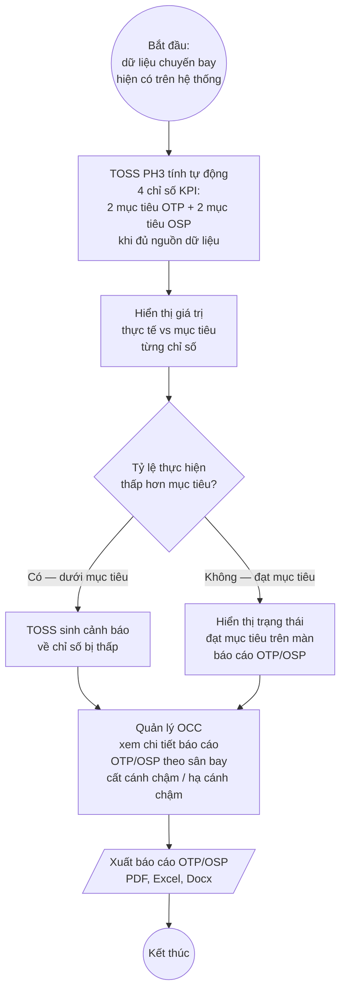

# Sơ đồ Quy trình To-Be — Phân hệ 3: Báo cáo & Tối ưu khai thác

> **Nguyên tắc (CLAUDE.md §0):** Sơ đồ này chỉ mô tả những gì đã được ghi nhận trong các nguồn BRD-TOSS-PH3 và PHAN-RA-BRD-PH3 đã trích dẫn. Nơi nào nguồn còn cờ `[cần xác nhận]` hoặc "chưa có nguồn" thì giữ nguyên cờ đó (`*(chờ xác nhận)*`). Không suy diễn thêm bước hoặc logic chưa có trong nguồn.

---

## 1. Tổng quan phạm vi

| Trường | Giá trị |
|---|---|
| Phân hệ | PH3 — Báo cáo & Tối ưu khai thác |
| Actor chính | Trực ban Trưởng (OCC Chief), Bộ phận Kỹ thuật, Bộ phận Dịch vụ, Quản lý OCC, TOSS PH3 |
| Ranh giới hệ thống | TOSS PH3 tổng hợp + trình bày báo cáo; dữ liệu nguồn từ Netline, AMOS, Lido, ACARS, QAR, CLC, Load Sheet, MO Plus |
| Trigger (khởi động) | Đầu ngày khai thác (sinh BCAO) hoặc theo yêu cầu người dùng (báo cáo on-demand) hoặc theo lịch (scheduled report) |
| Kết thúc | BCAO được phê duyệt và phát hành / Báo cáo phân tích được trả về người dùng |
| Nguồn BR | BR-311 … BR-321 (BRD-TOSS-PH3-bao-cao-toi-uu-v0.5.md §7.3.2 – §7.3.3) |
| Nguồn FUNC | FUNC-304 … FUNC-368 (PHAN-RA-BRD-PH3-quan-ly-bao-cao-toi-uu-khai-thac-v0.3.md) |

---

## 2. Sơ đồ To-Be — BP-010: Lập và phát hành BCAO

> **Nguồn:** BR-311, BR-312, BR-313, BR-314, BR-315 (BRD §7.3.2); FUNC-304 … FUNC-327 (PHAN-RA §BR-302 … §BR-304); Khảo sát 08/06/2026 §II.4; Khảo sát 09/06/2026 §II.7.

```mermaid
flowchart TD
    S((Bắt đầu\nnhư kỳ ngày mới)) --> A1[TOSS PH3 tự động thu thập\ndữ liệu từ Netline, AMOS, Lido,\nCLC — điền sẵn các trường\ntổng hợp được vào BCAO]

    subgraph Lan_KyThuat ["Làn: Bộ phận Kỹ thuật"]
        B1[Đăng nhập TOSS\nmở Tab Kỹ thuật\ncủa BCAO hôm nay]
        B2[Nhập phụ lục kỹ thuật:\nAOG, lệnh công việc,\ntình trạng APU/PACK]
        B3[Lưu Tab Kỹ thuật]
    end

    subgraph Lan_DichVu ["Làn: Bộ phận Dịch vụ"]
        C1[Đăng nhập TOSS\nmở Tab Dịch vụ\ncủa BCAO hôm nay]
        C2[Nhập dữ liệu dịch vụ\nthuộc trách nhiệm\nbộ phận dịch vụ]
        C3[Lưu Tab Dịch vụ]
    end

    subgraph Lan_TrucBanTruong ["Làn: Trực ban Trưởng"]
        D1[Đăng nhập TOSS\nmở Tab Tổng quan\ncủa BCAO hôm nay]
        D2[Kiểm tra dữ liệu\ntự động thu thập:\nsố chuyến, OTP/OSP, LF,\nsố tàu khai thác/dự bị]
        D3[Nhập bổ sung sự kiện\nbất thường chưa có\ntrong nguồn tích hợp:\nchọn tàu → chọn chuyến\n→ chọn mã nguyên nhân\n→ ghi chú chi tiết]
        D4{Bổ sung\nyếu nhân /\nchuyên cơ?}
        D5A[Kiểm tra tự động:\nTOSS nhận mác từ nguồn\ntích hợp *(chờ xác nhận)*]
        D5B[Tích chọn thủ công\nyếu nhân / chuyên cơ\ntừ danh sách chuyến đã lọc]
        D6[Trực ban Trưởng\nxem trước BCAO\ntrực quan — biểu đồ]
        D7{BCAO\nhoàn chỉnh?}
        D8[Trình phê duyệt BCAO]
    end

    subgraph Lan_QuanLy ["Làn: Quản lý OCC (người phê duyệt)"]
        E1{Phê duyệt?}
        E2[Phát hành BCAO\nqua email — không ký số\ntới danh sách đầu mối\nđã cấu hình]
        E3[Yêu cầu chỉnh sửa\ntrả về Trực ban Trưởng]
    end

    A1 --> B1
    A1 --> C1
    A1 --> D1

    B1 --> B2 --> B3
    C1 --> C2 --> C3
    D1 --> D2

    B3 --> D2
    C3 --> D2

    D2 --> D3
    D3 --> D4
    D4 -->|Có| D5A
    D5A -->|Nguồn có mác| D6
    D5A -->|Nguồn thiếu mác| D5B
    D5B --> D6
    D4 -->|Không| D6
    D6 --> D7
    D7 -->|Còn thiếu| D3
    D7 -->|Đủ| D8

    D8 --> E1
    E1 -->|Duyệt| E2
    E1 -->|Yêu cầu sửa| E3
    E3 --> D2
    E2 --> END((Kết thúc —\nBCAO phát hành))
```

### Chú giải sơ đồ 2

- **`((...))`** — điểm bắt đầu / kết thúc quy trình.
- **`[...]`** — bước xử lý (activity) thực hiện trên TOSS.
- **`{...}`** — điểm quyết định (decision gateway).
- **`subgraph`** — làn (swim lane) theo vai trò.
- **Mũi tên có nhãn** — nhánh có điều kiện.
- `*(chờ xác nhận)*` — tên hệ thống nguồn cấp mác yếu nhân/chuyên cơ chưa được xác nhận (xem OID: SME-09).

### Điểm thay đổi chính so với As-Is

| Bước | As-Is | To-Be | Loại thay đổi | BR |
|---|---|---|---|---|
| Thu thập số liệu BCAO | Các bộ phận nhập tay toàn bộ vào Word | TOSS tự động thu thập tối đa; chỉ nhập phần chuyên môn | Tự động hóa | BR-312 |
| Màn hình soạn thảo | File Word riêng từng người, email qua lại | Một màn hình chung, phân quyền theo tab | Số hóa / Hợp nhất | BR-313 |
| Nhập bất thường | Free text trong Word | Chọn tàu → chọn chuyến → chọn mã nguyên nhân → ghi chú | Chuẩn hóa dữ liệu | BR-315 |
| Nhận diện yếu nhân / chuyên cơ | Thủ công hoàn toàn | Tự động nếu nguồn có mác; thủ công khi nguồn thiếu | Tự động hóa một phần | BR-316 |
| Phát hành | Email thủ công, đính kèm Word | Phát hành từ TOSS qua email tới danh sách đầu mối cấu hình sẵn | Số hóa / Thay thế thủ công | BR-314 |
| Trình bày | Bảng Word thuần | Trực quan bằng biểu đồ, trang đầu tóm tắt lãnh đạo | Cải tiến trình bày | BR-317 |

---

## 3. Sơ đồ To-Be — Theo dõi và quản lý mục tiêu OTP/OSP

> **Nguồn:** BR-320, BR-321 (BRD §7.3.3); FUNC-339, FUNC-367, FUNC-368 (PHAN-RA §BR-308, §BR-314); Khảo sát 09/06/2026 §II.8.
>
> Luồng này mô tả cách hệ thống tính và cảnh báo về 4 chỉ số KPI (2 OTP + 2 OSP). Định nghĩa + công thức chi tiết của 4 KPI và tiêu chí 80% áp dụng nhóm nào — *(chờ xác nhận — xem OID: KS-48)*.



### Chú giải sơ đồ 3

- **`[/Tài liệu/]`** — tài liệu / đầu ra được sinh ra.
- Chuẩn nghiệp vụ: chuyến được coi là đúng giờ khi cất cánh chậm không quá 14 phút; chậm hơn 1 phút đã tính là chậm (nguồn: BR-320).
- Định nghĩa chi tiết 4 KPI và công thức tính *(chờ xác nhận — OID: KS-48)*.

---

## 4. Sơ đồ To-Be — Báo cáo nhiên liệu (Fuel)

> **Nguồn:** BR-325, BR-326, BR-329, BR-330, BR-331 (BRD §7.3.4); FUNC-342 … FUNC-345, FUNC-372 … FUNC-378 (PHAN-RA §BR-309, §BR-316, §BR-317); Đề xuất §II.3; Khảo sát 11/06/2026 chiều §II.10.
>
> Sơ đồ này mô tả luồng người dùng tra cứu và xuất nhóm báo cáo nhiên liệu trên TOSS PH3. Các loại báo cáo khác trong nhóm nhiên liệu (BR-327, BR-328, BR-332) có FUNC nhưng nguồn chưa mô tả luồng người dùng rõ ràng — xem §5.

```mermaid
flowchart TD
    S3((Bắt đầu:\nngười dùng\nmở Báo cáo Nhiên liệu)) --> G1[Áp dụng Standard Filter:\nFrom Date, To Date,\nLocal/UTC, Plan/Actual, Carrier]

    G1 --> G2[Chọn loại báo cáo nhiên liệu\ncần xem]

    G2 --> G3{Loại báo cáo?}

    G3 -->|Tiêu thụ nhiên liệu\nFuel/FH| G4[Hiển thị Median/Mean/Max/Min\ntheo loại tàu và chặng\nkèm độ tin cậy %\nvà đối soát Kế hoạch vs Thực tế]

    G3 -->|Pilot Extra Fuel\nvà chỉ số kinh tế| G5[Hiển thị Pilot Extra Fuel\nFuel Burn/RTK, Fuel Burn/BH]

    G3 -->|Pallet Relief —\nPayload Extra| G6[Áp dụng bộ lọc bổ sung:\nngày, đường bay,\nkhung giờ cất cánh, loại tàu]
    G6 --> G7{Khối lượng\ndữ liệu lớn?}
    G7 -->|Không| G8[Hiển thị bảng Pallet Relief\ncột Payload Extra và/hoặc\ncột Delta = Actual − OFP\n*(chờ xác nhận: mặc định hiển thị)*]
    G7 -->|Có — heavy report| G9[Chạy ngầm\ntrả kết quả ra tab riêng\nlưu link tải 7 ngày]

    G3 -->|Tankering Strategy\n— khuyến nghị| G10[Hiển thị khuyến nghị\nmang dầu bổ sung\ntính từ giá nhiên liệu PH4\nvà dữ liệu thực tế\ntính chất: khuyến nghị,\nkhông bắt buộc thực thi]

    G4 --> G11[/Xuất PDF / Excel / Docx/]
    G5 --> G11
    G8 --> G11
    G9 --> G11
    G10 --> G11
    G11 --> END3((Kết thúc))
```

### Chú giải sơ đồ 4

- **`[/Tài liệu/]`** — đầu ra xuất được.
- **Pallet Relief / Payload Extra:** phần dầu/nhiên liệu tổ bay đề nghị lấy thêm so với OFP (thường phát sinh ~30 phút trước khởi hành).
- **Cột Delta:** Actual − OFP (chênh lệch giữa giá trị thực tế phi công lấy và giá trị trên OFP). Hiển thị mặc định *(chờ xác nhận — xem OID: FUNC-375)*.
- **Tankering Strategy:** tính chất khuyến nghị, không bắt buộc (nguồn: BR-329).
- Logic tính nhiên liệu thực tế (Actual Remaining Fuel, Actual Trip Fuel) theo thứ tự ưu tiên ACARS → QAR được quy định tại BR-332 / FUNC-426 … FUNC-429.

---

## 5. Chức năng chờ mô hình hóa

Các FUNC dưới đây đã được phân rã từ BRD nhưng nguồn chưa mô tả đủ luồng người dùng (actors, gateways, điều kiện rẽ nhánh) để vẽ sơ đồ To-Be. Cần SME bổ sung trước khi mô hình hóa.

| Nhóm | Mã FUNC | Tên chức năng | Lý do chờ | BR cha |
|---|---|---|---|---|
| Nền tảng báo cáo | FUNC-379 … FUNC-389 | FOS Report 14 nhóm, Standard Filter, Standard Layout, cảnh báo hiệu năng | Luồng dùng: chỉ mô tả cấu trúc dữ liệu và bố cục UI, chưa có workflow người dùng rõ ràng | BR-301 … BR-303 |
| Scheduled Report | FUNC-390, FUNC-391 | Gửi báo cáo định kỳ tự động | Tần suất, định dạng, danh sách email cụ thể *(chờ xác nhận)* | BR-307 |
| Báo cáo lịch bay & đội tàu | FUNC-337, FUNC-338, FUNC-340, FUNC-341 | Biến động lịch bay, phân loại tính chất chuyến, Divert, sử dụng đội tàu | Luồng người dùng và output format chưa mô tả đủ trong nguồn | BR-319, BR-322 |
| Báo cáo nhiên liệu chi tiết | FUNC-392 … FUNC-397 | ACARS Fuel Integration Coverage, ACARS Fuel Reliability | Tiêu chí "illogical fuel" và định nghĩa 6 tỷ lệ tô màu *(chờ xác nhận)* | BR-359, BR-360 |
| Email độ phủ dữ liệu | FUNC-398 … FUNC-400 | Performance Email hàng tuần | Chức năng gửi email tự động, không có gateway người dùng — chờ xác nhận tần suất và trigger | BR-361 |
| Performance Factor (PF) | FUNC-401 … FUNC-404 | PF Comparison, PF Trend by AC Type/Reg, PF Data Coverage | Cần SME xác nhận định nghĩa Data Period và cách chọn Reg | BR-351 … BR-354 |
| Schedule Robustness | FUNC-405 | Đánh giá độ ổn định lịch bay | Phương pháp tính, ngưỡng đánh giá chưa có nguồn | BR-323 |
| Fuel Invoice, FH Plan vs Actual | FUNC-406, FUNC-407, FUNC-408 | Fuel Invoice Summary, FH Plan vs Actual Daily | Luồng người dùng chỉ là query + xem bảng — chưa đủ gateways để vẽ | BR-328, BR-336 |
| Ground Service Gantt | FUNC-409, FUNC-410 | Quản lý mốc Gantt, Standard vs Actual | Cần SME bổ sung cách khai báo mốc linh hoạt | BR-337 |
| Báo cáo tải/dịch vụ/tổ bay | FUNC-354 … FUNC-365 | Load Factor, NOTOC, Cargo, tổ bay, Profitability... | Luồng người dùng chưa mô tả rõ ràng trong nguồn | BR-341 … BR-342, BR-347 … BR-350 |
| Nhóm sai lệch tải/thời gian | FUNC-416 … FUNC-423 | Sai lệch CLC vs thực tế, Delta OFP/Load Sheet, thời gian nhập tải | Quy tắc sai lệch và mốc thời gian *(chờ xác nhận với SME Tuấn Dương)* | BR-345 |
| MTOW Exceed | FUNC-411 | Chuyến vượt giới hạn MTOW | Tiêu chí, ngưỡng vượt chưa có nguồn — cần SME bổ sung | BR-344 |
| Nước sạch | FUNC-412, FUNC-413 | Upload điện nước, bổ sung chuyến thiếu điện | Luồng upload file chưa mô tả đủ | BR-346 |
| FORM D / FORM E | FUNC-414, FUNC-415 | Báo cáo theo mẫu nhà chức trách | Tên đầy đủ, cấu trúc, trường dữ liệu *(chờ xác nhận — OID: SME-32)* | BR-363 |
| Flight List Backup Tool | FUNC-424, FUNC-425 | Download và xuất SFTP định kỳ | Tần suất, đường dẫn SFTP, định dạng file *(chờ xác nhận)* | BR-364 |
| Data Monitoring | FUNC-369 … FUNC-371 | Màn hình độ phủ và độ chính xác dữ liệu | Tiêu chí định lượng độ chính xác chưa có nguồn — cần SME bổ sung | BR-357, BR-358 |

---

## 6. Bảng So sánh As-Is → To-Be

| Bước nghiệp vụ | Trạng thái As-Is | Trạng thái To-Be | Loại thay đổi | BR liên quan |
|---|---|---|---|---|
| Soạn thảo BCAO | Mỗi bộ phận soạn thủ công trên Word, gửi email qua lại để ghép | TOSS tổng hợp tự động tối đa; các bộ phận chỉ nhập phần chuyên môn trên cùng một màn hình phân tab | Số hóa / Hợp nhất / Tự động hóa | BR-311, BR-312, BR-313 |
| Trình bày BCAO | Bảng văn bản Word, lãnh đạo phải đọc toàn bộ | Biểu đồ trực quan, trang đầu tóm tắt KPI chính và bất thường cho lãnh đạo; các trang chi tiết cho bộ phận chuyên môn | Cải tiến trình bày | BR-317 |
| Nhập sự kiện bất thường | Free text, không chuẩn hóa, khó thống kê | Chọn tàu → chọn chuyến → chọn mã nguyên nhân từ danh mục → ghi chú | Chuẩn hóa dữ liệu | BR-315 |
| Nhận biết yếu nhân / chuyên cơ | Thủ công hoàn toàn | Tự động khi nguồn có mác; thủ công khi thiếu *(chờ xác nhận nguồn)* | Tự động hóa một phần | BR-316 |
| Phê duyệt và phát hành BCAO | Chưa có luồng phê duyệt rõ ràng trong hệ thống; gửi email thủ công | Luồng phê duyệt trên TOSS; phát hành tự động qua email tới danh sách đầu mối cấu hình sẵn; không ký số | Số hóa quy trình | BR-314 |
| Theo dõi OTP/OSP | Tổng hợp thủ công từ nhiều nguồn | TOSS tính tự động khi đủ dữ liệu; hiển thị thực tế vs mục tiêu; cảnh báo khi thấp hơn mục tiêu | Tự động hóa | BR-320, BR-321 |
| Phân tích nhiên liệu | Tổng hợp thủ công, đối soát bằng Excel | TOSS cung cấp báo cáo Fuel/FH, Pilot Extra, Pallet Relief, Tankering trên cùng nền FOS Report | Số hóa / Tích hợp | BR-325, BR-326, BR-329, BR-331 |
| Xuất báo cáo | Thủ công (copy-paste từ hệ thống nguồn) | Xuất trực tiếp từ TOSS: PDF, Excel, Docx; báo cáo nặng trả tab riêng, lưu link 7 ngày | Số hóa / Tự động hóa | BR-306 |
| Báo cáo định kỳ | Gửi thủ công theo lịch | Scheduled report gửi tự động; trạng thái chạy ngầm hiển thị trên màn người dùng *(chờ xác nhận tần suất)* | Tự động hóa | BR-307 |

---

*TOBE-PH3-bao-cao-toi-uu v0.1 — 2026-06-17. Nguồn: BRD-TOSS-PH3-bao-cao-toi-uu-v0.5.md (BR-311…BR-321), PHAN-RA-BRD-PH3-quan-ly-bao-cao-toi-uu-khai-thac-v0.3.md (FUNC-304…FUNC-368), Khảo sát 08/06 §II.4, Khảo sát 09/06 §II.7–II.8, Khảo sát 11/06 chiều §II.10.*
