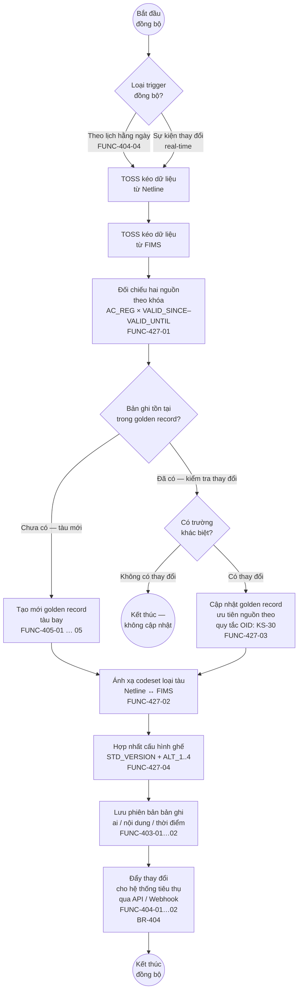
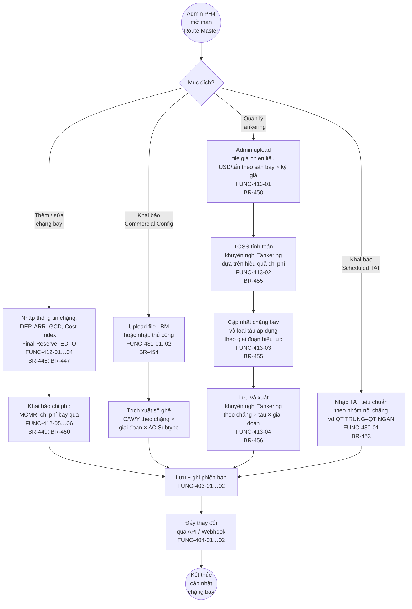
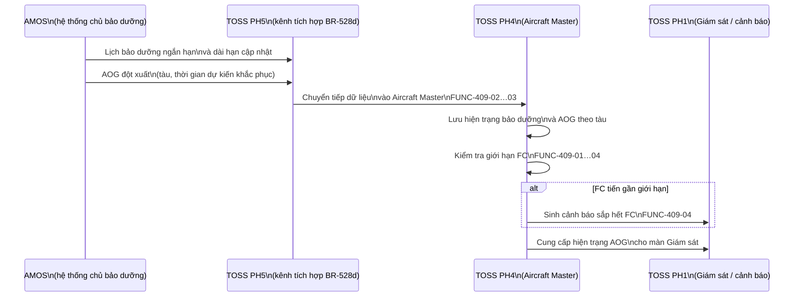
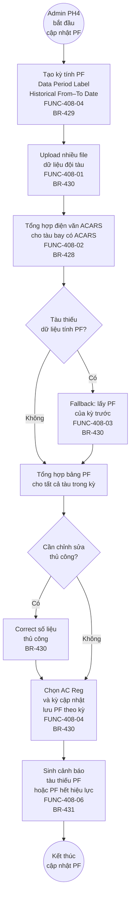
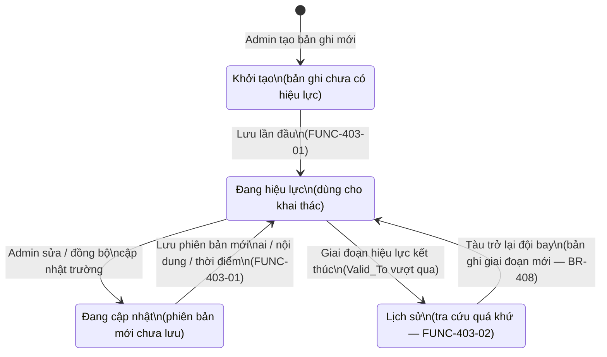

# Sơ đồ Quy trình To-Be — Phân hệ 4: Quản lý danh mục (Master Data)

> **Nguyên tắc (CLAUDE.md §0):** Sơ đồ này chỉ mô tả những gì đã được ghi nhận trong các nguồn BRD-TOSS-PH4 v0.5 và PHAN-RA-BRD-PH4 v0.4. Nơi nào nguồn còn cờ `[cần xác nhận]` hoặc OID chưa chốt thì giữ nhãn `*(chờ xác nhận)*`. Không suy diễn thêm bước hoặc logic phân nhánh chưa có trong nguồn.

---

## 1. Tổng quan phạm vi

| Trường | Giá trị |
|---|---|
| Phân hệ | PH4 — Quản lý danh mục (Master Data) |
| Actor chính | Admin PH4 (người quản trị danh mục); Điều phái viên (tiêu thụ + duyệt một số bản ghi); Netline, FIMS, AMOS (nguồn dữ liệu tích hợp); TOSS PH1/PH2/PH3 (hệ thống tiêu thụ) |
| Vai trò của PH4 | Nguồn sự thật duy nhất (Single Source of Truth) cho dữ liệu danh mục dùng chung; PH1–PH3 và PH5 chỉ đọc (tiêu thụ) từ PH4 (BR-401 / BR-405) |
| Ranh giới hệ thống | TOSS PH4 quản lý master data; Netline và FIMS là nguồn đồng bộ Aircraft Master (BR-418); AMOS là hệ thống chủ bảo dưỡng — PH4 chỉ đồng bộ hiện trạng (BR-419); Lido nhận Standard Taxi Time theo phương án tích hợp (BR-443 / FUNC-418-05) |
| Trigger (khởi động) | (1) Dữ liệu nguồn (Netline/FIMS/AMOS) có thay đổi → đồng bộ tự động; (2) Admin PH4 mở màn danh mục để thêm/sửa thủ công |
| Kết thúc | Bản ghi danh mục được lưu, phiên bản được ghi nhận, thay đổi được đẩy (push) cho hệ thống tiêu thụ qua API/Webhook (BR-404) |
| Nguồn BR | BR-401 … BR-469 (BRD-TOSS-PH4-quan-ly-danh-muc-v0.5.md) |
| Nguồn FUNC | FUNC-401-01 … FUNC-431-xx (PHAN-RA-BRD-PH4-quan-ly-danh-muc-v0.4.md) |

---

## 2. Sơ đồ To-Be — Aircraft Master: Đồng bộ tự động từ Netline/FIMS

> **Nguồn:** BR-406, BR-407, BR-408, BR-418; FUNC-427-01…06; FUNC-403-01…02; FUNC-404-01…04.
>
> PH4 hợp nhất (merge) dữ liệu tàu bay từ hai nguồn Netline và FIMS thành bản ghi golden record theo khóa (số đăng ký × giai đoạn hiệu lực). Mỗi thay đổi được ghi phiên bản và đẩy sang các hệ thống tiêu thụ.



### Chú giải sơ đồ 2

- **`((...))`** — điểm bắt đầu / kết thúc quy trình.
- **`[...]`** — bước xử lý (activity) thực hiện bởi TOSS PH4.
- **`{...}`** — điểm quyết định (decision gateway).
- **Mũi tên có nhãn** — nhánh có điều kiện.
- **Quy tắc ưu tiên nguồn** khi hai nguồn xung đột: ghi `*(chờ xác nhận)*` — xem OID: KS-30 (FUNC-427-03).
- **Đồng bộ real-time** (BR-404): TOSS đẩy ngay khi phát sinh thay đổi, không chờ lịch định kỳ.

---

## 3. Sơ đồ To-Be — Aircraft Master: Quản lý thủ công bởi Admin PH4

> **Nguồn:** BR-406, BR-407, BR-408, BR-409, BR-410, BR-411, BR-412, BR-413, BR-414, BR-415, BR-416, BR-417, BR-419, BR-420; FUNC-405, FUNC-406, FUNC-408 đến FUNC-427; FUNC-403-01…02.
>
> Bên cạnh đồng bộ tự động, Admin PH4 có thể thêm/sửa thuộc tính không đến từ Netline/FIMS (ví dụ: loại hình thuê, APU/Packs INOP, hạn chế sân bay) và duyệt một số bản ghi từ tự thống kê (ví dụ: Standard Taxi Time).

```mermaid
flowchart TD
    S((Admin PH4\nmở màn\nAircraft Master)) --> M1[Tìm kiếm tàu bay\ntheo số đăng ký\nhoặc loại tàu]

    M1 --> M2{Mục đích?}

    M2 -->|Xem lịch sử| M3[Tra cứu trạng thái\ntàu bay tại thời điểm\nbất kỳ trong quá khứ\nFUNC-403-02]
    M3 --> END_VIEW((Kết thúc\ntra cứu))

    M2 -->|Thêm thuộc tính\nkhai thác| M4[Cập nhật thuộc tính:\nAPU/Packs INOP\nFrom_DT / To_DT\nFUNC-420-01\nBR-420]
    M4 --> SAVE

    M2 -->|Khai báo hình thức\nsở hữu / thuê| M5[Chọn loại:\nOwned / Dry Lease\nWet Lease / Damp Lease\nFUNC-405-03\nBR-409\n*(Damp Lease — xem OID: SME-10)*]
    M5 --> SAVE

    M2 -->|Khai báo hạn chế\nsân bay| M6[Nhập AP_RESTRICTION\ncho tàu bay\nFUNC-426-01\nBR-416\n*(Codeset — xem OID: SME-31)*]
    M6 --> SAVE

    M2 -->|Cập nhật DOW\ntheo version| M7[Lưu phiên bản DOW\nkèm ngày hiệu lực\nFUNC-403-01\nBR-411]
    M7 --> SAVE

    M2 -->|Khai báo cấu hình\nghế thay thế| M8[Cập nhật STD_VERSION_ALT_1..4\nFUNC-422-02\nBR-412]
    M8 --> SAVE

    SAVE[Lưu thay đổi +\nghi phiên bản\nFUNC-403-01…02] --> PUSH[Đẩy thay đổi\nqua API / Webhook\nFUNC-404-01…02]
    PUSH --> END_M((Kết thúc\ncập nhật))
```

### Chú giải sơ đồ 3

- Sơ đồ mô tả các nhánh thao tác thủ công **được ghi rõ trong nguồn BR/FUNC**; các thuộc tính khác (NOISE, RADIO, AC_INDEX…) có FUNC nhưng không mô tả luồng thao tác riêng biệt — xem §6 Chức năng chờ mô hình hóa.
- `*(Damp Lease — xem OID: SME-10)*` — tên chính thức biến thể Wet Lease tự lo nhiên liệu chưa được chốt.
- `*(Codeset AP_RESTRICTION — xem OID: SME-31)*` — codeset chưa được chốt đầy đủ.

---

## 4. Sơ đồ To-Be — Airport Master

> **Nguồn:** BR-432 … BR-445; FUNC-410-01…12; FUNC-411-01…02; FUNC-418-01…06; FUNC-419-01…04.
>
> Airport Master gồm hai luồng chính: (A) Admin PH4 quản lý thông tin sân bay thủ công; (B) luồng riêng cho Standard Taxi Time có bước tự thống kê và duyệt trước khi áp dụng (BR-443 / FUNC-418-02…03).

```mermaid
flowchart TD
    S((Admin PH4\nmở màn\nAirport Master)) --> AP1{Mục đích?}

    AP1 -->|Thêm / sửa thông tin\nsân bay| AP2[Nhập / cập nhật:\nMã ICAO, IATA, tên sân bay\nquốc gia, region, tiếp xúc\nFUNC-410-01]
    AP2 --> AP3[Cập nhật hạ tầng:\nRunway, Taxiway, Bãi đỗ\nFUNC-410-02…03]
    AP3 --> AP4[Cập nhật Minima theo\nApproach Type\nILS CAT I/II/III, RNAV, VOR, NDB\nFUNC-410-04\nBR-435]
    AP4 --> AP5[Cập nhật dịch vụ\nmặt đất: GPU/ASU, nhiên liệu\nchi phí, Parking Stand\nFUNC-410-09; FUNC-410-12\nBR-437; BR-438; BR-440]
    AP5 --> SAVE_AP[Lưu + ghi phiên bản\nFUNC-403-01…02]

    AP1 -->|Khai báo sân bay\nđặc biệt| SP1[Thêm vào danh mục\nsân bay đặc biệt\nFUNC-419-01\nBR-442\n*(Danh mục đầy đủ — xem OID: SME-18)*]
    SP1 --> SP2[Gán điều kiện chứng chỉ\ntổ bay bổ sung\nFUNC-419-02]
    SP2 --> SP3[Dữ liệu này làm cơ sở\ncảnh báo PH1\nFUNC-419-03]
    SP3 --> SAVE_AP

    AP1 -->|Cập nhật\nStandard Taxi Time| STT1[TOSS tự thống kê\ngiá trị đề xuất\ntừ dữ liệu QAR/QAI\nqua API / DB View\nFUNC-418-02\nBR-443]
    STT1 --> STT2[Trình Admin PH4\nhoặc Điều phái viên\nduyệt giá trị đề xuất\nFUNC-418-03]
    STT2 --> STT3{Duyệt?}
    STT3 -->|Từ chối| STT1
    STT3 -->|Chấp thuận| STT4[Lưu bản ghi Standard Taxi Time\ntheo sân bay × thời gian hiệu lực\nFUNC-418-01]
    STT4 --> STT5[Sinh cảnh báo\nkhi giá trị thay đổi\nFUNC-418-04\nBR-443]
    STT5 --> STT6[[Đồng bộ sang Lido\nnếu Lido hỗ trợ tích hợp\nFUNC-418-05\n*(xem OID: KS-16)*]]
    STT6 --> SAVE_AP

    SAVE_AP --> PUSH_AP[Đẩy thay đổi\nqua API / Webhook\nFUNC-404-01…02]
    PUSH_AP --> END_AP((Kết thúc\ncập nhật\nsân bay))
```

### Chú giải sơ đồ 4

- **`[[...]]`** — bước tại hệ thống ngoài phạm vi TOSS hoặc phụ thuộc quyết định tích hợp chưa chốt.
- **Standard Taxi Time** có luồng duyệt (approve) riêng vì FUNC-418-03 ghi rõ "trình điều phái viên duyệt trước khi áp dụng" (BR-443).
- **`*(xem OID: KS-16)*`** — phương án đồng bộ sang Lido chưa chốt (giai đoạn đầu có thể nhập hai lần).
- **`*(Danh mục sân bay đặc biệt đầy đủ — xem OID: SME-18)*`** — danh sách chưa được xác nhận chính thức.
- Import PDF LIDO Chart (BR-445) và Obstacle Data / EOSID (BR-444) có FUNC nhưng không mô tả luồng thao tác chi tiết trong nguồn — xem §6.

---

## 5. Sơ đồ To-Be — Route Master / Tankering

> **Nguồn:** BR-446 … BR-457; FUNC-412-01…06; FUNC-413-01…04; FUNC-428-01…02; FUNC-429-01…04; FUNC-430-01…02.
>
> Route Master lưu thông tin chặng bay và các tham số tối ưu hóa. Luồng Tankering có bước tính toán khuyến nghị từ dữ liệu giá nhiên liệu.



### Chú giải sơ đồ 5

- **Tính Tankering** (FUNC-413-02) sử dụng giá nhiên liệu do Admin upload; lưu ý giá từ Việt Nam đi quốc tế khác giá nội địa — cả hai giá đều được tính (BR-455).
- **Commercial Config** (FUNC-431-01..02): nhãn FUNC dùng mã v0.3; ánh xạ sang BR-454 mới của v0.5 — xem §4 ánh xạ mã trong PHAN-RA-BRD-PH4 v0.4.
- **Included Baggage Allowance** (BR-451, FUNC-428-01…02) và **Sector Groups by FH** (BR-452, FUNC-429-01…04) có FUNC nhưng không mô tả luồng tương tác riêng — xem §6.

---

## 6. Sơ đồ To-Be — Luồng đồng bộ AMOS → Aircraft Master (hiện trạng bảo dưỡng & AOG)

> **Nguồn:** BR-419; FUNC-409-01…04.
>
> PH4 không tự quản lý bảo dưỡng. AMOS là hệ thống chủ. PH4 chỉ nhận (đồng bộ) và lưu hiện trạng để sinh cảnh báo.



### Chú giải sơ đồ 6

- **PH5** là kênh tích hợp (BR-528d) — PH4 nhận dữ liệu qua PH5, không kết nối trực tiếp AMOS.
- **TOSS không tự quản lý bảo dưỡng** — Out-of-scope §5.2 #3; AMOS là hệ thống chủ (BR-419).
- **FC (Flight Cycle):** TOSS theo dõi giới hạn và sinh cảnh báo (FUNC-409-04) nhưng không quyết định hành động bảo dưỡng.

---

## 7. Sơ đồ To-Be — BP-005: Nhận tàu bay mới → Cập nhật Aircraft Master

> **Nguồn:** BP-005 (BRD §8, FDOP §3.5); BR-406, BR-407, BR-408, BR-411; FUNC-405-01…05; FUNC-403-01…02; FUNC-427-01…06.
>
> Khi hãng tiếp nhận tàu bay mới (mua hoặc thuê khô — Dry Lease), PH4 cần được cập nhật để tàu trở thành một phần đội bay khai thác. Sơ đồ chỉ bao phủ phần **PH4 cập nhật Aircraft Master** — các bước nghiệp vụ khác của BP-005 (lập OFP chuyến Ferry, briefing tổ bay…) thuộc PH1/PH2.

```mermaid
flowchart TD
    S((Nhận tàu bay\nmới — BP-005\nFDOP §3.5)) --> N1[SQD cung cấp\nmã 24-bit và phối hợp\nnhận chứng nhận CAAV\n*(Tên đầy đủ SQD — xem OID: SME)*]

    N1 --> N2[Thu thập thông số tàu:\nMSN, số đăng ký mới\nICAO 24-bit, ToT\nFDOP §3.5]

    N2 --> N3[PER Group / FOE nhận\nWeigh Manifest từ Boeing/Airbus\nxác định DOW ban đầu\nFDOP §3.5]

    N3 --> N4[Admin PH4 tạo mới\nbản ghi tàu bay\ntrong Aircraft Master\nFUNC-405-01…04\nBR-406]

    N4 --> N5[Nhập thuộc tính định danh:\nREG, ALT_REG, callsign\nloại tàu ICAO/IATA\nFUNC-405-01…02\nBR-407]

    N5 --> N6[Khai báo hình thức sở hữu:\nOwned / Dry Lease / Wet Lease\nFUNC-405-03\nBR-409\n*(Damp Lease — xem OID: SME-10)*]

    N6 --> N7[Nhập DOW version đầu tiên\ntheo Weigh Manifest draft\nFUNC-403-01\nBR-411]

    N7 --> N8[Nhập cấu hình khoang\nSTD_VERSION ban đầu\nFUNC-422-01\nBR-412]

    N8 --> N9[Khai báo thời gian\nhiệu lực khai thác đầu tiên\nValid_From = ngày ToT\nFUNC-405-04\nBR-408]

    N9 --> N10[Ghi nhận trạng thái tàu\nAC_STATE theo codeset\nFUNC-421-01\nBR-417\n*(Codeset AC_STATE — xem OID: SME-29)*]

    N10 --> N11{Netline đã có\nbản ghi tàu?}
    N11 -->|Chưa có| N12[Bản ghi PH4\nlà nguồn tạm thời\nchờ Netline đồng bộ]
    N11 -->|Đã có| N13[Đồng bộ / hợp nhất\nvới bản ghi Netline\nFUNC-427-01\nBR-418]
    N12 --> N14
    N13 --> N14[Lưu golden record\nvà ghi phiên bản\nFUNC-403-01…02]

    N14 --> N15[Đẩy thông tin tàu mới\ncho PH1, PH2, PH3\nqua API / Webhook\nFUNC-404-01…02\nBR-404]

    N15 --> N16[Cập nhật DOW final\nkhi nhận Weigh Manifest\nchính thức\nFUNC-403-01\nBR-411]

    N16 --> END((Tàu bay sẵn sàng\ntrong Aircraft Master\ncho khai thác))
```

### Chú giải sơ đồ 7

- **ToT (Transfer of Title):** mốc thời gian chuyển giao quyền sở hữu/quyền khai thác; `Valid_From` của giai đoạn hiệu lực đầu tiên được đặt theo ToT (nguồn: FDOP §3.5).
- **DOW (Dry Operating Weight):** bản ghi ban đầu từ Weigh Manifest draft; cần cập nhật lại khi có bản chính thức (FUNC-403-01, BR-411).
- **SQD, VAECO, PER Group (FOE):** các đơn vị phối hợp trong BP-005 theo FDOP §3.5 — tên đầy đủ chưa được xác nhận chính thức `*(chờ xác nhận)*`.
- **Chuyến Ferry và OFP:** thuộc luồng PH1/PH2, không nằm trong phạm vi sơ đồ này.
- Nhánh "Netline chưa có bản ghi" chỉ xảy ra trong giai đoạn chờ Netline cập nhật — nguồn BR-418 ghi rõ hợp nhất theo khóa REG × giai đoạn hiệu lực khi có đủ hai nguồn.

---

## 8. Sơ đồ To-Be — Performance Factor (PF): Thu nạp và Cập nhật

> **Nguồn:** BR-428, BR-429, BR-430, BR-431; FUNC-408-01…06.
>
> PH4 giữ vai trò lưu trữ và tính toán PF. Báo cáo PF (PF Comparison, PF Trend…) đã chuyển sang PH3 (BR-351…BR-356) và không nằm trong sơ đồ này.



### Chú giải sơ đồ 8

- **Chu kỳ tính PF:** trung bình hai tuần hoặc một tháng một lần (BR-428), bao gồm cả chuyến có MEL và chuyến không có MEL.
- **Báo cáo PF** (PF Comparison / Trend / Data Coverage) không nằm trong PH4 — xem PH3 BR-351…BR-356.
- **`*(Tên đầy đủ pgepoid — xem OID: SME-38)*`** — tên phần mềm BackPACK/PEP/PET/FOS chưa được xác nhận đầy đủ.

---

## 9. Sơ đồ To-Be — Vòng đời bản ghi danh mục (Versioning)

> **Nguồn:** BR-403; FUNC-403-01…02; BR-404; FUNC-404-01…04.
>
> Áp dụng cho mọi loại bản ghi danh mục (Aircraft, Airport, Route, PF…).



### Chú giải sơ đồ 9

- Mọi chuyển trạng thái đều ghi vết kiểm toán: `last_update`, `last_update_user`, `record_id` (BR-403).
- Trạng thái **Lịch sử** không bị xóa — có thể truy xuất tại bất kỳ thời điểm nào (FUNC-403-02).
- Tàu bay có thể vào/ra đội bay nhiều lần (BR-408) → mỗi lần tạo bản ghi giai đoạn mới, bản ghi cũ chuyển sang Lịch sử.

---

## 10. Chức năng chờ mô hình hóa

Các FUNC sau đây đã có trong PHAN-RA-BRD-PH4 v0.4 nhưng nguồn **chưa mô tả luồng tương tác** hoặc chỉ liệt kê thuộc tính — chưa đủ căn cứ để vẽ sơ đồ.

| Nhóm | FUNC | BR cha (v0.5) | Lý do chưa mô hình hóa |
|---|---|---|---|
| Aircraft Master | FUNC-423-01…03 (AC_INDEX, cỡ tổ bay tiêu chuẩn) | BR-413 | Nguồn chỉ liệt kê trường `AC_INDEX`, `CREWSIZE_COCKPIT/CABIN` từ Netline; không mô tả luồng thao tác thêm/sửa riêng biệt |
| Aircraft Master | FUNC-424-01…05 (ILS, AUTOLAND, ACARS, SPECIAL_EQUIPMENT) | BR-414 | Nguồn liệt kê từ header Netline; không mô tả luồng duyệt hoặc cập nhật riêng |
| Aircraft Master | FUNC-425-01…04 (NOISE, RADIO, PHONE) | BR-415 | Nguồn chỉ từ cột Netline; luồng thao tác không mô tả |
| Aircraft Master | FUNC-421-01…04 (AC_STATE, OVERFLOW) | BR-417 | Có FUNC nhưng không có mô tả luồng duyệt/thay đổi trạng thái thủ công ngoài đồng bộ |
| Airport Master | FUNC-410-07…08 (SID/STAR/IAP, Slot/phép bay) | BR-436 | Nguồn liệt kê nội dung quản lý; không có luồng nhập/duyệt chi tiết |
| Airport Master | FUNC-410-10…11 (NOTAM, an ninh sân bay) | BR-439 | Nguồn ghi "quản lý"; cơ chế cập nhật (thủ công hay tự động) chưa rõ |
| Airport Master | BR-444 (Obstacle Data, EOSID, import .stx) | BR-444 | Should — FUNC chưa có trong v0.4; luồng import chưa mô tả |
| Airport Master | BR-445 (Import PDF LIDO Chart) | BR-445 | Should — FUNC chưa có trong v0.4; luồng quét PDF chưa mô tả |
| MEL / CDL | BR-424 … BR-427 (Master MEL, công cụ biên soạn, hotfix SB, đồng bộ AMOS) | BR-424…427 | Có FUNC-407-01…06 nhưng luồng vòng đời tài liệu MEL (biên soạn → revision → approve → xuất XML) chưa được mô tả đủ; OID SME-44 chưa chốt |
| Route Master | FUNC-428-01…02 (Included Baggage Allowance) | BR-451 | Nguồn ghi "quản lý theo nhóm đường bay"; không mô tả luồng upload/nhập |
| Route Master | FUNC-429-01…04 (Sector Groups by FH) | BR-452 | Should — nguồn chỉ liệt kê trường; không mô tả luồng |
| Danh mục bổ trợ | FUNC-414-01…06 (Phi công, Tiếp viên, Quốc gia, FIR, ULD, Email) | BR-461…BR-465 | Quản lý CRUD đơn giản; phi công/tiếp viên đồng bộ từ MO Plus (BR-461); luồng không phức tạp, không có bước duyệt riêng |
| Tham số vận hành | FUNC-415-01…06 | BR-468 | Admin cấu hình trực tiếp; luồng đơn giản (không có bước duyệt riêng theo nguồn) |
| Phép bay | FUNC-420-01…09 (Flight Permission, Flight Type Code) | BR-466, BR-467 | Có FUNC nhưng luồng tích hợp SkyCheck (OID: KS-15) chưa chốt; giai đoạn đầu nhập thủ công — đủ để vẽ sơ đồ đơn giản sau khi OID giải quyết |

---

## 11. Bảng So sánh As-Is → To-Be (PH4)

> **Lưu ý:** Cột As-Is phản ánh thực trạng ghi nhận trong báo cáo khảo sát (KS 08/06, 09/06, 11/06) và đề xuất giải pháp kỹ thuật. Cột To-Be phản ánh yêu cầu BR/FUNC đã ghi nhận.

| Khía cạnh | As-Is (Hiện trạng) | To-Be (TOSS PH4) | Nguồn BR |
|---|---|---|---|
| Nguồn sự thật tàu bay | Phân tán: Netline, FIMS, bảng tính riêng mỗi đơn vị; không có golden record duy nhất | Một golden record duy nhất hợp nhất từ Netline + FIMS theo khóa REG × giai đoạn hiệu lực; đẩy cho các hệ thống tiêu thụ qua API/Webhook | BR-418, BR-404 |
| Đồng bộ danh mục | Đồng bộ thủ công hoặc theo lịch định kỳ; các phân hệ tự duy trì bản sao | Đồng bộ chủ động (push) ngay khi phát sinh thay đổi; không còn bản sao cục bộ ở các phân hệ | BR-404 |
| Lịch sử thay đổi | Không có hoặc ghi rời (Excel, email) | Ghi phiên bản tự động theo bản ghi: ai / nội dung / thời điểm; tra cứu lại được bất kỳ thời điểm | BR-403 |
| Hiệu lực khai thác tàu | Quản lý đơn giản (tàu vào/ra chưa theo giai đoạn) | Quản lý nhiều giai đoạn hiệu lực (Valid_From/To), tàu có thể in/out nhiều lần | BR-408 |
| Standard Taxi Time | Quản lý thủ công tại MOI; nhập lại ở từng hệ thống | Tự thống kê từ QAR/QAI → điều phái duyệt → lưu danh mục; đồng bộ sang Lido *(chờ OID: KS-16)* | BR-443 |
| Danh mục sân bay đặc biệt | Quản lý rải rác; chưa gắn điều kiện chứng chỉ tổ bay | Danh mục chính thức gắn với điều kiện chứng chỉ; làm cơ sở cảnh báo PH1 | BR-442 |
| Performance Factor | Tính bên ngoài TOSS (BackPACK/PEP/PET); nhập thủ công vào khai thác | Upload file tính PF trong TOSS; fallback tự động; lưu lịch sử theo kỳ; sinh cảnh báo tàu thiếu PF | BR-428…431 |
| Trạng thái bảo dưỡng/AOG | Nhận qua điện thoại/email từ AMOS; không tập trung | Đồng bộ tự động qua PH5 từ AMOS; lưu hiện trạng; sinh cảnh báo FC | BR-419 |
| Danh mục MEL | Nhận file XML từ hãng sản xuất; quản lý rải rác theo dòng tàu | Import XML vào TOSS; công cụ biên soạn chung Boeing+Airbus; đồng bộ AMOS; highlight mới; liên kết tài liệu *(chờ OID: SME-44)* | BR-424…427 |
| Phép bay | Xin và quản lý thủ công (ngoài TOSS); không tích hợp SkyCheck | Nhập trực tiếp trên TOSS; chuẩn bị 2 API nhận từ SkyCheck khi sẵn sàng; sinh báo cáo phép bay *(chờ OID: KS-15)* | BR-466 |

---

*TOBE-PH4 v0.1 — 2026-06-17. Trạng thái: Draft. Nguồn BR: BRD-TOSS-PH4 v0.5 (BR-401…469). Nguồn FUNC: PHAN-RA-BRD-PH4 v0.4. Lịch sử version: xem `ba/workspace/drafts/quy-trinh/BA-VERSION-LOG.md`.*
