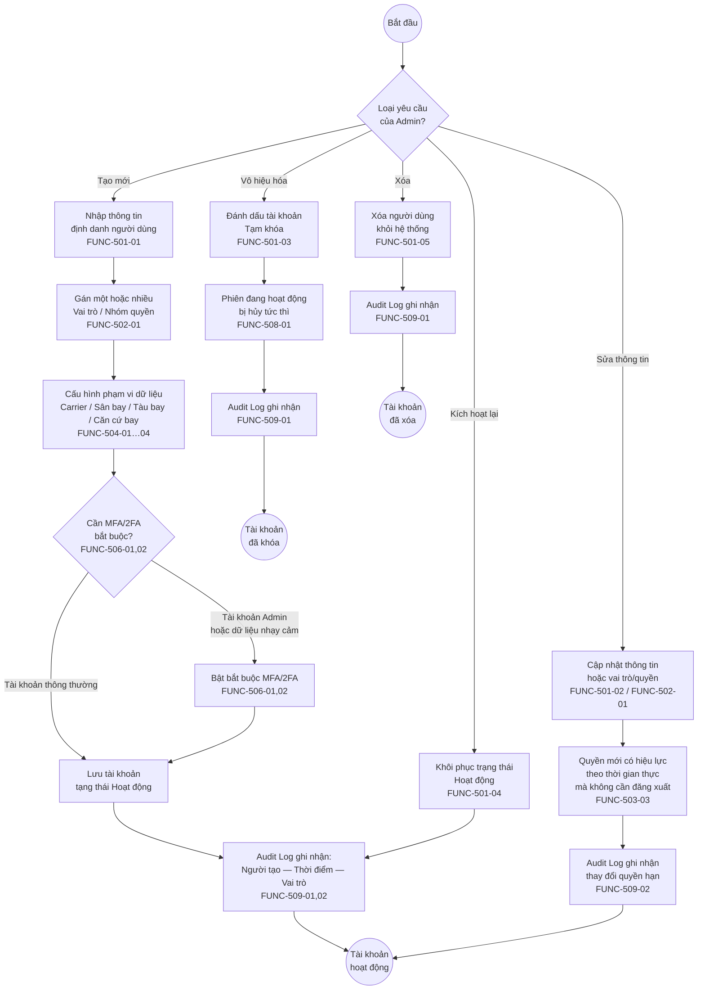
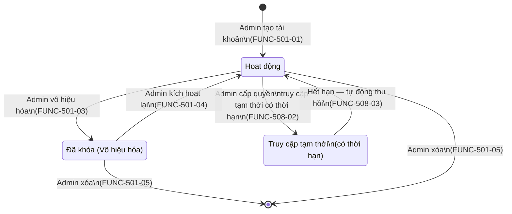
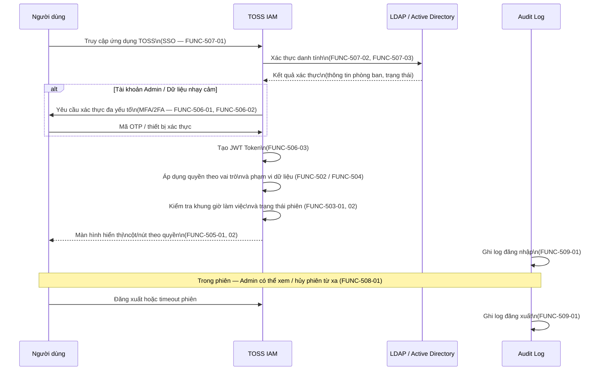
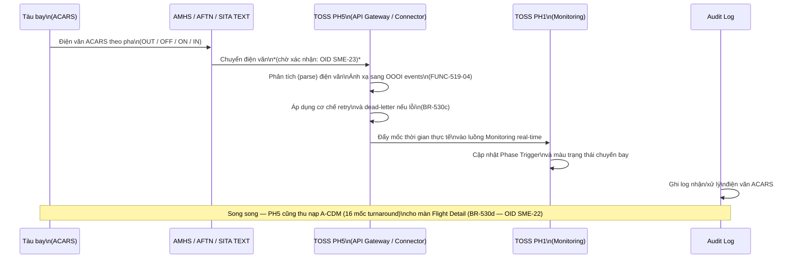
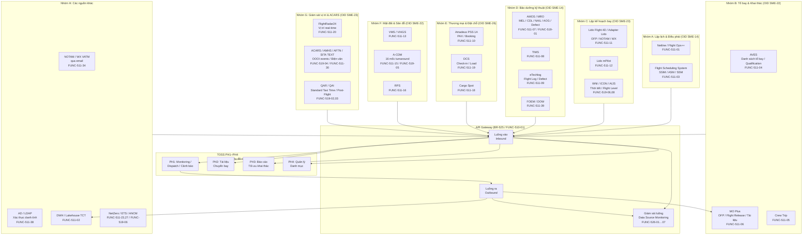
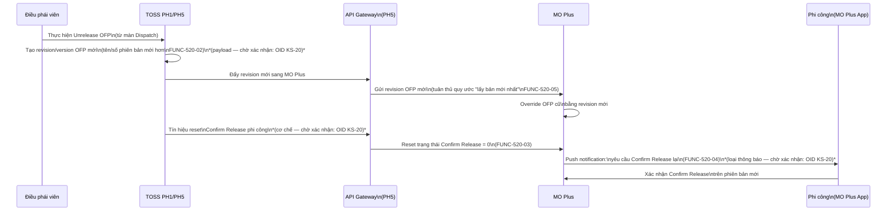

# Sơ đồ Quy trình To-Be — Phân hệ 5: Quản trị hệ thống (IAM/RBAC, Tích hợp, Hạ tầng)

> **Nguyên tắc (CLAUDE.md §0):** Sơ đồ này chỉ mô tả những gì đã được ghi nhận trong các nguồn BRD-TOSS-PH5-v0.5 và PHAN-RA-BRD-PH5-v0.3. Nơi nào nguồn còn cờ `[cần xác nhận]` hoặc OID còn mở thì giữ nguyên cờ đó tại đúng node liên quan. Không suy diễn thêm bước hoặc logic phân nhánh chưa có trong nguồn.

---

## §1. Tổng quan phạm vi

| Trường | Giá trị |
|---|---|
| Phân hệ | PH5 — Quản trị hệ thống (IAM/RBAC, Tích hợp, Hạ tầng, Chuẩn UI) |
| Actor chính | Admin TOSS, Người dùng (Dispatcher/OCC), Hệ thống ngoài (Netline/FIMS/Lido/MO Plus/AMOS và ~35 hệ thống khác) |
| Ranh giới hệ thống | PH5 sở hữu (a) vòng đời tài khoản IAM/RBAC, (b) API Gateway và toàn bộ data contract với hệ thống ngoài, (c) thu nạp movement/ACARS thay thế FMS; PH1–PH4 tiêu thụ dữ liệu đã được PH5 chuẩn hóa — không tự kết nối điểm-điểm |
| Trigger (khởi động) | Yêu cầu tạo/sửa tài khoản, hoặc sự kiện dữ liệu từ hệ thống ngoài phát sinh |
| Kết thúc | Tài khoản/quyền có hiệu lực; dữ liệu hợp nhất sẵn sàng cho PH1–PH4 tiêu thụ |
| Nguồn BR | BR-501 … BR-555 (BRD-TOSS-PH5-quan-tri-he-thong-v0.5.md) |
| OID còn mở | SME-14, SME-22, SME-23, SME-26, KS-20, KS-42 — gắn cờ tại từng bước liên quan |

**Lưu ý về phạm vi sơ đồ hóa:**
PH5 bao phủ ~40 kết nối tích hợp và nhiều nhóm NFR hạ tầng. Tài liệu này mô hình hóa ba nhóm có đủ nguồn để vẽ luồng: (1) Vòng đời người dùng IAM/RBAC; (2) Thu nạp movement thay FMS; (3) Bản đồ tích hợp tổng thể. Các nhóm tích hợp chi tiết (data contract với từng hệ thống đối tác) và các nhóm NFR hạ tầng (HA, CI/CD, sizing) **chờ workshop chuyên đề tích hợp** — liệt kê tại §5.

---

## §2. Sơ đồ To-Be — Vòng đời Người dùng IAM/RBAC

> Nguồn: BR-501 (vòng đời tài khoản), BR-502 (RBAC 2 lớp), BR-503 (multi-role), BR-504 (dynamic policies), BR-505 (quyền truy cập tạm thời), BR-506 (ẩn/hiện theo quyền), BR-509 (MFA/2FA), BR-510 (SSO + LDAP/AD), BR-511 (phiên + timeout), BR-512 (audit log).
>
> FUNC liên quan: FUNC-501-01…06, FUNC-502-01…05, FUNC-503-01…03, FUNC-504-01…04, FUNC-505-01…02, FUNC-506-01…03, FUNC-507-01…04, FUNC-508-01…03, FUNC-509-01…04.

### §2.1 Vòng đời tài khoản (Tạo → Sửa → Vô hiệu hóa → Kích hoạt lại)

#### Chú giải §2.1

- **`((...))`** — điểm bắt đầu / kết thúc quy trình.
- **`[...]`** — bước xử lý (activity) thực hiện trên TOSS IAM.
- **`{...}`** — điểm quyết định (decision gateway).
- **Mũi tên có nhãn** — nhánh có điều kiện.

---

### §2.2 Sơ đồ vòng đời trạng thái tài khoản

> Nguồn: BR-501 (tạo/vô hiệu hóa/kích hoạt lại/xóa), BR-505 (quyền truy cập tạm thời tự thu hồi — FUNC-508-02, FUNC-508-03).

---

### §2.3 Luồng đăng nhập — Xác thực & Phiên làm việc

> Nguồn: BR-509 (MFA/2FA), BR-510 (SSO + LDAP/AD), BR-511 (kiểm soát phiên), BR-512 (audit log đăng nhập/đăng xuất).
> FUNC: FUNC-506-01…03, FUNC-507-01…04, FUNC-508-01, FUNC-509-01.

---

## §3. Sơ đồ To-Be — Thu nạp Movement thay FMS

> **Bối cảnh:** FMS (Flight Management System cũ của VNA) là nguồn thu nạp movement (điện văn ACARS OUT/OFF/ON/IN và mốc thời gian thực tế) hiện hành. TOSS PH5 thay thế bằng cách tích hợp trực tiếp với ACARS — không qua FMS và không qua Mission Watch *(chờ xác nhận tên hệ thống — OID SME-23)*.
>
> Nguồn: BR-530c (tích hợp ACARS trực tiếp — chuẩn AMHS/AFTN/SITA TEXT), BR-527 (event-based + snapshot), FUNC-519-04 (ACARS trực tiếp làm trigger phase), FUNC-511-30 (tiêu thụ điện văn ACARS), FUNC-511-32 (AMHS, AFTN).

#### Chú giải §3

- **`AMHS / AFTN / SITA TEXT`** — kênh truyền điện văn hàng không; chuẩn cụ thể chưa xác nhận *(chờ xác nhận: OID SME-23)*.
- **Không qua FMS** — luồng hiện hành qua FMS được thay thế hoàn toàn; không có bước "giao tiếp với FMS" trong To-Be.
- **Retry / dead-letter** — cơ chế fail-safe của API Gateway theo BR-530c; chi tiết payload và timing chờ workshop tích hợp.

---

## §4. Bản đồ Tích hợp Tổng thể — TOSS PH5 ↔ Các hệ thống ngoài

> Nguồn: BR-525 (API Gateway), BR-527 (event-based + snapshot), BR-528a…h (data contract theo nhóm), BR-530a…g (inbound chi tiết), BR-531 (API ra cho hệ thống vệ tinh), BR-532 (Unrelease ↔ MO Plus — OID KS-20), FUNC-511-01…41.
>
> **Nguyên tắc đọc sơ đồ:** API Gateway là điểm kiểm soát duy nhất — mọi luồng inbound và outbound đều đi qua đây. PH1–PH4 chỉ tiêu thụ dữ liệu đã hợp nhất; không kết nối điểm-điểm.

#### Chú giải §4

- **`subgraph`** — nhóm hệ thống ngoài theo lĩnh vực nghiệp vụ.
- **`API Gateway`** — điểm kiểm soát tập trung duy nhất; mọi luồng đều đi qua (BR-525).
- **`GW_MON`** — màn hình giám sát luồng dữ liệu vào/ra cho Admin (BR-533 / FUNC-526-01…07).
- Các OID mở *(SME-14, SME-22, SME-23, SME-26)* gắn trên nhóm hệ thống tương ứng — data contract chưa xác nhận đầy đủ.
- Nhóm G (ACARS) là luồng thay thế FMS — xem §3 để biết chi tiết luồng xử lý.

---

### §4.1 Sơ đồ chi tiết — Luồng Unrelease OFP ↔ MO Plus

> Nguồn: BR-532 (Unrelease + reset Confirm Release phi công — OID KS-20), FUNC-520-01…06.
>
> **Lưu ý:** Toàn bộ quy ước tín hiệu, payload, timing và cơ chế notification **chờ xác nhận phối hợp với đội phát triển MO Plus — OID KS-20**.

---

## §5. Chức năng chờ mô hình hóa (chờ workshop chuyên đề)

Các nhóm chức năng dưới đây có BR và FUNC đã phân rã nhưng **chưa có đủ thông tin luồng** để vẽ sơ đồ — phần lớn do data contract với hệ thống đối tác chưa được xác nhận qua workshop kỹ thuật chuyên đề.

| Nhóm | BR liên quan | FUNC liên quan | OID / Lý do chờ |
|---|---|---|---|
| Data contract chi tiết từng hệ thống (Nhóm A–H §4) | BR-528a…h, BR-530a…g | FUNC-511-01…41, FUNC-519-01…08 | SME-14, SME-22, SME-23, SME-26 — chuẩn API/file/message, ánh xạ trường, retry chưa xác nhận |
| API Gateway — kiến trúc nội bộ (rate-limit, versioning, dead-letter) | BR-525, BR-526, BR-527, BR-548 | FUNC-510-01…06 | Chờ SA/kiến trúc sư hệ thống xác nhận topology gateway |
| Tập API ra cho hệ thống vệ tinh (chi tiết trường dữ liệu) | BR-531 | FUNC-525-01…13 | SME-23, SME-26 — một số trường dữ liệu trả về chờ xác nhận với FOE và đội MO Plus |
| Migration FIMS → TOSS (luồng extract-transform-load) | BR-540, BR-541 | FUNC-524-01…04, FUNC-511-37 | Chờ khảo sát kỹ thuật hệ thống FIMS hiện hành |
| Notification / Email tự động (event trigger, danh sách người nhận) | BR-536, BR-537, BR-538, BR-539 | (chưa có FUNC riêng trong v0.3) | Chờ workshop bổ sung FUNC notification |
| Attribution tài khoản bot AOS theo ca trực | BR-513 | (chưa có FUNC trong v0.3) | KS-42 — quy ước đặt tên tài khoản bot chưa xác nhận |
| Nhóm NFR hạ tầng HA / CI/CD / sizing / SLA | BR-543…BR-555 | NFR-513…NFR-521 | Chưa đủ thông tin luồng vận hành để mô hình hóa (là ràng buộc kiến trúc, không phải business flow) |
| Tích hợp CQĐV (khảo sát + cấu hình) | BR-535 | FUNC-528-01, 02 | Chờ khảo sát Khối CĐS và các CQĐV |
| Download lịch bay cho Backup Tool Netline | BR-541 | (chưa phân rã trong v0.3) | Chờ xác nhận định dạng tệp và trigger download |

---

## §6. So sánh As-Is → To-Be

| Khía cạnh | As-Is (Hiện trạng) | To-Be (TOSS PH5) | Thay đổi | BR liên quan |
|---|---|---|---|---|
| Quản lý tài khoản người dùng | Phân tán tại từng hệ thống thành phần; không có IAM tập trung | Phân hệ IAM độc lập, quản lý toàn bộ vòng đời tài khoản; cổng SSO duy nhất | Hợp nhất — một điểm quản lý duy nhất | BR-501, BR-510 |
| Xác thực | Đăng nhập riêng lẻ từng hệ thống; không có SSO | SSO tích hợp LDAP/AD Tổng công ty; MFA/2FA bắt buộc cho Admin | Nâng cấp — giảm đăng nhập thủ công, tăng bảo mật | BR-509, BR-510 |
| Phân quyền | Phân quyền thô (per-app); không có data scope theo Carrier/sân bay/tàu bay | RBAC 2 lớp: chức năng (tới API) + dữ liệu (Carrier/sân bay/tàu bay); quyền có hiệu lực real-time | Nâng cấp — phân quyền chi tiết hơn và tự động hơn | BR-502, BR-503, BR-504 |
| Quyền truy cập tạm thời | Không có cơ chế tự hết hạn; cần Admin thu hồi thủ công | Quyền tạm thời tự thu hồi khi hết hạn | Mới | BR-505 |
| Ẩn/hiện cột theo quyền | Mỗi vai trò có màn hình riêng | Màn hình dùng chung; cột/nút tự động ẩn/hiện theo quyền | Mới | BR-506 |
| Audit log | Rời rạc, không đầy đủ | Ghi nhận đầy đủ mọi hành vi: đăng nhập, thay đổi quyền, thao tác nghiệp vụ trọng yếu; ghi rõ người — thời điểm — hành động | Nâng cấp toàn diện | BR-512, BR-513 |
| Thu nạp movement (ACARS/OOOI) | Qua FMS (hệ thống cũ, luồng chậm) | Trực tiếp từ ACARS qua AMHS/AFTN/SITA TEXT — không qua FMS; retry/dead-letter tự động | Thay thế hoàn toàn | BR-530c, FUNC-519-04 |
| Kết nối hệ thống ngoài | Kết nối điểm-điểm phân tán; không có API Gateway tập trung | API Gateway tập trung; chuẩn hóa data contract; retry/dead-letter/alert tự động cho mọi kết nối | Hợp nhất + chuẩn hóa | BR-525, BR-528a…h, BR-530a…g |
| Giám sát luồng dữ liệu | Thủ công / không có màn hình tổng thể | Màn hình Data Source Monitoring: luồng vào/ra, trạng thái kết nối, ngày cập nhật cuối | Mới | BR-533, BR-534 |
| Dispatch Release / Unrelease ↔ MO Plus | Chỉ đồng bộ trạng thái Release một chiều; Unrelease chưa có cơ chế reset Confirm Release phi công | Hai chiều: Release + Unrelease + reset Confirm Release + push notification phi công | Mở rộng | BR-532 — OID KS-20 |

---

### Chú giải hình thức chung

- **`((...))`** — điểm bắt đầu / kết thúc quy trình.
- **`[...]`** — bước xử lý (activity).
- **`{...}`** — điểm quyết định (decision gateway).
- **`[[...]]`** — quy trình con / hệ thống ngoài phạm vi TOSS.
- **`subgraph`** — nhóm nghiệp vụ hoặc swim lane theo lĩnh vực.
- **Mũi tên có nhãn `-->|...|`** — luồng có điều kiện.
- **`*(chờ xác nhận: OID ...)*`** — điểm chưa xác nhận, gắn với mã OID trong sổ cái SO-THEO-DOI-DIEM-CHOT-v0.1.md.

---

*TOBE-PH5-quan-tri-he-thong-v0.1 — 2026-06-17. Truy vết nguồn: BRD-TOSS-PH5-v0.5, PHAN-RA-BRD-PH5-v0.3. Lịch sử version: BA-VERSION-LOG.md.*
