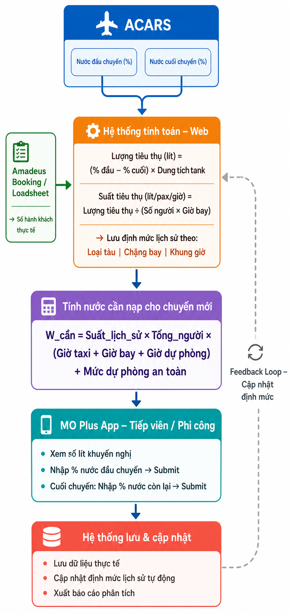

# BRD-Light: Module Potable Water Service

**Dự án:** MO Plus -- Bổ sung module Quản lý Nước Sạch Trên Tàu Bay

---

## 1. Bức tranh tổng thể

Module **Portable Water Service** được bổ sung vào hệ thống MO Plus nhằm giải quyết bài toán: **biết được chuyến bay cần bao nhiêu lít nước sạch, tránh nạp thừa lãng phí (tăng trọng lượng cất cánh vô ích gây tốn nhiên liệu) hoặc nạp thiếu ảnh hưởng đến chất lượng dịch vụ trên không.**

Hiện tại dữ liệu nước sạch đã có trong hệ thống A-CAD (thông qua điện văn ACARS truyền về từ một số đội tàu bay) nhưng chưa được khai thác tự động; tổ bay cũng chưa có công cụ thống nhất để xác nhận và báo cáo thực tế.

### Đối tượng sử dụng:

| Đối tượng | Nền tảng | Việc chính |
| :--- | :--- | :--- |
| **Tổ bay** (Cơ trưởng / Cơ phó / Tiếp viên trưởng / Tiếp viên) | MO Plus App (iPad) | - Xem số lượng nước khuyến nghị (nạp gợi ý).<br>- Nhập xác nhận chỉ số nước đầu chuyến và cuối chuyến.<br>- Nhận cảnh báo khi tải lượng thay đổi. |
| **Admin / Khai thác** | Website MO Plus | - Cấu hình master data (dung tích tank, định mức mặc định).<br>- Thiết lập tham số buffer (theo thời gian hoặc theo người).<br>- Nhập tay bù thiếu dữ liệu (khi ACARS lỗi).<br>- Theo dõi báo cáo phân tích hiệu suất nạp và tiêu thụ nước. |

---

## 2. Luồng dữ liệu tổng thể

{width="4.339271653543307in" height="9.151042213473316in"}

---

## 3. Logic tính toán

### 3.1. Tính suất tiêu thụ lịch sử từ A-CAD / ACARS
Từ dữ liệu A-CAD của các chuyến đã thực hiện, ví dụ:
* Đầu chuyến: đồng hồ chỉ **92%**, cuối chuyến còn **30%** $\rightarrow$ tiêu thụ **62% tank**.
* Dung tích tank của loại tàu bay đó (ví dụ B787) = 1.000 lít $\rightarrow$ tiêu thụ thực tế = **620 lít**.
* Chuyến bay đó có **160 hành khách + 10 tổ bay = 170 người**, thời gian bay là **2 giờ**.

$$\text{Suất tiêu thụ lịch sử} = \frac{620 \text{ lít}}{170 \text{ người} \times 2 \text{ giờ}} \approx 1.82 \text{ lít/người/giờ}$$

*(Lưu ý: Suất tiêu thụ lịch sử này sẽ được hệ thống tính toán tự động dựa trên số liệu tích lũy của nhiều chuyến bay trước đó).*

Hệ thống sẽ gom nhóm và tính toán suất tiêu thụ trung bình theo các chiều:
* **Loại tàu bay:** (A321, A350, B787, ATR...)
* **Chặng bay:** (Nội địa ngắn / Nội địa dài / Quốc tế)
* **Khung giờ khai thác:** (Sáng sớm / Giờ cao điểm / Tối muộn)

> [!NOTE]
> Khi chưa có đủ dữ liệu lịch sử (áp dụng cho tàu bay mới nhận hoặc chặng bay mới mở), Admin được quyền thiết lập **Định mức tiêu thụ mặc định** tại màn hình quản trị để hệ thống luôn có số liệu tính toán gợi ý.

### 3.2. Tính lượng nước cần nạp cho chuyến bay mới
Công thức lõi tính toán lượng nước khuyến nghị:

$$\text{W\_khuyến\_nghị} = \text{Suất\_lịch\_sử} \times (\text{Pax} + \text{Crew}) \times \text{Giờ\_bay} + \text{W\_buffer}$$

Trong đó:
* **Suất_lịch_sử:** Suất tiêu thụ trung bình lít/người/giờ đã phân nhóm ở mục 3.1.
* **Pax (Hành khách):** Số lượng khách lấy theo nguồn ưu tiên (Booking hoặc Loadsheet thực tế).
* **Crew (Tổ bay):** Số lượng tổ bay lấy từ hệ thống quản lý lịch trình tổ bay (Crew System).
* **Giờ_bay:** Thời gian bay dự kiến của chuyến bay mới (Flight Time).
* **W_buffer (Lượng nước đệm an toàn):** Được cấu hình linh hoạt theo hai cơ chế:
  1. Cấu hình theo thời gian và dung tích: giờ taxi trung bình tại sân bay, giờ dự phòng theo chặng, lượng tối thiểu an toàn theo dòng tàu.
  2. Cấu hình **buffer theo số lượng người tương đương**: cộng thêm lượng nước tiêu thụ của một số lượng người nhất định (ví dụ mặc định cộng thêm buffer tương đương **+5 người** vào tổng số Pax + Crew) để tạo biên an toàn.

### 3.3. Các nguồn số khách và quy tắc ưu tiên

| Thời điểm | Nguồn dữ liệu | Hành vi hệ thống |
| :--- | :--- | :--- |
| **Trước khi có Loadsheet** | Booking trên hệ thống Amadeus PSS | Tính toán lượng nước khuyến nghị sơ bộ dựa trên số khách đặt chỗ dự kiến và số lượng Crew từ Crew System. |
| **Sau khi có Loadsheet** (BNA $\rightarrow$ MO) | Loadsheet thực tế | Hệ thống tự động bóc tách file Loadsheet để lấy số Pax thực tế trên từng khoang máy bay, tính lại lượng nước cần nạp ngay lập tức. |
| **Khi có chênh lệch đáng kể** | Trigger Notification | Nếu lượng nước tính lại sau khi có Loadsheet lệch so với lượng nước tính theo Booking vượt quá ngưỡng cảnh báo (ví dụ chênh lệch > 20 lít), hệ thống sẽ gửi Push Notification tới App MO Plus của tổ bay. Tổ bay bấm vào thông báo sẽ hiển thị Popup cập nhật thông số. |

### 3.4. Tự động thu nạp dữ liệu từ "Điện nước sạch" của tàu bay
Đối với các dòng tàu bay hiện đại (như A350 và B787), hệ thống hỗ trợ tích hợp tự động dữ liệu điện văn ACARS truyền về từ tàu bay (gọi là **Điện nước sạch**):
* Hệ thống tự động bắt điện văn khi máy bay đóng cửa chuẩn bị khởi hành để ghi nhận **% nước đầu chuyến**.
* Hệ thống tự động bắt điện văn khi máy bay hạ cánh đóng động cơ để ghi nhận **% nước cuối chuyến**.
* Lượng nước từ điện văn ACARS được xử lý như một lần submit tự động của hệ thống, lưu trữ song song với số liệu nhập tay của tổ bay để phục vụ việc đối chiếu, giám sát chênh lệch và cập nhật cơ sở dữ liệu suất lịch sử.

---

## 4. Màn hình App -- MO Plus (Tổ bay)

### M-01: Giao diện Dashboard (1 màn hình duy nhất -- vuốt từ trên xuống)
Toàn bộ quy trình theo dõi và xác nhận nước của tổ bay được thực hiện trên **một màn hình duy nhất**, chia làm 3 block chính tương ứng với hành trình chuyến bay.

#### Quy tắc múi giờ hiển thị (Timezone):
Để đồng bộ với hệ thống vận hành khai thác TOS, toàn bộ các mốc thời gian hiển thị trên App (giờ đi, giờ đến, thời gian submit) đều sử dụng **giờ UTC**. Tại khu vực tiêu đề (Header), thiết kế đồng hồ hiển thị song song giờ UTC và giờ Local Việt Nam (GMT+7) để tổ bay dễ đối chiếu.

---

#### Block 1 -- Thông số nước khuyến nghị (Luôn hiển thị)
* **Thành phần đồ họa:** Thiết kế **thanh chỉ thị lượng nước dạng đồ họa trực quan (cột nước hiển thị dung tích tank - "nhìn giả nước")** giúp tổ bay nhận biết ngay dung tích bồn chứa, mức nước hiện tại (%) và vạch khuyến nghị cần nạp.

```
┌────────────────────────────────────────────────────────┐
│ VN123 · HAN→SGN · 15/06/2026 · B787                    │
│ Giờ UTC: 05:00 (Local: 12:00) | [↻ Làm mới]            │
├────────────────────────────────────────────────────────┤
│ Suất tiêu thụ lịch sử: 1.82 L/người/h                  │
│                                                        │
│ 💧 Lượng nước khuyến nghị cần nạp: ~370 L              │
│ ┌────────────────────────────────────────────────────┐ │
│ │ [██████████░░░░░░░░░░░░░░░] 37% (Tank: 1.000 L)    │ │
│ │                            ▲ Vạch khuyến nghị (~37%) │
│ └────────────────────────────────────────────────────┘ │
│ Dựa trên: 160 khách (Booking Amadeus) + 10 Crew        │
│ ℹ️ Chưa có Loadsheet                                   │
└────────────────────────────────────────────────────────┘
```
* Nút **[↻ Làm mới]**: Tổ bay chủ động bấm để đồng bộ số khách mới nhất từ Amadeus hoặc Loadsheet.
* Khi Loadsheet được bóc tách và số nước cần nạp thay đổi lớn $\rightarrow$ hiện Popup cảnh báo đè lên màn hình App.

#### Popup cảnh báo khi Loadsheet cập nhật:
```
┌──────────────────────────────────────────┐
│ ⚠️ THÔNG SỐ NƯỚC ĐÃ CẬP NHẬT              │
│                                          │
│ Có file Loadsheet thực tế:               │
│ - Số khách thay đổi: 160 → 178 Pax       │
│ - Lượng nước khuyến nghị: 370 → 401 lít  │
│                                          │
│                [Đã biết]                 │
└──────────────────────────────────────────┘
```

---

#### Block 2 -- Xác nhận nước ĐẦU CHUYẾN
```
┌────────────────────────────────────────────────────────┐
│ 📋 Xác nhận nước ĐẦU CHUYẾN                            │
│                                                        │
│ Nhập tỷ lệ % hiển thị trên đồng hồ cabin:               │
│ ┌────────────────────────────────────────────────────┐ │
│ │ [  75 ] %  → Tương đương ~750 lít / 1.000 lít      │ │
│ └────────────────────────────────────────────────────┘ │
│                                                        │
│ 📷 Chụp ảnh đồng hồ hiển thị (Tùy chọn)                │
│                                                        │
│             [GỬI XÁC NHẬN ĐẦU CHUYẾN]                  │
└────────────────────────────────────────────────────────┘
```
* Tổ bay nhập tỷ lệ % nước trên đồng hồ đo thực tế $\rightarrow$ Hệ thống tự quy đổi ra số lít dựa trên dung tích tank của loại tàu bay đó.
* Hỗ trợ mở camera chụp ảnh đồng hồ đo đính kèm vào lịch sử chuyến bay.
* Ghi nhận tự động ID của người gửi (Cơ trưởng hoặc Tiếp viên trưởng) và dấu thời gian gửi (giờ UTC).

---

#### Block 3 -- Xác nhận nước CUỐI CHUYẾN
*(Mở khóa sau khi chuyến bay hạ cánh và đã hoàn tất xác nhận đầu chuyến)*

```
┌────────────────────────────────────────────────────────┐
│ 📋 Xác nhận nước CUỐI CHUYẾN                           │
│                                                        │
│ Chỉ số đầu chuyến đã nhập: 75% (~750 lít)              │
│ Nhập tỷ lệ % còn lại trên đồng hồ cabin:               │
│ ┌────────────────────────────────────────────────────┐ │
│ │ [  30 ] %  → Tương đương ~300 lít còn lại          │ │
│ └────────────────────────────────────────────────────┘ │
│ → Lượng nước tiêu thụ thực tế: ~450 lít                │
│                                                        │
│ 📷 Chụp ảnh đồng hồ hiển thị (Tùy chọn)                │
│                                                        │
│             [GỬI XÁC NHẬN CUỐI CHUYẾN]                 │
└────────────────────────────────────────────────────────┘
```
* Hiển thị chỉ số đầu chuyến để tổ bay đối chiếu trực quan.
* Tự động tính toán lượng nước tiêu thụ thực tế để tổ bay kiểm tra trước khi gửi.

---

## 5. Màn hình Website -- Admin

### Chuẩn thiết kế giao diện bảng biểu của TOS:
Tất cả các màn hình bảng biểu quản trị và báo cáo trên Web Admin (từ W-03 đến W-07) phải tuân thủ chuẩn thiết kế giao diện chung của hệ thống TOS:
* **Tùy biến cột (Customize Columns):** Cho phép người dùng tùy chọn ẩn/hiện các cột thông tin trên bảng biểu. Cấu hình cột hiển thị phải được tự động lưu lại theo tài khoản người dùng đăng nhập (User-based settings). Khi người dùng đăng nhập lại, giao diện sẽ tự động tải cấu hình này.
* **Bộ lọc tối ưu diện tích (Collapse Menu/Filter):** Thanh menu điều hướng bên trái và các bộ lọc tìm kiếm phía trên bảng biểu phải có tính năng thu gọn (Collapse/Expand) để dành không gian hiển thị tối đa cho bảng dữ liệu.
* **Xử lý dữ liệu khuyết thiếu:** Các cột thông tin chưa có dữ liệu tích hợp được từ hệ thống vệ tinh sẽ hiển thị ký hiệu gạch ngang `-` thay vì để trống.

### W-01: Cấu hình Master Data & Buffer
Admin thực hiện cấu hình các tham số nền cho hệ thống:
* Dung tích tank chứa nước tối đa theo từng dòng tàu bay (A321, A350, B787...).
* Số lượng tổ bay mặc định (Crew) theo từng cấu hình đội tàu.
* Định mức tiêu thụ mặc định (lít/người/giờ) khi chặng bay hoặc tàu bay chưa có dữ liệu lịch sử.
* Cấu hình tham số **W_buffer**:
  - Giờ taxi trung bình theo từng sân bay.
  - Giờ dự phòng (holding time) theo chặng bay.
  - Mức tối thiểu an toàn (lít) theo loại tàu.
  - Tham số **buffer theo người** (ví dụ: cộng thêm nước của 5 người mặc định).
* Thiết lập ngưỡng cảnh báo ngoại lệ:
  - Cảnh báo nạp thừa khi: Lượng nước nạp thực tế vượt mức khuyến nghị quá $X\%$.
  - Cảnh báo dùng cạn nước khi: Chỉ số nước cuối chuyến còn lại dưới $Y\%$.

### W-02: Nhập tay bổ sung (Khi mất kết nối tự động hoặc ACARS lỗi)
* Admin có thể tìm kiếm chuyến bay và nhập tay chỉ số nước đầu chuyến/cuối chuyến của tổ bay từ báo cáo giấy hoặc các nguồn khác.
* Hệ thống ghi nhận rõ nguồn dữ liệu: `Nhập tay - Admin [Tên User]` để phân biệt với dữ liệu tự động từ ACARS hoặc dữ liệu gửi trực tiếp từ App MO Plus.

### W-03: Báo cáo suất tiêu thụ lịch sử (FWS-19)
* Bộ lọc theo loại tàu, chặng bay, khung giờ, khoảng thời gian.
* Hiển thị: Suất tiêu thụ trung bình thực tế (lít/người/giờ), xu hướng tiêu thụ theo thời gian dưới dạng biểu đồ đường.

### W-04: Báo cáo nước đầu/cuối chuyến (FWS-20)
Hiển thị so khớp thông tin nước giữa các nguồn dữ liệu trên cùng một chuyến bay:

| Chuyến bay | Tàu bay | Số người | Nước khuyến nghị | Đầu chuyến (ACARS) | Đầu chuyến (Tổ bay) | Cuối chuyến (Tổ bay) | Tiêu thụ thực tế | Suất thực tế |
| :--- | :--- | :--- | :--- | :--- | :--- | :--- | :--- | :--- |
| VN123 | B787 | 170 | 370L | 750L (75%) | 750L (75%) | 300L (30%) | 450L | 1.32 L/p/h |

* Nếu số liệu giữa ACARS và Tổ bay nhập tay bị lệch nhau: Hệ thống tô màu vàng cảnh báo để Admin xem xét kiểm tra.

### W-05: Báo cáo chuyến nạp thừa (FWS-20)
* Danh sách chuyến bay nạp nước vượt quá khuyến nghị hệ thống $> X\%$. Sắp xếp giảm dần theo lượng nước thừa để giúp VNA phân tích lãng phí trọng tải nạp thừa.

### W-06: Báo cáo chuyến dùng cạn nước (FWS-21)
* Danh sách chuyến bay kết thúc với mức nước còn lại dưới ngưỡng an toàn $Y\%$. Đây là các chuyến có nguy cơ thiếu nước phục vụ hành khách $\rightarrow$ Đề xuất tăng định mức hoặc tăng buffer cho chặng/loại tàu đó.

### W-07: Báo cáo chuyến vượt tính toán (FWS-22)
* Thống kê các chuyến bay tổ bay yêu cầu nạp nước vượt so với số liệu khuyến nghị kèm lý do giải trình để Admin làm cơ sở tối ưu công thức tính.

---

## 6. Tích hợp hệ thống liên quan

| Hệ thống | Hướng tích hợp | Dữ liệu lấy vào / trao đổi | Ghi chú |
| :--- | :--- | :--- | :--- |
| **A-CAD (ACARS)** | Nhận dữ liệu tự động | Điện văn ACARS chứa % nước đầu chuyến và cuối chuyến. | Áp dụng tự động cho tàu B787 và A350. |
| **Amadeus PSS** | Nhận dữ liệu tự động | Số lượng khách đặt chỗ dự kiến (Booking pax). | Sử dụng để tính toán khuyến nghị sơ bộ trước chuyến bay. |
| **Loadsheet (BNA $\rightarrow$ MO)** | Nhận dữ liệu tự động | Bóc tách file Loadsheet để lấy số lượng khách thực tế trên các khoang sau check-in. | Sử dụng để tính toán lại lượng nước khuyến nghị chính xác. |
| **Crew System** | Nhận dữ liệu tự động | Số lượng thành viên tổ bay (Crew). | Đồng bộ để đưa vào công thức tính tổng số người. |
| **MO Plus Flight data** | Nhận dữ liệu tự động | Flight number, loại tàu bay, chặng bay, giờ bay dự kiến. | Dữ liệu nền cho việc tính toán. |
| **Weight & Balance** | Trao đổi hai chiều *(Cần xác nhận)* | Đẩy lượng nước thực tế nạp sang module W&B để tính toán DOW/DOCG. | Đang chờ thống nhất phạm vi tích hợp. |

---

## 7. Điểm cần chốt

### 7.1. Về dữ liệu và tính toán
* [ ] **Ngưỡng chênh lệch khách gửi Noti:** Xác định cụ thể ngưỡng lượng nước thay đổi (ví dụ: lệch > 20 lít hay lệch > 30 lít) giữa cách tính theo Booking và Loadsheet để gửi Push Notification cho tổ bay trên App.
* [ ] **Cơ chế đồng bộ dữ liệu ACARS:** Tần suất đẩy dữ liệu điện văn ACARS từ A-CAD về TOSS là thời gian thực (ngay khi nhận điện văn) hay định kỳ batch?

### 7.2. Về tích hợp Weight & Balance (W&B)
* [ ] Lượng nước thực tế nạp (tổ bay submit hoặc lấy từ ACARS) có bắt buộc đẩy sang module W&B để tính DOW/DOCG không? Hay W&B tự sử dụng định mức cố định của họ?

---

## 8. Đề xuất triển khai theo 3 giai đoạn

* **Giai đoạn 1 -- MVP (Tuần 1-6):** Quản trị master data (dung tích tank, định mức mặc định, cấu hình buffer) + Tích hợp dữ liệu nền chuyến bay, Amadeus Booking và Crew + Giao diện App MO nhập chỉ số đầu/cuối chuyến + Báo cáo cơ bản.
* **Giai đoạn 2 -- Model & Integration (Tuần 7-10):** Engine tự động tính suất tiêu thụ lịch sử + Tự động bóc tách Loadsheet thực tế và gửi Push Notification cảnh báo + Tích hợp điện văn ACARS tự động cho dòng tàu B787/A350 + Báo cáo phân tích ngoại lệ (nạp thừa, cạn nước).
* **Giai đoạn 3 -- Go-live (Tuần 11-14):** Kiểm thử chấp nhận người dùng (UAT) với tổ bay thực tế + Tối ưu hóa hiệu năng và bảo mật + Đào tạo người dùng và bàn giao tài liệu hoàn thiện.

*Tổng thời gian triển khai: $\le$ 4 tháng kể từ ngày Hợp đồng có hiệu lực.*
