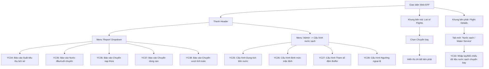

# BẢN MÔ TẢ CÔNG VIỆC BA - THIẾT KẾ & ĐẶC TẢ PHÂN HỆ WEBSITE (MODULE NƯỚC SẠCH TRÊN HỆ THỐNG MO/EFF)

Tài liệu này hệ thống hóa và mô tả chi tiết các đầu việc phân tích thiết kế mà anh (**BA phụ trách Website**) cần thực hiện cho Module Nước sạch (Potable Water Service) dựa trên danh sách yêu cầu thực tế trong file [ULNL_CNM.VNA.MO.CR.Phase2_nước sạch-dpm.xlsx - NL Chuc nang.csv](file:///c:/Users/anhnlv/Downloads/TOSS-20260611T014328Z-3-001/TOSS/ba/workspace/input/ULNL_CNM.VNA.MO.CR.Phase2_n%C6%B0%E1%BB%9Bc%20s%E1%BA%A1ch-dpm.xlsx%20-%20NL%20Chuc%20nang.csv) và cấu trúc giao diện thực tế của hệ thống **VNA EFF (Electronic Flight Folder / Mobile Operation)**.

> [!IMPORTANT]
> **Định hướng triển khai:**
> Phân hệ này sẽ được tích hợp trực tiếp vào hệ thống **MO / Web EFF** hiện tại của VNA (thay vì làm cổng riêng trên TOSS do tiến độ TOSS không kịp đáp ứng). 
> Cấu trúc giao diện sẽ được thiết kế ăn khớp 100% với layout EFF hiện tại (gồm: Danh sách chuyến bay ở cột trái, Khung chi tiết dạng Tab ở cột phải, và thanh điều hướng Menu ở Header).

---

## I. Quy Hoạch Giao Diện Trên Web EFF (Mobile Operation)

Dựa trên ảnh chụp giao diện hiện tại của hệ thống **VNA EFF**, giao diện quản lý nước sạch được phân bổ như sau:

### 1. Khung bên trái (List of flights)
* Giữ nguyên thiết kế bảng danh sách chuyến bay và bộ lọc (FLT DATE, FLT NO, Confirm doc, AC REG, DEP, ARR).
* Khi người dùng click chọn một chuyến bay ở bảng này $\rightarrow$ Khung chi tiết bên phải sẽ hiển thị các thông tin tương ứng.

### 2. Khung bên phải (Tab chi tiết tài liệu chuyến bay)
* Bổ sung thêm một **Tab mới tên là "Nước sạch"** (hoặc **"Water Service"**) nằm sau tab *Request documents*.
* Khi click vào tab này, hệ thống hiển thị:
  * **Thông số khuyến nghị nạp:** Suất lịch sử áp dụng, tổng khách (Pax + Crew), giờ bay và lượng nước khuyến nghị (đã tính kèm buffer).
  * **Trạng thái dữ liệu khách:** Lấy từ Booking Amadeus hay đã bóc tách từ Loadsheet.
  * **Bảng so khớp & xác nhận số liệu nước đầu/cuối chuyến (YC33):**
    * Dòng 1: Số liệu tự động từ **A-CAD / Điện nước sạch** (nếu là tàu A350/B787).
    * Dòng 2: Số liệu do **Tổ bay submit** qua App MO Plus (kèm liên kết xem ảnh đồng hồ đã chụp).
    * Dòng 3 (Nhập tay / Điều chỉnh): Dành cho Admin nhập bù hoặc sửa đổi khi có sai lệch, lưu rõ lý do điều chỉnh.

### 3. Thanh Header điều hướng
* **Menu "Report" (Dropdown):** Tích hợp thêm link truy cập 5 báo cáo nước sạch (YC34, YC35, YC36, YC37, YC38) và nút xuất Excel (YC39).
* **Menu "Admin":** Bổ sung mục "Cấu hình nước sạch" (Water Service Config) để dẫn tới các trang quản lý master data và tham số buffer (YC25, YC26, YC27, YC28).

---

## II. Chi Tiết Đầu Việc Thiết Kế Mockup & Viết Đặc Tả (SRS) cho 11 Chức Năng

### Nhóm 1: Các trang Quản lý Cấu hình (Master Data - Nằm trong Menu Admin)

#### 1. Cấu hình Dung tích bồn nước (Tank Capacity) -- YC25
* **Mô tả:** Thiết lập dung tích chứa nước sạch tối đa (lít) cho từng dòng tàu bay (A321, A350, B787, ATR...).
* **Đầu việc Mockup:** Layout trang danh sách chuẩn EFF. Bảng gồm: Loại tàu bay, Hãng sản xuất, Dung tích Tank chứa (Lít), Trạng thái, Người cập nhật cuối, Ngày cập nhật cuối (UTC). Thêm nút "Sửa" và "Thêm mới".
* **Đầu việc SRS:** Ràng buộc validation (dung tích phải là số nguyên dương, loại tàu bay không trùng lặp). Phân quyền chỉnh sửa cho nhóm quản trị viên.

#### 2. Cấu hình Định mức mặc định (Default Consumption Rate) -- YC26
* **Mô tả:** Thiết lập định mức tiêu thụ nước mặc định (lít/người/giờ) khi chặng/tàu bay chưa có dữ liệu lịch sử.
* **Đầu việc Mockup:** Bộ lọc theo Loại tàu bay, Nhóm chặng (Nội địa ngắn/dài/Quốc tế), Khung giờ khai thác. Form nhập định mức (Inline Edit hoặc Modal Pop-up).
* **Đầu việc SRS:** Đặc tả logic fallback (thứ tự ưu tiên tìm kiếm định mức mặc định của engine khi tính toán lượng nước khuyến nghị).

#### 3. Cấu hình Tham số đệm (Buffer Configuration) -- YC27
* **Mô tả:** Thiết lập các tham số đệm an toàn.
* **Đầu việc Mockup:** Form cấu hình chia làm các khu vực nhập liệu: Giờ taxi theo sân bay (phút), giờ dự phòng theo chặng (phút), mức tối thiểu an toàn theo loại tàu (lít), và **buffer theo người tương đương (ví dụ: mặc định +5 người)**.
* **Đầu việc SRS:** Logic áp dụng các tham số này vào công thức tính toán lượng nước cần nạp khuyến nghị.

#### 4. Cấu hình Ngưỡng ngoại lệ (Exception Threshold) -- YC28
* **Mô tả:** Thiết lập các biên độ để đánh dấu cảnh báo trên báo cáo.
* **Đầu việc Mockup:** Form nhập các ngưỡng: nạp thừa ($X\%$), dùng cạn ($Y\%$), ngưỡng chênh lệch pax booking vs loadsheet ($Z$ lít) để trigger notification.
* **Đầu việc SRS:** Logic đối chiếu dữ liệu thực tế với ngưỡng để tự động gắn cờ (Flag) ngoại lệ.

---

### Nhóm 2: Màn hình Vận hành & Nhập liệu (Nằm trong Tab "Nước sạch" của Chuyến bay)

#### 5. Nhập tay/Điều chỉnh dữ liệu nước chuyến bay (Manual Water Data Entry) -- YC33
* **Mô tả:** Cho phép Admin nhập bổ sung hoặc chỉnh sửa số liệu nước đầu/cuối chuyến khi ACARS lỗi hoặc tổ bay không gửi được.
* **Đầu việc Mockup:** Form nhập liệu tích hợp trực tiếp trong Tab "Nước sạch" ở cột phải sau khi chọn chuyến bay:
  * Nhập chỉ số % nước đầu chuyến (Hệ thống tự động quy đổi ra lít tương ứng).
  * Nhập chỉ số % nước cuối chuyến.
  * Trường nhập Ghi chú / Lý do điều chỉnh (bắt buộc nhập nếu sửa đổi bản ghi hiện có).
* **Đầu việc SRS:** Logic lưu vết (Audit log: ghi nhận giá trị cũ, giá trị mới, ID user thực hiện và lý do). Quy tắc ưu tiên hiển thị số liệu nhập tay lên các báo cáo.

---

### Nhóm 3: Các màn hình Báo cáo (Nằm trong Menu Report Dropdown)

#### 6. Báo cáo Suất tiêu thụ lịch sử (Historical Consumption Rate Report) -- YC34
* **Mô tả:** Thống kê suất tiêu thụ thực tế để làm cơ sở tinh chỉnh định mức.
* **Đầu việc Mockup:** Bộ lọc (thời gian, dòng tàu, chặng bay). Biểu đồ xu hướng (Line Chart) suất tiêu thụ theo tuần/tháng. Bảng dữ liệu chi tiết.
* **Đầu việc SRS:** Công thức tính suất trung bình lũy kế của chặng/tàu.

#### 7. Báo cáo Nước đầu/cuối chuyến bay (Departure & Arrival Water Report) -- YC35
* **Mô tả:** Đối chiếu dữ liệu nước giữa ACARS và Tổ bay nhập tay.
* **Đầu việc Mockup:** Bảng dữ liệu thể hiện: Chuyến bay, Loại tàu, Số khách (Pax), Nước khuyến nghị, Đầu chuyến (ACARS), Đầu chuyến (Tổ bay), Cuối chuyến (Tổ bay), Tiêu thụ thực tế, Suất thực tế. Highlight màu sắc cảnh báo khi có lệch số liệu.
* **Đầu việc SRS:** Logic phát hiện lệch số liệu (chênh lệch vượt quá số lít cấu hình).

#### 8. Báo cáo Chuyến bay nạp thừa nước (Overfueled Flights Report) -- YC36
* **Mô tả:** Danh sách các chuyến bay nạp nước thực tế vượt quá khuyến nghị gây lãng phí tải.
* **Đầu việc Mockup:** Bộ lọc theo tỷ lệ nạp thừa. Bảng dữ liệu sắp xếp giảm dần theo lượng nước thừa thực tế (Lít).
* **Đầu việc SRS:** Điều kiện lọc các chuyến bay có nước đầu chuyến thực tế > lượng nước khuyến nghị.

#### 9. Báo cáo Chuyến bay dùng cạn nước (Depleted Water Flights Report) -- YC37
* **Mô tả:** Thống kê chuyến bay hạ cánh với lượng nước còn lại dưới ngưỡng an toàn.
* **Đầu việc Mockup:** Bảng dữ liệu làm nổi bật (màu đỏ) các chuyến kết thúc với % nước cuối chuyến dưới ngưỡng an toàn cấu hình.
* **Đầu việc SRS:** Logic kiểm tra chỉ số nước cuối chuyến so với ngưỡng cấu hình.

#### 10. Báo cáo Chuyến bay nạp nước vượt lượng tính toán (Water Overrequest Flights Report) -- YC38
* **Mô tả:** Thống kê các chuyến bay tổ bay yêu cầu nạp vượt gợi ý kèm lý do giải trình.
* **Đầu việc Mockup:** Bảng hiển thị thông tin chuyến bay, lượng nước khuyến nghị, lượng nước thực tế nạp, chênh lệch và trường hiển thị Lý do giải trình do tổ bay nhập trên App.
* **Đầu việc SRS:** Logic đồng bộ dữ liệu lý do từ Mobile App gửi về để hiển thị đối soát.

#### 11. Chức năng Xuất báo cáo Excel (Report Export) -- YC39
* **Mô tả:** Xuất dữ liệu báo cáo ra tệp Excel.
* **Đầu việc Mockup:** Nút bấm "Xuất Excel" đặt trên thanh công cụ của các màn hình báo cáo.
* **Đầu việc SRS:** Định dạng tệp xuất (xlsx), quy tắc xuất đúng bộ lọc và tùy biến ẩn/hiện cột hiện tại của người dùng.

---

## III. Hướng Dẫn Bổ Sung Vào Tài Liệu MOPLUS_SRS_EFF_WEB_v2.5.docx

Khi anh thực hiện chỉnh sửa tài liệu gốc [MOPLUS_SRS_EFF_WEB_v2.5.docx](file:///c:/Users/anhnlv/Downloads/TOSS-20260611T014328Z-3-001/TOSS/ba/workspace/drafts/srs/MOPLUS_SRS_EFF_WEB_v2.5.docx), anh cần thực hiện điền thông tin vào các vị trí và phần cấu trúc sau đây để đảm bảo tính nhất quán của tài liệu:

### 1. Cập nhật Bảng ghi nhận thay đổi (Trang 2)
* **Ngày:** `17/06/2026`
* **Vị trí thay đổi:** `Mục 3.48...3.53`
* **Loại thay đổi (A/M/D):** `A` (Tạo mới)
* **Mô tả thay đổi:** `Bổ sung phân hệ Quản lý nước sạch (Potable Water Service) bao gồm: Tab hiển thị/Nhập tay chỉ số nước trên chuyến bay, 5 báo cáo đối chiếu & giám sát, và 4 màn hình cấu hình tham số đệm/danh mục.`
* **Version:** `2.6` (tăng phiên bản tài liệu từ 2.5 lên 2.6).

### 2. Định vị trí chèn các yêu cầu chức năng mới trong Mục 3
Do tài liệu hiện tại kết thúc phần báo cáo ở mục **`3.47 Báo cáo tuân thủ Confirm/Upload`**, các yêu cầu mới của Phân hệ Nước sạch sẽ được chèn tiếp nối vào sau mục 3.47 như sau:

#### A. Nhóm Yêu cầu Chuyến bay (Tab Nước sạch)
Chèn mới mục **3.48** để mô tả Tab chi tiết chuyến bay:
* **`3.48 Nước sạch — Xem và Nhập liệu nước sạch chuyến bay`**
  * *`3.48.1 Sơ đồ luồng hệ thống`* (Vẽ luồng tương tác giữa Web EFF $\rightarrow$ Database $\rightarrow$ ACARS/App MO).
  * *`3.48.2 Mô tả luồng xử lý`* (Đặc tả logic hiển thị nước gợi ý từ Amadeus, tự động bóc tách Loadsheet, hiển thị ACARS và xử lý lưu vết của người dùng khi gửi số đầu/cuối chuyến - YC33).
  * *`3.48.3 Màn hình chức năng`* (Nhúng ảnh Mockup giao diện Tab Nước sạch).
  * *`3.48.4 Mô tả chi tiết màn hình`* (Bảng định nghĩa các trường nhập % đầu/cuối, trường quy đổi lít, trường nhập lý do khi sửa đổi).

#### B. Nhóm Báo cáo Nước sạch
Chèn mới các mục từ **3.49 đến 3.53** để mô tả các màn hình báo cáo:
* **`3.49 Báo cáo suất tiêu thụ nước sạch lịch sử (YC34)`**
* **`3.50 Báo cáo nước đầu/cuối chuyến bay (YC35)`**
* **`3.51 Báo cáo chuyến bay nạp thừa nước sạch (YC36)`**
* **`3.52 Báo cáo chuyến bay dùng cạn nước sạch (YC37)`**
* **`3.53 Báo cáo chuyến bay nạp nước vượt lượng tính toán (YC38)`**
  * *(Lưu ý: Chức năng xuất Excel YC39 và tùy biến cột sẽ được đặc tả trực tiếp trong bảng "Mô tả chi tiết màn hình" của từng báo cáo trên dưới dạng mô tả hành động nút bấm).*

#### C. Nhóm Cấu hình Danh mục & Tham số (Admin)
Chèn mới mục **3.54** ở cuối cùng của phần yêu cầu chức năng để mô tả các màn cấu hình quản trị:
* **`3.54 Cấu hình danh mục và tham số nước sạch (Admin)`**
  * *`3.54.1 Cấu hình dung tích bồn nước sạch (YC25)`*
  * *`3.54.2 Cấu hình định mức tiêu thụ nước mặc định (YC26)`*
  * *`3.54.3 Cấu hình tham số đệm (YC27)`*
  * *`3.54.4 Cấu hình ngưỡng ngoại lệ (YC28)`*

---

### 3. Biểu mẫu Đặc tả chi tiết từng tính năng (Tuân thủ mẫu chung)
Đối với mỗi chức năng được bổ sung ở trên, anh cần viết đầy đủ 4 phần thông tin theo cấu trúc chuẩn của tài liệu:

#### Cấu trúc bảng tóm tắt đầu chức năng:
| Thuộc tính | Mô tả |
| :--- | :--- |
| **Tên chức năng** | Ví dụ: `Cấu hình dung tích bồn nước sạch` |
| **Mục đích** | Cho phép người dùng cấu hình dung tích bồn chứa nước sạch của từng tàu bay phục vụ quy đổi tỷ lệ % sang lít. |
| **Trigger** | Người dùng truy cập Menu `Admin` -> chọn mục `Water Service Config` -> Chọn tab `Tank Capacity`. |
| **Tiền điều kiện** | Người dùng đăng nhập thành công và được phân quyền thuộc nhóm `Admin`. |
| **Hậu điều kiện** | Lưu vết thay đổi vào Database và đồng bộ cấu hình tới các engine tính toán. |

#### Mô tả luồng xử lý (Bảng các bước):
| Bước | Người dùng / Tác nhân | Hệ thống xử lý |
| :--- | :--- | :--- |
| 1 | Truy cập màn hình cấu hình. | Hiển thị danh sách dung tích tank hiện tại. |
| 2 | Nhập thông tin và nhấn "Lưu". | Kiểm tra tính hợp lệ của dữ liệu (Validate). |
| ... | ... | ... |

#### Mô tả chi tiết màn hình (Bảng định nghĩa Control):
| STT | Tên | Loại control | Mô tả |
| :---: | :--- | :--- | :--- |
| 1 | Loại tàu bay | Combobox | Lấy danh mục tàu bay hiện tại của VNA để chọn. |
| 2 | Dung tích (Lít)| Textbox | Nhập số dung tích bồn. Bắt buộc nhập, định dạng số nguyên dương. |
| 3 | Nút Lưu | Button | Click để thực hiện kiểm tra và lưu cấu hình. |

---

## IV. Các Bước Triển Khai Tiếp Theo Cho BA

1. **Bước 1: Thiết kế giao diện nháp (Mockup)**
   * Dựa vào ảnh thiết kế giao diện **Web EFF** hiện tại để thiết kế thêm Tab "Nước sạch" bên khung phải.
   * Vẽ thêm các màn hình cấu hình danh mục và biểu đồ báo cáo tích hợp vào Header EFF.
2. **Bước 2: Viết Tài liệu Đặc tả Chức năng (SRS)**
   * Tạo tệp Markdown tại `ba/workspace/drafts/srs/03-dac-ta-chuc-nang/SRS-MO-Water-Web-v1.0.md`.
   * Đặc tả chi tiết hành vi, logic validate, các mốc thời gian UTC và phân quyền cho 11 tính năng trên.
3. **Bước 3: Biên dịch tài liệu sang Word (.docx)**
   * Chạy script `export-word.ps1` để chuyển đổi tệp Markdown SRS sang tệp Word đúng biểu mẫu Viettel phục vụ nghiệm thu tài liệu thiết kế.

