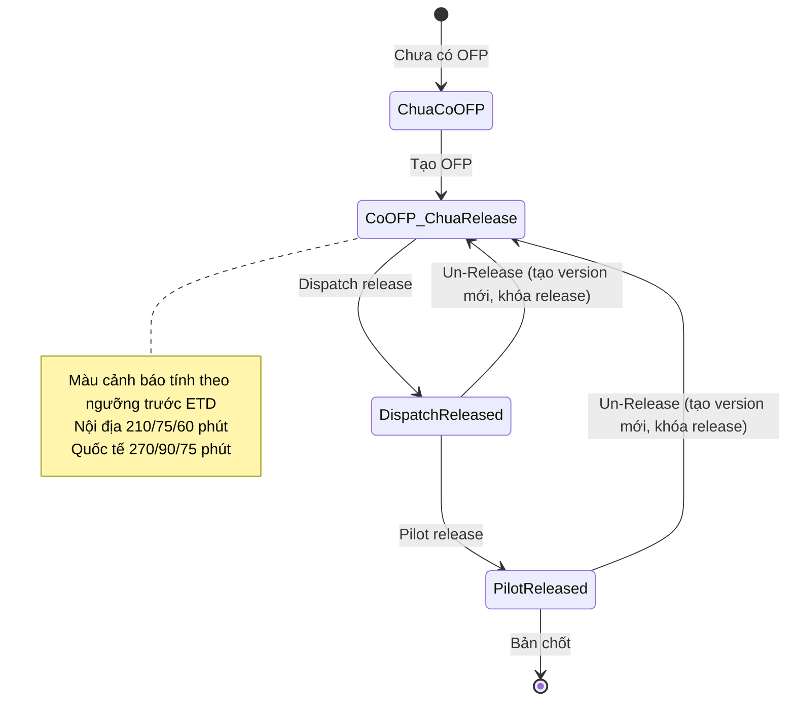
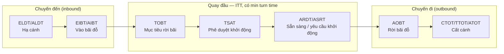

# SOP — Phương pháp ghi chép & tổ chức tài liệu dự án

> Quy định cách ghi chép thống nhất cho TOSS, dùng được cho cả con người và agent. Nền tảng là kiến trúc dual-scope của dự án: một nguồn Markdown duy nhất phục vụ agent đọc và phân tích, đồng thời xuất ra Word cho người khi cần bàn giao.
>
> Tài liệu này (a) ghi nhận các phương pháp ghi chép đã tham khảo và đánh giá mức phù hợp, (b) chốt một chuẩn ghi chép phân lớp dùng chung, và (c) chỉ định một phương pháp duy nhất để ghi nội dung buổi họp trước khi tổng hợp thành báo cáo khảo sát.

## 1. Nguyên tắc nền

- Nguồn ghi chép phải là **văn bản thuần** để agent đọc, tìm kiếm và so sánh phiên bản được, đồng thời render ra bố cục sạch hoặc hình ảnh cho người.
- Mọi tài liệu tuân thủ quy tắc đọc tiết kiệm token: có lớp tóm tắt để định vị trước khi đọc chi tiết ([[feedback-file-read-write-token-efficient]]).
- Ghi chép chỉ tái tạo điều đã ghi nhận, không suy diễn (CLAUDE.md §0). Điểm chưa rõ thì giữ nguyên và gắn cờ.
- Bản giao người sinh ra khi xuất, không lẫn dấu vết nội bộ ([[feedback-human-voice-deliverables]]).

## 2. Ghi nhận các phương pháp ghi chép đã tham khảo

Bốn phương pháp phổ biến trong tài liệu hướng dẫn ghi chép, cùng hai phương pháp mở rộng phù hợp với môi trường có agent, được đánh giá theo mức phù hợp với dự án:

| Phương pháp | Mô tả ngắn | Phù hợp agent | Phù hợp người | Dùng tại TOSS |
|---|---|---|---|---|
| **Outline** | Dàn ý phân cấp, tiêu đề lớn rồi ý phụ thụt lề | Cao (tiêu đề là mục tiêu tìm kiếm) | Cao | Xương sống cấu trúc §I–VI báo cáo, mọi tài liệu có heading |
| **Charting** | Bảng hàng và cột để so sánh nhiều đối tượng | Rất cao (mỗi hàng một bản ghi, so sánh phiên bản được) | Cao | Bảng đối soát §VI, sổ OID, glossary, ma trận truy vết |
| **Mindmap** | Sơ đồ nhánh từ một chủ đề trung tâm | Thấp nếu vẽ tay, cao nếu dùng Mermaid | Cao (trực quan) | Mermaid cho luồng nghiệp vụ (xem §5) |
| **Cornell** | Chia trang thành vùng ghi chú, vùng từ khóa và câu hỏi, vùng tóm tắt | Trung bình | Cao | Ghi nội dung buổi họp (xem §4) |
| **Zettelkasten** | Ghi chú nguyên tử, mỗi đơn vị một ý, liên kết chéo bằng tham chiếu | Rất cao | Trung bình | Hệ thống memory của agent, glossary, OID |
| **Progressive summarization** | Tóm tắt theo lớp, đào sâu dần từ tổng quan đến chi tiết | Rất cao | Cao | Lớp INDEX rồi tiêu đề rồi chi tiết |

## 3. Chuẩn ghi chép phân lớp dùng chung (chốt áp dụng)

Mọi tài liệu dự án dùng Markdown phân lớp, kết hợp các phương pháp trên trong một nguồn duy nhất:

| Lớp | Thành phần Markdown | Phương pháp tương ứng | Phục vụ |
|---|---|---|---|
| Tóm tắt | Frontmatter YAML và dòng một câu trong INDEX | Cornell (summary) và Progressive | Agent định vị nhanh, người nắm ý chính |
| Khung | Tiêu đề phân cấp | Outline | Cả hai |
| Đối chiếu | Bảng | Charting | Cả hai |
| Trực quan | Sơ đồ Mermaid | Mindmap | Cả hai |
| Liên kết | Tham chiếu chéo dạng `[[tên]]` và mã ID | Zettelkasten | Agent lần theo, người tra cứu |
| Bàn giao | Xuất Word khi cần | — | Người |

Quy ước bắt buộc kèm theo:

- Mỗi thư mục tài liệu có một `INDEX.md` liệt kê file kèm dòng tóm tắt.
- Mỗi tài liệu dài có mục tóm tắt hoặc trích yếu ở đầu file.
- Các thực thể quản trị (thuật ngữ, điểm chốt, yêu cầu) mang ID riêng và tham chiếu chéo thay vì lặp lại nội dung.
- Luồng nghiệp vụ chính ưu tiên thể hiện bằng Mermaid (§5).

## 4. Phương pháp ghi nội dung buổi họp trước khi tổng hợp (chốt: Cornell)

Để ghi nhận nội dung một buổi họp hoặc khảo sát **trước khi** tổng hợp thành báo cáo khảo sát, dự án dùng **phương pháp Cornell phiên bản Markdown**.

### 4.1 Lý do chọn Cornell

Cornell là phương pháp thiết kế cho việc ghi nhanh theo thời gian thực, đúng với bối cảnh transcript ghi âm tuyến tính. Quan trọng hơn, ba vùng của Cornell ánh xạ trực tiếp vào ba đầu ra mà dự án cần ngay sau buổi họp:

| Vùng Cornell | Vai trò khi họp | Chảy vào đâu sau buổi |
|---|---|---|
| Notes (ghi chú chính) | Ghi lại nội dung trao đổi theo dòng thời gian | §II báo cáo khảo sát (Yêu cầu / Thảo luận và Đề xuất / Kết luận) |
| Cues (từ khóa và câu hỏi) | Đánh dấu điểm chưa rõ, viết tắt lạ, việc cần chốt | §IV báo cáo và sổ OID |
| Summary (tóm tắt) | Đúc kết cuối buổi | §I báo cáo và dòng tóm tắt INDEX |

Outline và Charting không phù hợp cho bước ghi thô vì buổi họp thường nhảy chủ đề và chưa biết trước các trục so sánh. Mindmap khó ghi nhanh bằng văn bản trong lúc họp. Cornell vừa cho phép ghi nhanh, vừa tách sẵn phần câu hỏi mở để chuyển thẳng vào quy trình theo dõi điểm chốt.

### 4.2 Template ghi chép Cornell (Markdown)

Đặt tại `meeting-notes/<DDMMYYYY>/` cùng chỗ với transcript, đặt tên `GHI-CHEP-<DDMMYYYY>-<buoi>.md`.

```markdown
---
buoi_hop: "<chủ đề buổi họp>"
ngay: "<DDMMYYYY>"
nguoi_ghi: "<tên>"
nguon: "<transcript / ghi trực tiếp>"
---

# Ghi chép buổi <chủ đề> — <ngày>

## Tóm tắt (điền cuối buổi)
<2 đến 3 câu đúc kết: buổi họp chốt được gì, còn mở gì>

## Ghi chú theo chủ đề

### <Chủ đề 1>
- <nội dung trao đổi, ghi gọn theo dòng thời gian>
- <quyết định nếu có>

### <Chủ đề 2>
- ...

## Từ khóa và câu hỏi mở (cues)
- [ ] <viết tắt chưa rõ nghĩa> — cần hỏi lại
- [ ] <điểm cần chốt> — chờ xác nhận
- [ ] <số liệu nghe chưa chắc> — đối chiếu lại
```

Quy tắc khi ghi: ghi gọn theo ý, không chép nguyên văn; tự dùng viết tắt nhất quán; mọi cụm nghe chưa chắc đưa vào phần cues thay vì đoán nghĩa.

### 4.3 Cầu nối sang báo cáo khảo sát

Sau buổi họp, bản ghi Cornell là đầu vào cho quy trình lập báo cáo khảo sát (`SOP-BAO-CAO-KHAO-SAT-v0.1.md`). Phần Notes được phân loại lại theo chủ đề và viết thành ba phần chuẩn, phần Cues chuyển vào §IV và sổ OID, phần Summary đưa vào §I. Khi có transcript ghi âm, bản ghi Cornell bổ trợ cho transcript chứ không thay thế, vì transcript vẫn là nguồn gốc tuyệt đối ([[feedback-source-transcript-first]]).

## 5. Quy ước Mermaid cho luồng nghiệp vụ chính

Luồng nghiệp vụ quan trọng được thể hiện bằng Mermaid để cả người và agent cùng đọc một nguồn. Hai ví dụ mẫu dưới đây dựng lại nội dung đã ghi nhận trong báo cáo khảo sát 15/06, minh họa cách trình bày.

### 5.1 Vòng đời phát hành OFP (state diagram)



### 5.2 Chuỗi mốc thời gian quay đầu tàu bay theo A-CDM (flowchart)



Hai sơ đồ trên dùng đúng các mốc và ngưỡng đã được ghi nhận trong nguồn, không bổ sung mốc ngoài tài liệu. Khi một luồng có điểm chưa rõ, giữ chú thích cần làm rõ ngay trong sơ đồ thay vì tự hoàn thiện logic.

## 6. Phạm vi áp dụng

- Phương pháp Cornell (§4) áp dụng cho mọi buổi họp và khảo sát có người ghi chép, kể cả khi đã có ghi âm.
- Chuẩn Markdown phân lớp (§3) áp dụng cho mọi tài liệu mới trong `ba/workspace/drafts/` và `ba/sync/`.
- Quy ước Mermaid (§5) áp dụng khi mô tả luồng trạng thái, quy trình hoặc chuỗi thời gian.
- Tài liệu cũ không bắt buộc viết lại, chỉ áp dụng khi có dịp cập nhật.

## 7. Liên kết

- Quy trình lập báo cáo khảo sát: `SOP-BAO-CAO-KHAO-SAT-v0.1.md`.
- Skill kỹ thuật xử lý ASR: `.claude/skills/meeting-synthesize/`.
- Sổ theo dõi điểm chốt: `SO-THEO-DOI-DIEM-CHOT-v0.1.md`.
- Quy tắc đọc và ghi tiết kiệm token: [[feedback-file-read-write-token-efficient]].

---

*SOP-GHICHEP-001 v0.1 — 2026-06-16. Chốt chuẩn ghi chép phân lớp dùng chung cho agent và người; chọn Cornell làm phương pháp ghi nội dung buổi họp trước khi tổng hợp báo cáo khảo sát.*
