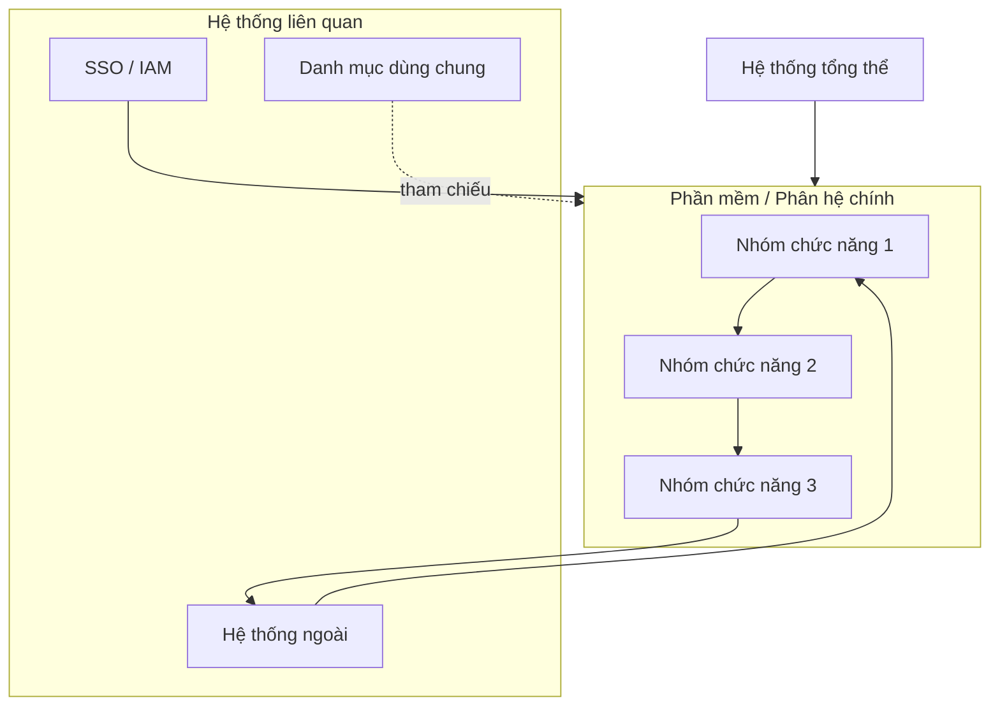
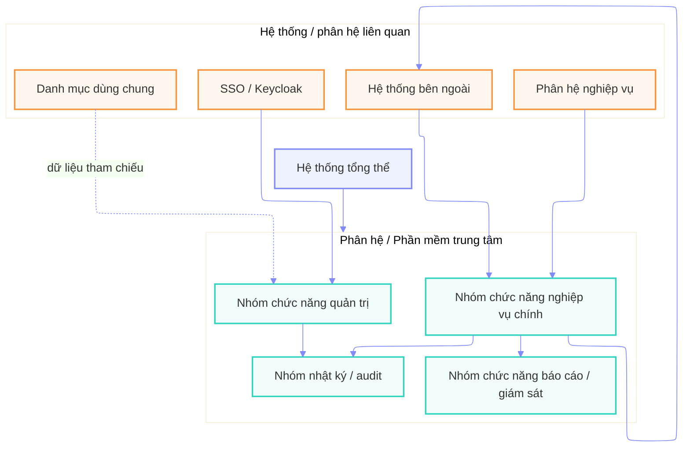
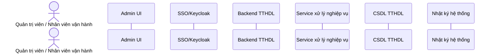
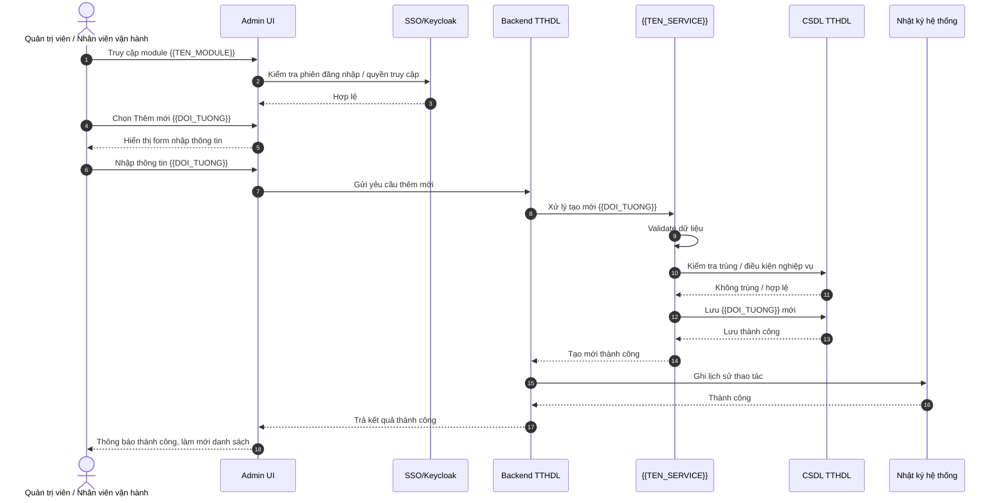
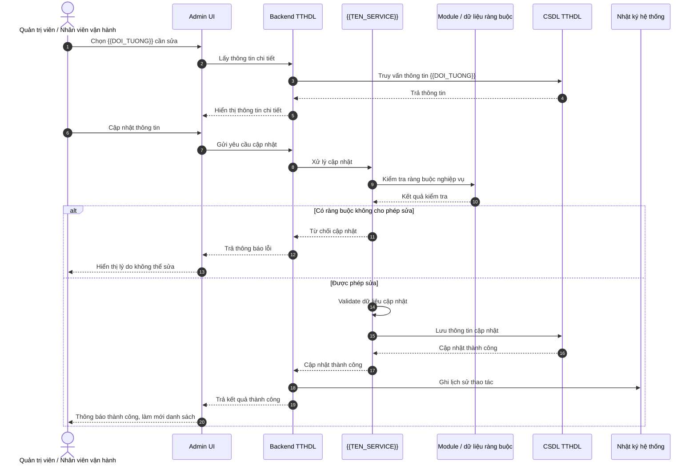
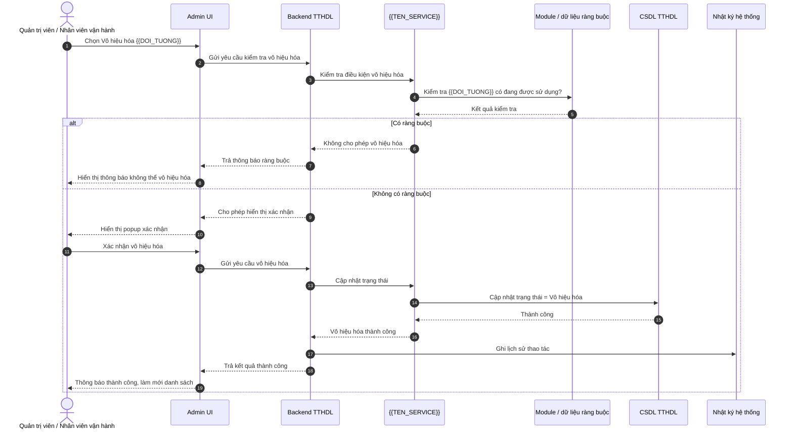
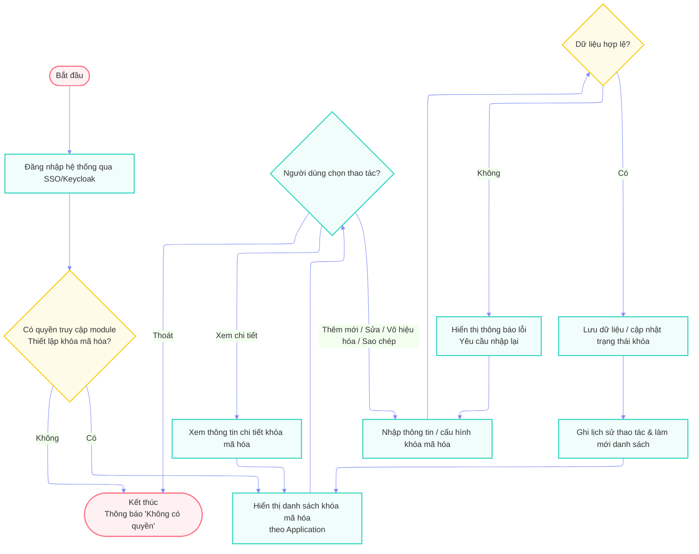
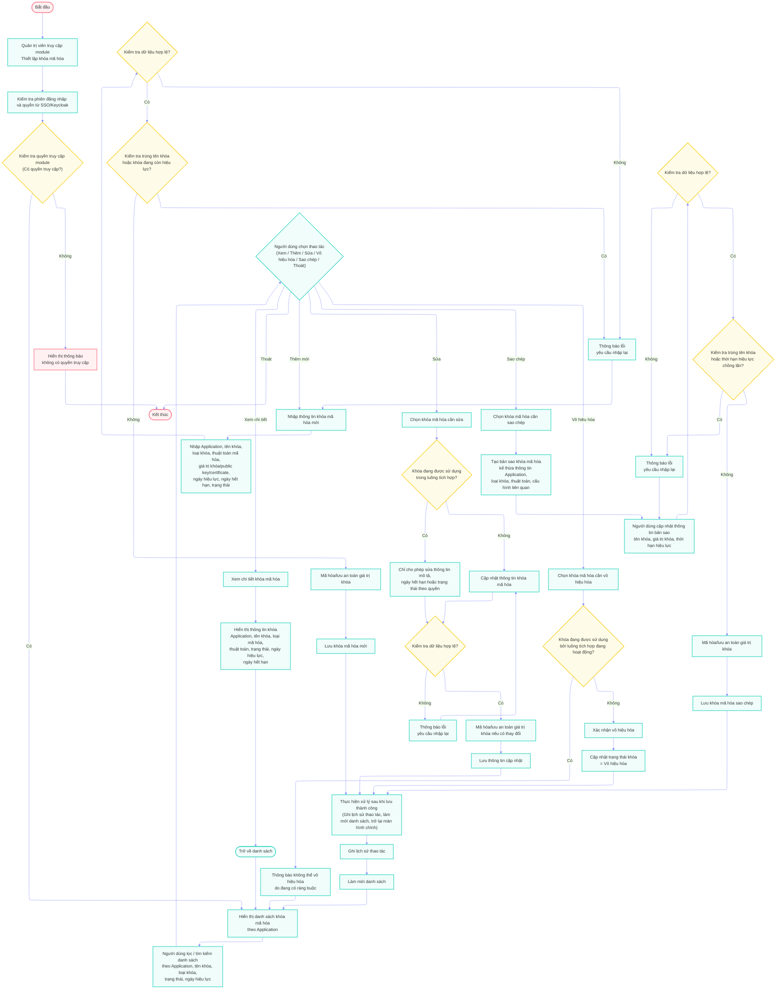

# Diagram Skill - Kỹ năng vẽ sơ đồ BA bằng Mermaid

## 1. Mục tiêu

Skill này hướng dẫn AI tạo các sơ đồ Mermaid phục vụ BA khi phân tích hệ thống, viết SRS/BRD/URD, chuyển giao nghiệp vụ và mô tả luồng chức năng.

Các loại sơ đồ cần hỗ trợ:

1. Sơ đồ tổng thể quan hệ luồng chức năng - nghiệp vụ / ma trận quan hệ chức năng - nghiệp vụ.
2. Luồng nghiệp vụ module chức năng đầy đủ.
3. Luồng nghiệp vụ module chức năng đơn giản.
4. Use Case Diagram của module chức năng.
5. Sequence Diagram theo từng function.

Nguyên tắc ưu tiên:

- Dùng Mermaid thay vì hình ảnh tĩnh nếu người dùng cần chèn vào tài liệu docs/Word/SRS.
- Ưu tiên sơ đồ dễ đọc, ít giao cắt, có thể export sang PNG/SVG.
- Với sơ đồ phục vụ tài liệu chính thức, phải có bản đơn giản và bản đầy đủ nếu module phức tạp.
- Không dùng layout quá rối, không ép quá nhiều nhánh vào một sơ đồ nếu làm giảm khả năng đọc.

---

## 2. Style Mermaid chuẩn dùng cho BA

### 2.1. Header mặc định

Luôn ưu tiên header sau cho flowchart nghiệp vụ:

```mermaid
---
config:
  layout: elk
  theme: base
  themeVariables:
    primaryColor: '#eef2ff'
    primaryBorderColor: '#818cf8'
    lineColor: '#818cf8'
    background: '#ffffff'
---
flowchart TB
```

### 2.2. Class style mặc định

Dùng class style thống nhất để sơ đồ dễ đưa vào tài liệu:

```mermaid
classDef step fill:#eef2ff,stroke:#818cf8,stroke-width:2px;
classDef decision fill:#fefce8,stroke:#facc15,stroke-width:2px;
classDef action fill:#f0fdfa,stroke:#2dd4bf,stroke-width:2px;
classDef endNode fill:#fff1f2,stroke:#fb7185,stroke-width:2px;
classDef system fill:#fff7ed,stroke:#fb923c,stroke-width:2px;
classDef data fill:#f8fafc,stroke:#64748b,stroke-width:2px;
```

Quy ước:

- `endNode`: bắt đầu, kết thúc, thông báo dừng luồng.
- `action`: thao tác người dùng, xử lý chính.
- `decision`: điều kiện rẽ nhánh.
- `system`: xử lý hệ thống, đồng bộ, kiểm tra quyền, gọi dịch vụ ngoài.
- `data`: CSDL, log, audit, dữ liệu cấu hình.

### 2.3. Quy tắc đặt tên node

- Dùng mã ngắn, dễ quản lý: `A`, `B`, `C`, `Z` cho luồng đơn giản.
- Dùng prefix theo nhánh trong luồng full:
  - `I`, `I1`, `I2`: xem chi tiết.
  - `J`, `J1`, `J2`: thêm mới.
  - `K`, `K1`, `K2`: sửa.
  - `L`, `L1`, `L2`: vô hiệu hóa/xóa.
  - `M`, `M1`, `M2`: cấu hình phụ hoặc sao chép.
  - `S1`, `N`, `O`: xử lý chung sau lưu.
- Không đặt ID node bằng tiếng Việt có dấu.

### 2.4. Quy tắc nội dung node

- Mỗi node tối đa 2-4 dòng.
- Dùng `<br/>` để xuống dòng trong node.
- Với node dài, dùng dấu ngoặc kép:

```mermaid
S1["Thực hiện xử lý sau khi lưu thành công<br/>(Ghi lịch sử thao tác, làm mới danh sách, trở lại màn hình chính)"]
```

- Node quyết định phải viết dạng câu hỏi:

```mermaid
D{"Có quyền truy cập module?"}
J2{"Kiểm tra dữ liệu hợp lệ?"}
```

---

## 3. Loại sơ đồ 1 - Sơ đồ tổng thể quan hệ luồng chức năng - nghiệp vụ

### 3.1. Khi nào dùng

Dùng khi người dùng muốn nhìn tổng thể hệ thống hoặc phân hệ, bao gồm:

- Các phân hệ/module chính.
- Quan hệ giữa các module.
- Luồng dữ liệu vào/ra.
- Quan hệ với hệ thống ngoài.
- Nguồn phát sinh log, báo cáo, cảnh báo.

Tên thường gặp:

- Sơ đồ tổng thể quan hệ luồng chức năng - nghiệp vụ.
- Ma trận quan hệ chức năng - nghiệp vụ.
- Sơ đồ quan hệ module.
- Sơ đồ tổng quan chức năng.

### 3.2. Cấu trúc khuyến nghị

Dùng `flowchart TB` hoặc `flowchart LR` tùy số lượng module.

Cấu trúc chuẩn:



### 3.3. Quy tắc vẽ

- Đặt hệ thống tổng thể ở trên cùng.
- Đặt module/phân hệ trung tâm ở giữa.
- Đặt hệ thống ngoài ở bên trái/phải hoặc dưới cùng.
- Dùng subgraph để gom nhóm:
  - Nhóm người dùng/hệ thống liên quan.
  - Nhóm chức năng lõi.
  - Nhóm quản trị/cấu hình.
  - Nhóm báo cáo/log/cảnh báo.
- Dùng mũi tên đặc `-->` cho quan hệ chính.
- Dùng mũi tên đứt `-.->` cho quan hệ tham chiếu/phụ thuộc gián tiếp.
- Không mô tả chi tiết từng field trong sơ đồ tổng thể.

### 3.4. Template



---

## 4. Loại sơ đồ 2 - Luồng nghiệp vụ module chức năng đầy đủ

### 4.1. Khi nào dùng

Dùng khi cần phân tích chi tiết module để viết SRS, transfer nghiệp vụ, review với dev/tester hoặc phát hiện thiếu case.

Luồng đầy đủ cần có:

- Bắt đầu.
- Kiểm tra đăng nhập/quyền.
- Hiển thị danh sách.
- Lọc/tìm kiếm.
- Chọn thao tác.
- Xem chi tiết.
- Thêm mới.
- Sửa.
- Vô hiệu hóa/xóa.
- Sao chép/cấu hình nếu có.
- Validate dữ liệu.
- Kiểm tra trùng/ràng buộc.
- Lưu dữ liệu.
- Ghi lịch sử thao tác.
- Làm mới danh sách.
- Kết thúc.

### 4.2. Quy tắc vẽ

- Dùng `flowchart TB`.
- Tách từng nhánh bằng comment Mermaid:

```mermaid
%% == Thêm mới ==
```

- Các nhánh nghiệp vụ chính quay về xử lý chung `S1` sau khi lưu thành công.
- Các nhánh lỗi quay về form nhập hoặc danh sách.
- Không để mũi tên của nhánh này cắt ngang nhánh khác quá nhiều.
- Với module có quá nhiều thao tác, nên tách thành nhiều sơ đồ nhỏ theo function.

### 4.3. Template full

```mermaid
---
config:
  layout: elk
  theme: base
  themeVariables:
    primaryColor: '#eef2ff'
    primaryBorderColor: '#818cf8'
    lineColor: '#818cf8'
    background: '#ffffff'
---
flowchart TB

    %% == Khởi tạo và kiểm tra quyền ==
    A([Bắt đầu]) --> B[Quản trị viên truy cập module<br/>{{TEN_MODULE}}]
    B --> C[Kiểm tra phiên đăng nhập và quyền từ SSO/Keycloak]
    C --> D{"Kiểm tra quyền truy cập module<br/>(Có quyền truy cập?)"}
    D -- Không --> E[Hiển thị thông báo<br/>không có quyền truy cập]
    D -- Có --> F[Hiển thị danh sách {{DOI_TUONG}}<br/>theo Application]
    E --> Z([Kết thúc])

    %% == Danh sách và thao tác ==
    F --> G[Người dùng lọc / tìm kiếm danh sách]
    G --> H{"Người dùng chọn thao tác<br/>(Xem / Thêm / Sửa / Vô hiệu hóa / Sao chép / Thoát)"}

    %% == Xem chi tiết ==
    H -- Xem chi tiết --> I[Xem chi tiết {{DOI_TUONG}}]
    I --> I1[Hiển thị thông tin chi tiết {{DOI_TUONG}}]
    I1 --> O1([Trở về danh sách])
    O1 --> F

    %% == Thêm mới ==
    H -- Thêm mới --> J[Nhập thông tin {{DOI_TUONG}} mới]
    J --> J1[Nhập các thông tin bắt buộc<br/>và thông tin cấu hình liên quan]
    J1 --> J2{"Kiểm tra dữ liệu hợp lệ?"}
    J2 -- Không --> J3[Thông báo lỗi<br/>yêu cầu nhập lại]
    J3 --> J
    J2 -- Có --> J4{"Kiểm tra trùng / chồng lấn / điều kiện nghiệp vụ?"}
    J4 -- Có --> J3
    J4 -- Không --> J5[Lưu {{DOI_TUONG}} mới]
    J5 --> S1

    %% == Sửa ==
    H -- Sửa --> K[Chọn {{DOI_TUONG}} cần sửa]
    K --> K1{"{{DOI_TUONG}} có đang được sử dụng<br/>hoặc bị ràng buộc?"}
    K1 -- Có --> K2[Thông báo không thể sửa<br/>hoặc chỉ cho phép sửa hạn chế]
    K2 --> F
    K1 -- Không --> K3[Cập nhật thông tin {{DOI_TUONG}}]
    K3 --> K4{"Kiểm tra dữ liệu hợp lệ?"}
    K4 -- Không --> K5[Thông báo lỗi<br/>yêu cầu nhập lại]
    K5 --> K3
    K4 -- Có --> K6[Lưu thông tin cập nhật]
    K6 --> S1

    %% == Vô hiệu hóa ==
    H -- Vô hiệu hóa --> L[Chọn {{DOI_TUONG}} cần vô hiệu hóa]
    L --> L1{"{{DOI_TUONG}} có ràng buộc<br/>hoặc đang được sử dụng?"}
    L1 -- Có --> L2[Thông báo: không thể vô hiệu hóa]
    L2 --> F
    L1 -- Không --> L3[Xác nhận vô hiệu hóa]
    L3 --> L4[Cập nhật trạng thái = Vô hiệu hóa]
    L4 --> S1

    %% == Sao chép / Cấu hình phụ nếu có ==
    H -- Sao chép / Cấu hình --> M[Chọn {{DOI_TUONG}} cần thao tác]
    M --> M1[Nhập / cập nhật thông tin cấu hình]
    M1 --> M2{"Kiểm tra dữ liệu hợp lệ?"}
    M2 -- Không --> M3[Thông báo lỗi<br/>yêu cầu nhập lại]
    M3 --> M1
    M2 -- Có --> M4[Lưu thông tin cấu hình]
    M4 --> S1

    %% == Xử lý sau lưu ==
    S1["Thực hiện xử lý sau khi lưu thành công<br/>(Ghi lịch sử thao tác, làm mới danh sách, trở lại màn hình chính)"]
    S1 --> N[Ghi lịch sử thao tác]
    N --> O[Làm mới danh sách]
    O --> F

    H -- Thoát --> Z

    %% == Kiểu định dạng ==
    classDef step fill:#eef2ff,stroke:#818cf8,stroke-width:2px;
    classDef decision fill:#fefce8,stroke:#facc15,stroke-width:2px;
    classDef action fill:#f0fdfa,stroke:#2dd4bf,stroke-width:2px;
    classDef endNode fill:#fff1f2,stroke:#fb7185,stroke-width:2px;

    class A,E,Z endNode
    class B,C,F,G,H,I,I1,J,J1,J3,J5,K,K2,K3,K5,K6,L,L2,L3,L4,M,M1,M3,M4,S1,N,O,O1 action
    class D,J2,J4,K1,K4,L1,M2 decision
```

### 4.4. Checklist full flow

Trước khi trả kết quả, kiểm tra:

- Có kiểm tra quyền không?
- Có danh sách và lọc/tìm kiếm không?
- Có đủ các thao tác chính của module không?
- Mỗi thao tác thêm/sửa/cấu hình có validate không?
- Có kiểm tra trùng/ràng buộc không?
- Có nhánh lỗi quay lại form/danh sách không?
- Có ghi lịch sử thao tác không?
- Có làm mới danh sách không?
- Có kết thúc/thoát không?

---

## 5. Loại sơ đồ 3 - Luồng nghiệp vụ module chức năng đơn giản

### 5.1. Khi nào dùng

Dùng để gắn vào tài liệu Word/SRS ở phần mô tả tổng quan module, phù hợp với người đọc không cần chi tiết kỹ thuật.

Luồng đơn giản cần thể hiện:

- Người dùng vào module.
- Kiểm tra quyền.
- Hiển thị danh sách.
- Chọn thao tác.
- Nhập/cập nhật/xem thông tin.
- Validate.
- Lưu / cập nhật trạng thái.
- Ghi log và refresh.

### 5.2. Quy tắc rút gọn

- Gom nhiều thao tác giống nhau vào một nhánh, ví dụ: `Thêm mới / Sửa / Vô hiệu hóa / Sao chép`.
- Không mô tả từng field chi tiết.
- Không tách quá nhiều điều kiện trùng/ràng buộc.
- Chỉ giữ các điểm quyết định quan trọng.

### 5.3. Template đơn giản

```mermaid
---
config:
  layout: elk
  theme: base
  themeVariables:
    primaryColor: '#eef2ff'
    primaryBorderColor: '#818cf8'
    lineColor: '#818cf8'
    background: '#ffffff'
---
flowchart TB

    A([Bắt đầu]) --> B[Đăng nhập hệ thống qua SSO/Keycloak]
    B --> C{"Có quyền truy cập module<br/>{{TEN_MODULE}}?"}
    C -- Không --> Z([Kết thúc<br/>Thông báo 'Không có quyền'])
    C -- Có --> D[Hiển thị danh sách {{DOI_TUONG}}]

    D --> E{"Người dùng chọn thao tác?"}

    %% Nhánh Xem chi tiết
    E -- Xem chi tiết --> F[Xem thông tin chi tiết {{DOI_TUONG}}] --> D

    %% Nhánh thao tác cập nhật
    E -- Thêm mới / Sửa / Vô hiệu hóa / Sao chép --> G["Nhập thông tin / cập nhật cấu hình {{DOI_TUONG}}"]
    G --> H{"Dữ liệu hợp lệ?"}
    H -- Không --> I[Hiển thị thông báo lỗi<br/>Yêu cầu nhập lại] --> G
    H -- Có --> J[Lưu dữ liệu / cập nhật trạng thái]
    J --> K["Ghi lịch sử thao tác & làm mới danh sách"] --> D

    %% Thoát
    E -- Thoát --> Z

    %% Style
    classDef step fill:#eef2ff,stroke:#818cf8,stroke-width:2px;
    classDef decision fill:#fefce8,stroke:#facc15,stroke-width:2px;
    classDef action fill:#f0fdfa,stroke:#2dd4bf,stroke-width:2px;
    classDef endNode fill:#fff1f2,stroke:#fb7185,stroke-width:2px;

    class A,Z endNode
    class B,D,E,F,G,H,I,J,K action
    class C,H decision
```

---

## 6. Loại sơ đồ 4 - Use Case Diagram của module chức năng

### 6.1. Khi nào dùng

Dùng khi cần mô tả actor nào được dùng chức năng nào trong module.

Use Case Diagram cần có:

- Actor chính.
- Actor phụ nếu có.
- Module boundary bằng `subgraph`.
- Các use case có mã `UC-MODULE-XX`.
- Hệ thống liên quan nếu có: SSO, CSDL, module khác, hệ thống ngoài.
- Quan hệ include/extend nếu cần, nhưng trong Mermaid flowchart nên mô tả bằng mũi tên có nhãn.

### 6.2. Quy tắc vẽ

- Dùng `flowchart LR` để actor nằm bên trái, module ở giữa, hệ thống liên quan bên phải.
- Không lạm dụng quá nhiều mũi tên chéo.
- Actor chỉ nối tới use case trực tiếp họ thực hiện.
- Các xử lý hệ thống dùng use case riêng nếu quan trọng: kiểm tra quyền, ghi log, kiểm tra ràng buộc, đồng bộ dữ liệu.

### 6.3. Template Use Case

```mermaid
---
config:
  layout: elk
  theme: base
  themeVariables:
    primaryColor: '#eef2ff'
    primaryBorderColor: '#818cf8'
    lineColor: '#818cf8'
    background: '#ffffff'
---
flowchart LR

    Admin[Quản trị viên]
    Operator[Nhân viên vận hành]
    Auditor[Cán bộ giám sát / kiểm tra]

    subgraph MOD[Module {{TEN_MODULE}}]
        UC00[UC-{{PREFIX}}-00<br/>Xác thực & phân quyền]
        UC01[UC-{{PREFIX}}-01<br/>Xem danh sách {{DOI_TUONG}}]
        UC02[UC-{{PREFIX}}-02<br/>Lọc / tìm kiếm {{DOI_TUONG}}]
        UC03[UC-{{PREFIX}}-03<br/>Xem chi tiết {{DOI_TUONG}}]
        UC04[UC-{{PREFIX}}-04<br/>Thêm mới {{DOI_TUONG}}]
        UC05[UC-{{PREFIX}}-05<br/>Sửa {{DOI_TUONG}}]
        UC06[UC-{{PREFIX}}-06<br/>Vô hiệu hóa {{DOI_TUONG}}]
        UC07[UC-{{PREFIX}}-07<br/>Sao chép / cấu hình {{DOI_TUONG}}]
        UC08[UC-{{PREFIX}}-08<br/>Kiểm tra ràng buộc nghiệp vụ]
        UC09[UC-{{PREFIX}}-09<br/>Ghi lịch sử thao tác]
    end

    subgraph SYS[Hệ thống liên quan]
        SSO[SSO / Keycloak]
        DB[(CSDL hệ thống)]
        OTHER[Module / hệ thống liên quan]
        LOG[(Audit / System Log)]
    end

    Admin --> UC00
    Operator --> UC00
    Auditor --> UC00
    UC00 --> SSO

    Admin --> UC01
    Admin --> UC02
    Admin --> UC03
    Admin --> UC04
    Admin --> UC05
    Admin --> UC06
    Admin --> UC07

    Operator --> UC01
    Operator --> UC02
    Operator --> UC03

    Auditor --> UC01
    Auditor --> UC03
    Auditor --> UC09

    UC01 --> DB
    UC02 --> DB
    UC03 --> DB
    UC04 --> DB
    UC05 --> UC08
    UC06 --> UC08
    UC08 --> OTHER

    UC04 --> UC09
    UC05 --> UC09
    UC06 --> UC09
    UC07 --> UC09
    UC09 --> LOG

    classDef actor fill:#f8fafc,stroke:#475569,stroke-width:2px;
    classDef usecase fill:#eef2ff,stroke:#4f46e5,stroke-width:1.5px;
    classDef system fill:#ecfdf5,stroke:#059669,stroke-width:1.5px;
    classDef db fill:#fefce8,stroke:#ca8a04,stroke-width:1.5px;

    class Admin,Operator,Auditor actor
    class UC00,UC01,UC02,UC03,UC04,UC05,UC06,UC07,UC08,UC09 usecase
    class SSO,OTHER system
    class DB,LOG db
```

---

## 7. Loại sơ đồ 5 - sequenceDiagram theo từng function

### 7.1. Khi nào dùng

Dùng khi cần mô tả chi tiết tương tác giữa người dùng, UI, backend, DB và hệ thống liên quan cho từng function cụ thể.

Mỗi function nên có một sequenceDiagram riêng, ví dụ:

- Thêm mới khóa mã hóa.
- Sửa khóa mã hóa.
- Vô hiệu hóa khóa mã hóa.
- Sao chép khóa mã hóa.
- Cấu hình Rate Limit.
- Gửi cảnh báo email.

### 7.2. Participant chuẩn

Với module quản trị TTHDL, ưu tiên các participant sau:



Thêm participant nếu function có tích hợp:

- `participant APIM as WSO2 APIM`
- `participant FLOW as Luồng tích hợp`
- `participant MAIL as Mail Service`
- `participant EXT as Hệ thống bên ngoài`
- `participant MON as Monitoring/Alerting`

### 7.3. Quy tắc sequence

- Luôn bắt đầu bằng actor thao tác trên UI.
- UI kiểm tra quyền hoặc gửi request kèm token.
- Backend kiểm tra quyền nghiệp vụ nếu cần.
- Service validate dữ liệu.
- DB kiểm tra trùng/ràng buộc.
- Dùng `alt/else/end` cho nhánh lỗi/thành công.
- Sau khi lưu thành công, ghi log thao tác.
- UI thông báo kết quả và làm mới danh sách.

### 7.4. Template sequence - thêm mới



### 7.5. Template sequence - sửa



### 7.6. Template sequence - vô hiệu hóa



---

## 8. Quy trình tạo sơ đồ khi nhận yêu cầu

Khi người dùng yêu cầu vẽ sơ đồ, thực hiện theo thứ tự:

1. Xác định loại sơ đồ người dùng cần:
   - Tổng thể quan hệ chức năng - nghiệp vụ.
   - Luồng module đầy đủ.
   - Luồng module đơn giản.
   - Use Case Diagram.
   - Sequence Diagram theo function.
2. Xác định đối tượng nghiệp vụ chính của module.
3. Xác định actor và quyền thao tác.
4. Liệt kê các thao tác chính: xem, lọc, thêm, sửa, xóa/vô hiệu hóa, sao chép, cấu hình, báo cáo, xuất file.
5. Liệt kê kiểm tra nghiệp vụ: validate, kiểm tra trùng, kiểm tra ràng buộc, kiểm tra trạng thái, kiểm tra quyền.
6. Liệt kê xử lý sau lưu: ghi log, đồng bộ hệ thống ngoài, refresh danh sách, cảnh báo nếu có.
7. Vẽ Mermaid theo template phù hợp.
8. Kiểm tra lại readability:
   - Có bị quá dài không?
   - Có quá nhiều mũi tên giao nhau không?
   - Có cần tách thêm sequence theo từng function không?

---

## 9. Quy tắc chất lượng đầu ra

Đầu ra phải đảm bảo:

- Mermaid chạy được, không lỗi cú pháp.
- Có thể copy sang Mermaid Live Editor.
- Dễ export PNG/SVG để chèn vào Word.
- Node viết bằng tiếng Việt rõ ràng, đúng thuật ngữ nghiệp vụ.
- Không dùng quá nhiều màu gây rối.
- Không dùng quá nhiều actor nếu không cần.
- Không gọi là BPMN nếu thực tế đang dùng Mermaid flowchart.
- Với luồng phức tạp, luôn đề xuất thêm bản đơn giản để đưa vào tài liệu chính và bản full để phân tích nội bộ.

---

## 10. Mẫu câu trả lời khi xuất sơ đồ

Khi trả lời người dùng, nên trình bày theo format:

```markdown
Dưới đây là 2 bản Mermaid cho module **{{TEN_MODULE}}**:

1. **Luồng đơn giản**: dùng để chèn vào tài liệu Word/SRS.
2. **Luồng đầy đủ**: dùng để phân tích chi tiết và transfer nghiệp vụ.

## 1. Luồng đơn giản

```mermaid
...
```

## 2. Luồng đầy đủ

```mermaid
...
```
```

Với Use Case và Sequence:

```markdown
Dưới đây là Use Case Diagram và sequenceDiagram theo từng function cho module **{{TEN_MODULE}}**.

## 1. Use Case Diagram
...

## 2. Sequence Diagram - Thêm mới
...

## 3. Sequence Diagram - Sửa
...
```

---

## 11. Ví dụ áp dụng nhanh - Module Thiết lập khóa mã hóa

### 11.1. Luồng đơn giản



### 11.2. Luồng đầy đủ



---

## 12. Lưu ý không nên làm

- Không vẽ tất cả sequence của mọi function trong một diagram.
- Không dùng quá nhiều nhãn mũi tên dài.
- Không dùng subgraph quá sâu trong flowchart module vì dễ rối khi export.
- Không dùng thuật ngữ kiến trúc phức tạp kiểu banking/gov nếu dự án không cần.
- Không biến sơ đồ Mermaid flowchart thành BPMN nếu người dùng chỉ cần sơ đồ nghiệp vụ.
- Không bỏ qua nhánh lỗi, nhánh không có quyền và xử lý ghi log.
