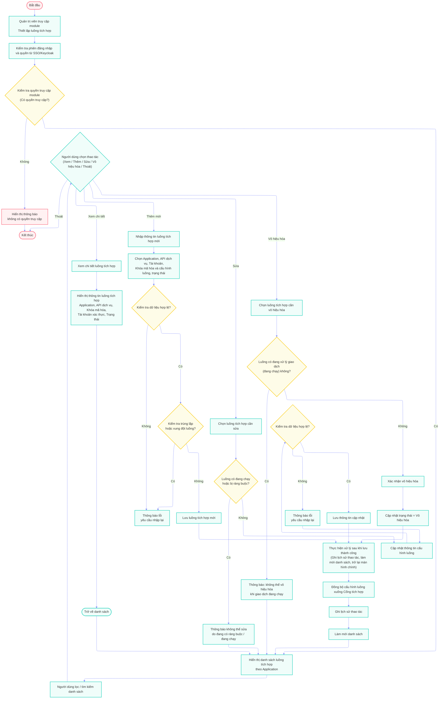
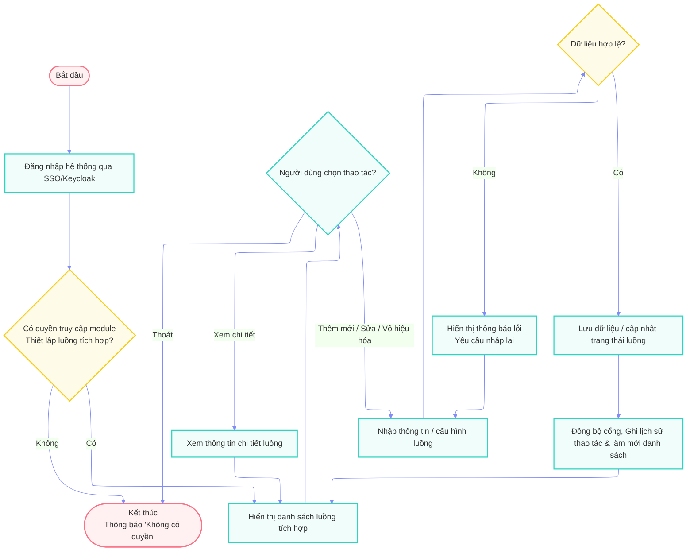
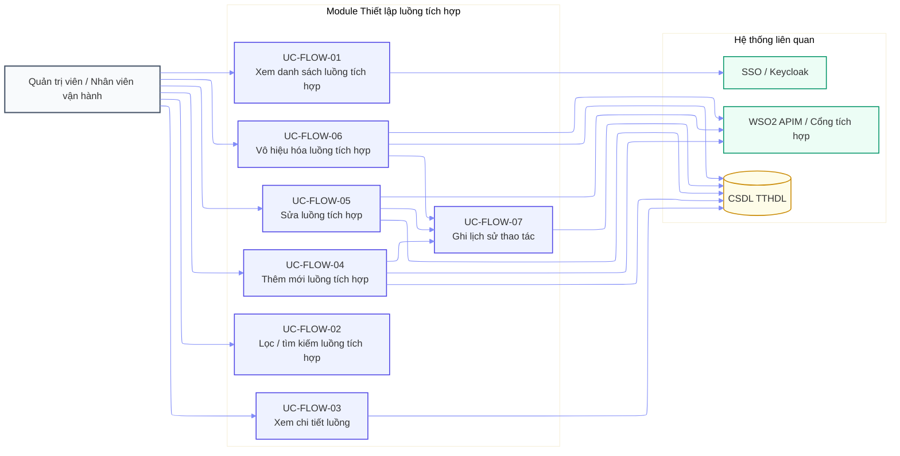
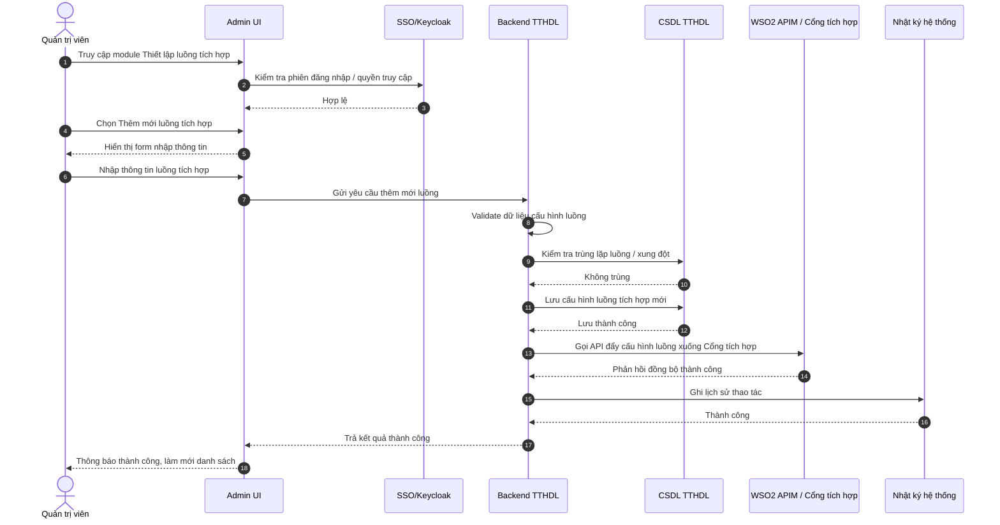
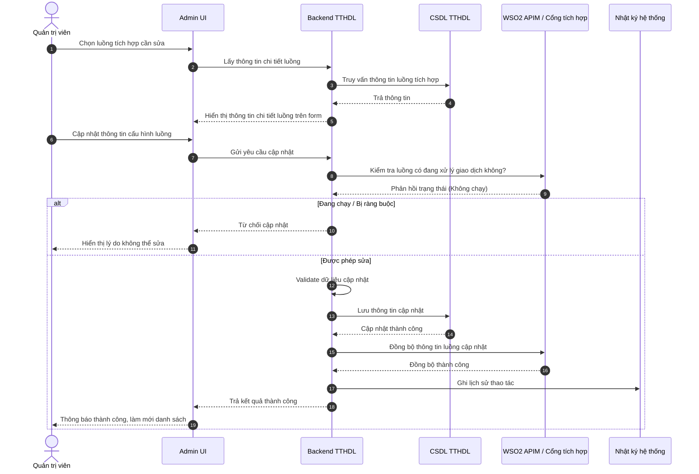
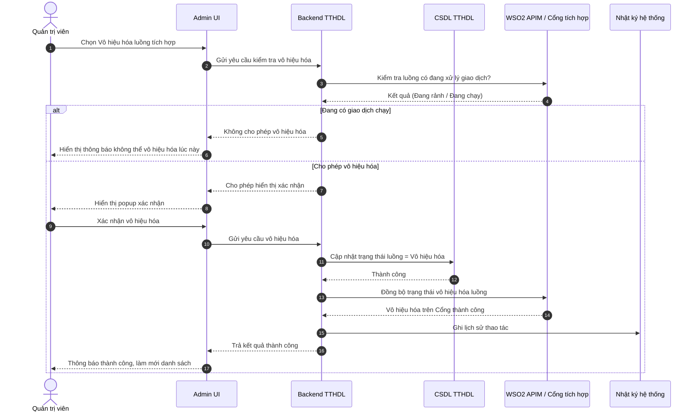

# Tổng hợp các Diagram cho Hệ thống Trục tích hợp dữ liệu (TTHDL)
Dựa theo yêu cầu và các quy chuẩn vẽ Mermaid (Diagram_Skill.md), dưới đây là các sơ đồ được xây dựng cho hệ thống và đặc biệt là module **Thiết lập luồng tích hợp**.

## 1. Ma trận quan hệ chức năng - nghiệp vụ cho hệ thống Trục tích hợp dữ liệu

```mermaid
---
config:
  layout: elk
  theme: base
  themeVariables:
    primaryColor: '#eef2ff'
    primaryBorderColor: '#818cf8'
    lineColor: '#818cf8'
    background: '#ffffff'
    mainBkg: '#eef2ff'
    secondBkg: '#f0fdfa'
    tertiaryBkg: '#fff7ed'
---
flowchart TD

    A[Hệ thống tổng thể<br/>Chuyển đổi số UBCKNN]

    A --> B[15 phân hệ nghiệp vụ]
    A --> C[Phân hệ SSO<br/>Quản lý người dùng]
    A --> D[Danh mục điện tử dùng chung]
    A --> E[App Mobile]
    A --> F[TTHDL<br/>Trục Tích hợp Dữ liệu]

    F --> F1[Cổng tích hợp dữ liệu]
    F --> F2[Quản trị & Giám sát Trục]

    F1 --> G1[Luồng nhận về]
    F1 --> G2[Luồng gửi đi]

    H[Hệ thống bên ngoài] -.-> G1
    G1 -.-> B

    B -.-> G2
    G2 -.-> H

    F1 --> I1[Xác thực / phân quyền<br/>Keycloak, OAuth2/OIDC]
    F1 --> I2[Quản lý API<br/>WSO2 APIM]
    F1 --> I3[Rate Limit / Routing]
    F1 --> I4[Mã hóa dữ liệu]
    F1 --> I5[Log tiến trình tích hợp]

    F2 --> M1[Quản lý danh sách dịch vụ<br/>theo Application]
    F2 --> M2[Quản lý tài khoản xác thực<br/>theo Application]
    F2 --> M3[Thiết lập khóa mã hóa<br/>theo Application]
    F2 --> M4[Thiết lập luồng tích hợp<br/>theo Application]
    F2 --> M5[Cấu hình ngưỡng cảnh báo]
    F2 --> M6[Cấu hình mail nhận cảnh báo]
    F2 --> M7[Báo cáo]
    F2 --> M8[Nhật ký hệ thống]

    M1 --> M1A[Xem / Lọc danh sách API]
    M1 --> M1B[Thêm mới / Sửa / Vô hiệu hóa API]
    M1 --> M1C[Cấu hình Rate Limit]

    M2 --> M2A[Xem / Lọc tài khoản]
    M2 --> M2B[Thêm mới / Sửa / Vô hiệu hóa tài khoản]

    M3 --> M3A[Xem / Lọc khóa mã hóa]
    M3 --> M3B[Thêm mới / Sửa / Vô hiệu hóa khóa]
    M3 --> M3C[Sao chép khóa mã hóa]

    M4 --> M4A[Xem / Lọc luồng tích hợp]
    M4 --> M4B[Thêm mới / Sửa / Vô hiệu hóa luồng]

    M5 --> M5A[Ngưỡng thời gian phản hồi]
    M5 --> M5B[Ngưỡng tỉ lệ lỗi kết nối]
    M5 --> M5C[Ngưỡng lưu lượng]

    M6 --> M6A[Xem / Lọc email]
    M6 --> M6B[Thêm mới / Sửa / Xóa cấu hình email]

    M7 --> M7A[Dashboard tổng quan]
    M7 --> M7B[Báo cáo giám sát luồng dữ liệu]
    M7 --> M7C[Báo cáo cảnh báo qua Email]

    M8 --> M8A[Quản lý lịch sử thao tác]
    M8 --> M8B[Quản lý lịch sử tiến trình tích hợp]

    I5 -.-> M8B
    I5 -.-> M7B
    M5 -.-> M7C
    M5 -.-> M6
    M6 -.-> M7C
    M1 -.-> M4
    M2 -.-> M4
    M3 -.-> M4
    M4 -.-> F1

    classDef coreNode fill:#eef2ff,stroke:#818cf8,color:#1e1b4b,stroke-width:2px
    classDef subsysNode fill:#f0fdfa,stroke:#2dd4bf,color:#1e1b4b,stroke-width:2px
    classDef gatewayNode fill:#fff7ed,stroke:#fb923c,color:#1e1b4b,stroke-width:2px
    classDef featureNode fill:#fdf4ff,stroke:#e879f9,color:#1e1b4b,stroke-width:2px
    classDef detailNode fill:#f0f9ff,stroke:#38bdf8,color:#1e1b4b,stroke-width:1.5px

    class A coreNode
    class B,C,D,E,H subsysNode
    class F,F1,F2 gatewayNode
    class G1,G2,I1,I2,I3,I4,I5 featureNode
    class M1,M2,M3,M4,M5,M6,M7,M8 featureNode
    class M1A,M1B,M1C,M2A,M2B,M3A,M3B,M3C,M4A,M4B,M5A,M5B,M5C,M6A,M6B,M7A,M7B,M7C,M8A,M8B detailNode
```

## 2. Luồng nghiệp vụ đầy đủ cho module "Thiết lập luồng tích hợp"

## 3. Luồng nghiệp vụ đơn giản cho module "Thiết lập luồng tích hợp"

## 4. Use Case Diagram của module chức năng "Thiết lập luồng tích hợp"

## 5. Sequence Diagram theo từng function của module "Thiết lập luồng tích hợp"

### 5.1. Thêm mới luồng tích hợp

### 5.2. Sửa luồng tích hợp

### 5.3. Vô hiệu hóa luồng tích hợp

